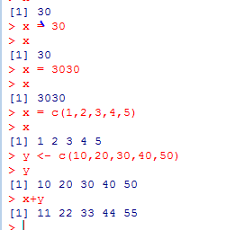
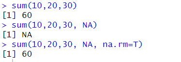
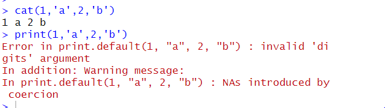
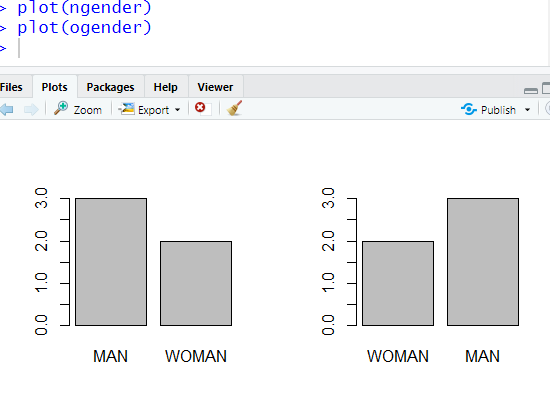
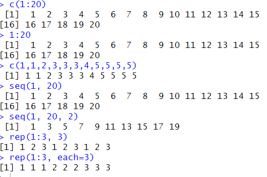
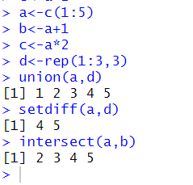

# R 1일차


R 설치 : www.r-project.org

Rstudio 설치 : https://www.rstudio.com/products/rstudio/download/#download


R.을 Rdata랑 연결 체크

위에 레지어쩌구도 체크


변수 선언

x = 30 같이 등호를 써도 되고

x <- 3030 같은 화살표를 써도 된다.


R의 주석은 #





명령어들

```


#R패키지 개수 확인
dim(available.packages())

available.packages()


#R session은 사용자가 R 프로그램을 시작한 후 R콘솔 시작 ~ 종료까지의 수행된 정보
sessioninfo()


#R프로그램 버전, 운영체제 정보, 다국어 지원현황, 기본 설치된 R패키지 정보 출력함


#설치된 R패키지 목록 확인
installed.packages()


#R패키지 설치
install.packages("stringr")
//update.packages("stringr")
remove.packages("stringr")


#설치된 패키지를 사용하기 위해서 메모리에 로드
library(stringr) 또는 require(stringr)

#메모리에 로드된 패키지 검색
search( )


#기본 데이터 셋 보기
data()

#빈도수 히스토그램
hist(Nile)
#밀도 기준 히스토그램
hist(Nile, freq=F)
# 분포곡선 그리기
lines(density(Nile)
#Plots영역에 표시할 그래프 개수 설정
par(mfrow=c(1,1))
# 파일 출력 경로
pdf("c:/workspceR/sample.pdf")
#정규분포를 따르는 난수 20개 생성해서 히스토그램 생성
hist(rnorm(20))   
#출력 파일 닫기
dev.off()
```


### 변수선언

첫문자는 영문자로 시작

첫문자가 .으로 시작 할 수도 있는데, 이 경우 뒤에는 숫자가 올 수 없다.

두번째 문자부터는 숫자, _, . 사용 가능

대소문자 구분

예약어 사용 불가

초기화된 전역 변수에 저장된 값은 불변 (ex TRUE, NULL)

x<-3
tracemem(x)
x<-'a'
tracemem(x)

-> 주소 값이 달라짐

##### R은 변수를 선언할 때 자료형(Type)을 선언하지 않는다.


## 데이터 타입 (Data Type) - numeric, character, logical,
Scalar 변수 - 단일 값(하나의 값)을 저장하는 변수


#age변수는 하나의 값을 저장하고 있는 벡터 타입

#### 벡터(Vector)는 하나 이상의 여러 개의 자료를 저장할 수 있는 1차원의 선형 자료 구조


age <- 30

class(age)  -> Numeric


age <- "29"
class(age) -> character


age <- TRUE   #상수객체(TRUE, FALSE)

class(age) -> logical


#T변수에 TRUE 저장, F변수에 FALSE 저장이 되어있음
age <-F
class(age) -> logical


age <- NA  #결측치 (Not Available)
class(age+10)
age <- null 
class(age+10)


sum(10, 20, 30)

sum(10, 20, 30, NA)

#### sum(10, 20, 30, NA, na.rm=T) => NA값 처리

결과화면 : 




### R Seesion에서 생성한 변수 목록 확인

ls()


#### 자료형 확인

is.numeric(변수)
is.logical(변수)
is.character(변수)
is.na(변수)
is.list(객체)
is.data.frame(객체)
is.array(객체)
is.matrix(객체)


#### 자료형 형변환

as.numeric(변수)
as.logical(변수)
as.character(변수)
as.list(객체)
as.data.frame(객체)
as.array(객체)
as.matrix(객체)
as.integer(변수)
as.double(변수)
as.complex(변수)  # 복소수
as.factor(객체)
as.Date(객체)


#### 문자 배열을 숫자로 바꿔서 계산하기

```
x<-c("1", "2", "3")
result <- x * 3
#print(result)
result <- as.numeric(x) * 3
#print(result)
result <- as.integer(x) * 3
#print(result)
```


#### 복소수 자료형 다루기

```
z<-5.3-3i   #복소수 자료형 생성
class(z)   
Re(z)    #실수부만  반환
Im(z)    #허수부만  반환
is.complex(z)
as.complex(5.3)
```


#class(변수)는 자료구조의 Type을 반환
#mode(변수)는 자료의 Type을 반환


## cat과 print의 차이

cat은 여러 문자 가능,

print는 하나의 문자만 가능


ex) 

cat(1,'a',2,'b')
print(1,'a',2,'b')





#### class 와 mode

class(변수)는 자료구조의 Type을 반환
mode(변수)는 자료의 Type을 반환


## 디렉토리 설정


getwd()

setwd("c:/R_Workspace")

getwd()


#### 로케일 설정


as.Date("2019-Sep-05", format="%y-%b-%d")

#Sys.setlocale(category="LC_ALL", locale="언어_국가")
#현재 로케일 정보 전체 확인
Sys.setlocale(category="LC_ALL", locale="")
Sys.getlocale()

Sys.setlocale(category="LC_ALL", locale="Korean_Korea")
Sys.getlocale()

Sys.setlocale(category="LC_ALL", locale="English_US") 
Sys.getlocale()

Sys.setlocale(category="LC_ALL", locale="Japanese_Japan")
Sys.getlocale()


### 도움말 보기


##### R에서 제공하는 기본 함수 사용 예제 보기

example(seq)


##### R에서 제공하는 함수의 파라미터 형식 보기

args(max)


#### 그 외

help(mean)
?sum

??mean


## factor 

#### - 동일한 값의 목록을 category로 갖는 벡터 자료

변수가 가질 수 있는 값의 범위로서 
예) 성별 변수의 범주는 남, 여
factor는 명목형(Norminal)과 순서형(Ordinal) 유형으로 분류


1.

gender <- c("man","woman", "woman", "man", "man")
plot(gender)  #차트는 수치 데이터만 가능하므로 오류
class(gender)
mode(gender)


2.

팩터로 해당 갯수 체크 

ngender <- as.factor(gender) #범주의 순서가 알파벳 순서로 정렬됨
class(ngender)
mode(ngender)
table(ngender) #빈도수 반환
plot(ngender)
is.factor(ngender)
ngender    #Levels속성에서 범주를 확인 (알파벳 순서?)


3. 범주 순서 바꾸기

args(factor)  #factor()함수의 매개변수 확인
ogender <- factor(gender, levels=c("woman", "man"), ordered=T)
ogender    #범주의 순서 확인

par(mfrow=c(1, 2))
plot(ngender)
plot(ogender)


결과 : (2번 3번)




### Vector : R에서 가장 기본이 되는 자료 구조, 1차원, 선형구조

요소의 접근은 변수[index첨자]로 접근, 첨자index는 1부터 시작한다.

동일한 데이터타입만 저장 가능

벡터 생성 함수 : c(), seq(), rep()

벡터 자료 처리 함수 :  union(), setdiff(), intersect(),...


```
c(1:20)
1:20
c(1,1,2,3,3,3,4,5,5,5,5)
seq(1, 20)
seq(1, 20, 2)  #순차적으로 값을 증감시켜서 벡터 자료 구조 생성
req(1:3, 3) 
req(1:3, each=3)

```





#### 집합 관련

```
a<-c(1:5)
b<-a+1
c<-a*2
d <- rep(1:3, 3) 
union(a, d)
setdiff(a, d)
intersect(a, d)

```





#### 형변환


```
f <- c(33, -5, "4", 5:9 ) # 자료형이 혼합된 경우, 문자열이 포함된 경우, 문자열로 자동 형변환
class(f) : "character"
mode(f) : "character"
```


#### 벡터접근


```
a<-c(1:20)
a[3:10]   #벡터의 요소에 접근
a[c(3, 10)]  #벡터의 요소에 접근
a[-c(2:18)]   #벡터의 첨자에 -를 지정하면 해당 위치의 원소는 제외
```