# R 시각화 1일차


##### 데이터 분석의 도입부 : 전체적인 데이터의 구조를 분석하거나 분석 방향을 제시

##### 데이터 분석의 중반부 : 잘못된 처리 결과를 확인

##### 데이터 분석의 후반부 : 분석결과를 도식화하여 의사결정에 반영하기 위해서 데이터를 시각화


- 이산변수로 구성된 데이터 셋을 이용하여 막대, 점, 원형 차트를 그릴 수 있다.

- 연속변수로 구성된 데이터프레임을 대상으로 히스토그램과 산점도를 그릴 수 있다.

- 데이터 분석의 도입부에서 전체적인 데이터의 구조를 살펴보기 위해서 시각화 도구를 사용한다.


숫자형 컬럼 1개 시각화 도구 - hist, plot, barplot

범주형 컬럼 1개 시각화 도구 - pie, barplot

숫자형 컬럼 2개 시각화 도구 - plot, abline, boxplot

숫자형 컬럼 3개 시각화 도구 - scatterplot3d(3차원 산점도)

n개의 컬럼 시각화 도구 - pairs(산점도 매트릭스)


이산변수(discrete quantitative data) - 정수 단위로 나누어 측정할 수 있는 변수


## barplot() 

기본적은 세로 막대 차트를 제공

- ylim(y축 범위), col(막대 색상) , main(제목) 등등 옵션이 매우 많으므로 help("barplot")으로 참고

- 가로 막대 차트 : horiz=TRUE
- 막대의 굵기와 간격 지정 : space (값이 클수록 막대의 굵기는 작아지고, 간격은 넓어진다)
- 축 이름 크기 설정 : cex.names
- #색상 index값 : 검은색(1), 빨간색(2), 초록색(3), 파란색(4), 하늘색(5), 자주색(6), 노란색(7)


## 실습1 : 분기별 매출

```R
chart_data <- c(305, 450, 320, 460, 330, 480, 380, 520)
names(chart_data) <- c("2014 1분기","2015 1분기"
                      , "2014 2분기", "2015 2분기"
                      , "2014 3분기", "2015 3분기"
                       , "2014 4분기", "2015 4분기"
)
str(chart_data)
print(chart_data)

barplot(chart_data, ylim=c(0, 600),  col=rainbow(8),
        main="2014년도 VS 2015년도 분기별 매출현황 비교",
        ylab="매출액(단위:만원)", xlab="년도별 분기현황")

#가로 막대 차트 : horiz=TRUE
barplot(chart_data, xlim=c(0, 600), horiz=TRUE,  col=rainbow(8),
        main="2014년도 VS 2015년도 분기별 매출현황 비교",
        ylab="매출액(단위:만원)", xlab="년도별 분기현황")

#막대의 굵기와 간격 지정 : space (값이 클수록 막대의 굵기는 작아지고, 간격은 넓어진다)
#축 이름 크기 설정 : cex.names
barplot(chart_data, xlim=c(0, 600), horiz=TRUE, 
       main="2014년도 VS 2015년도 분기별 매출현황 비교",
        ylab="매출액(단위:만원)", xlab="년도별 분기현황"
        , space=2, cex.names=0.8, col=rep(c(2, 4), 4))

#색상 index값 : 검은색(1), 빨간색(2), 초록색(3), 파란색(4), 하늘색(5), 자주색(6), 노란색(7)

barplot(chart_data, ylim=c(0, 600), horiz=TRUE, 
       main="2014년도 VS 2015년도 분기별 매출현황 비교",
        ylab="매출액(단위:만원)", xlab="년도별 분기현황"
        , space=5, cex.names=0.5, col=rep(c(1, 7), 4))
```


## 실습2 : 버지니아주의 하위계층 사망비율


- beside=T/F : X축 값이 측면으로 배열, F이면 하나의 막대에 누적

- font.main : 제목 글꼴 지정
- legend() : 범례 위치, 이름, 글자 크기, 색상 지정
- title() : 차트 제목, 차트 글꼴 지정


```R
data(VADeaths)
str(VADeaths)    #5행 4열
class(VADeaths)  #matrix
mode(VADeaths)   # numeric
head(VADeaths, 10)
# VADeaths 데이터셋은 1940년 미국 버지니아주의 하위계층 사망비율을 기록한 데이터셋

par(mfrow=c(1, 2)) 
barplot(VADeaths, beside=T, col=rainbow(5), 
        main="미국 버지니아주의 하위계층 사망비율")
#범례 출력
legend(19,71, c("50-54", "55-59", "60-64", "65-69", "70-74")
       , cex=0.8, fil=rainbow(5))

#누적막대 차트
barplot(VADeaths, beside=F, col=rainbow(5) )
title(main="미국 버지니아주의 하위계층 사망비율", font.main=4)
legend(19,71, c("50-54", "55-59", "60-64", "65-69", "70-74")
       , cex=0.8, fil=rainbow(5))
#19,71은 위치값

#beside=T/F : X축 값이 측면으로 배열, F이면 하나의 막대에 누적
#font.main : 제목 글꼴 지정
#legend() : 범례 위치, 이름, 글자 크기, 색상 지정
#title() : 차트 제목, 차트 글꼴 지정
```


결과 : 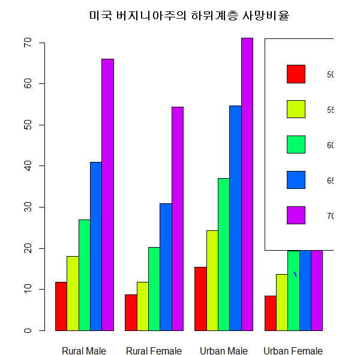


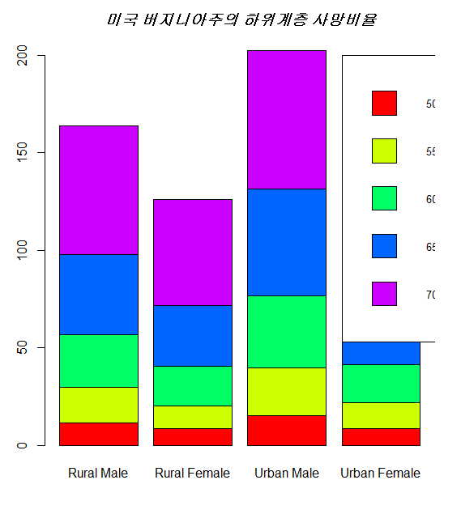


## 실습 3 : 점그래프, 파이그래프


- 점차트 - 점의 모양, 색상 설정 가능

- labels : 점에 대한 설명문

- cex : 점의 확대

- pch : 점 모양  원(1), 삼각형(2),....

- color : 점 색상 

- lcolor : 선 색상

  

점그래프

```R
par(mfrow=c(1, 1)) 
dotchart(chart_data, color=c("blue", "red"), lcolor="black", 
        pch=1:2, labels=names(chart_data), xlab="매출액", 
        main="2014년도 VS 2015년도 분기별 매출현황 비교"
        , cex=1.2)
```


파이그래프

```R
par(mfrow=c(1, 1)) 
pie(chart_data, col=rainbow(8),  
        pch=1:2, labels=names(chart_data),   
        main="2014년도 VS 2015년도 분기별 매출현황 비교"
        , cex=1.2)
```


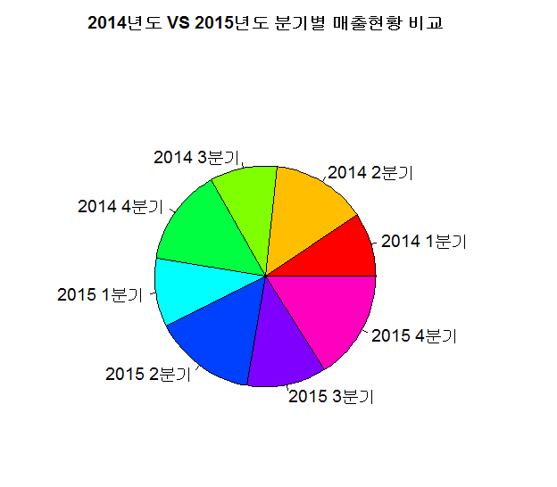


## 실습 4 : 박스그래프

- 연속변수(Continuous quantitative data)는 시간, 길이 등과 같이 연속성을 가진 변수
- boxplot은 요약 정보를 시각화하는데 효과적
- 데이터의 분포 정도와 이상치 발견을 목적으로 하는 경우 유용하게 사용된다.
- notch=T : 중위수(허리선) 비교
- abline() : 기준선 추가(선 스타일, 선 색상) [중앙에 빨간 선 긋기]


ex)

```
boxplot(VADeaths, range=0) #컬럼의 최대값과 최속밧을 점선으로 연결

boxplot(VADeaths, range=0, notch=T )

abline(h=37, lty=3, col="red")
```


박스1

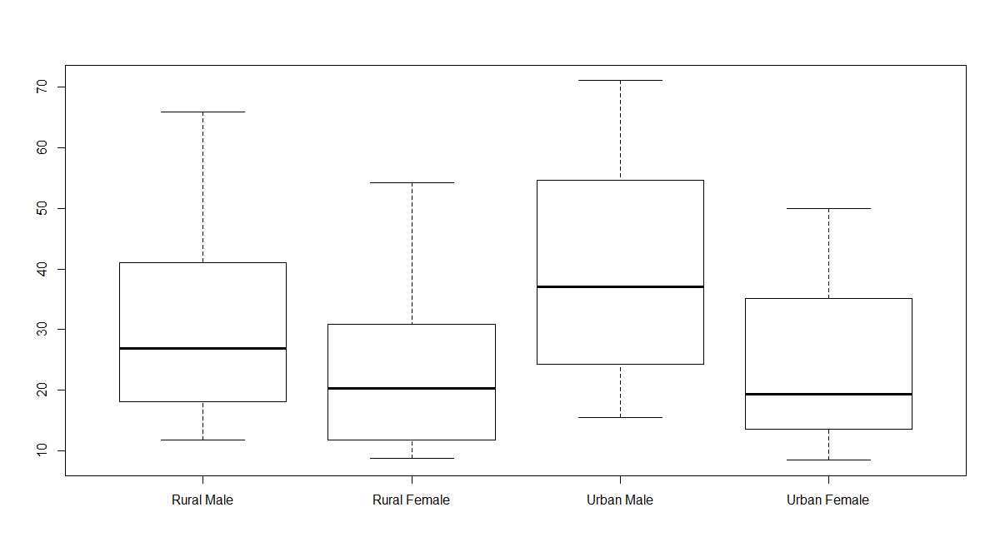


박스2. notch

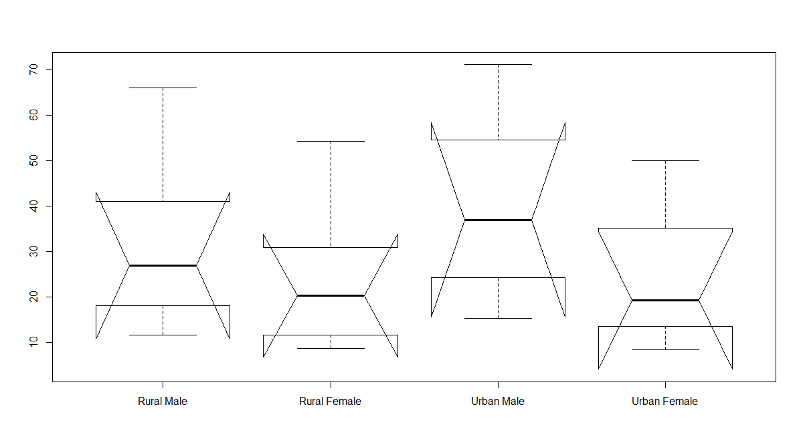


박스3. 빨간 기준선

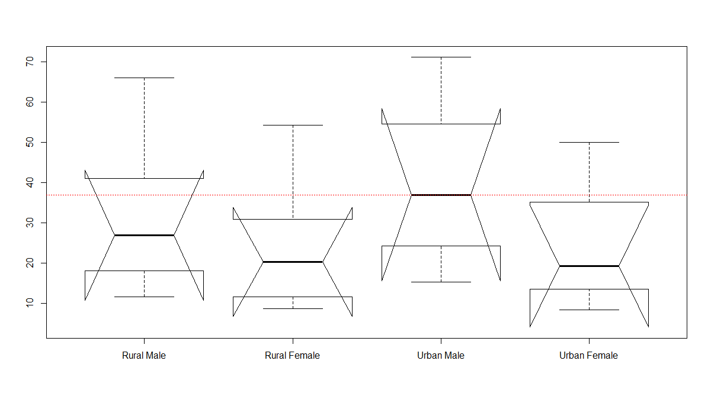


## 실습5 : 히스토그램

- 히스토그램 -  측정값의 범위(구간)를 그래프의 x축으로 놓고, 범위에 속하는 측정값의 출현 빈도수를 y축으로 나타낸 그래프 형태

- 히스토그램의 도수의 값을 선으로 연결하면 분포곡선을 얻을 수 있다
  - iris 데이터는 붓꽃 3종류의 관측 데이터 
  - Sepal.length, Sepal.Width(꽃받침)
  - Petal.length, Petal.Width(꽃잎)

실습 

```R
data(iris)

names(iris) 

str(iris)     #data.frame, 

head(iris)

summary(iris$Sepal.Length) #꽃받침 길이의 요약 통계

#실습-1
hist(iris$Sepal.Length, xlab="iris$Sepal.Length", 
     col="magenta", main="꽃받침 길이 histogram" , xlim=c(4.3, 7.9))


#실습 -2 빈도수로 히스토그램 그리기
par(mfrow=c(1,2))
hist(iris$Sepal.Width, xlab="iris$Sepal.Width", 
     col="green", main="꽃받침 넓이 histogram" , xlim=c(2.0, 4.5))

#실습 -3 확률 밀도로 히스토그램 그리기
hist(iris$Sepal.Width, xlab="iris$Sepal.Width", 
     col="mistyrose", freq=F,
     main="꽃받침 넓이 histogram" , xlim=c(2.0, 4.5)) 

#실습 -4 밀도를 기준으로 분포 곡선 추가
lines(density(iris$Sepal.Width), col="red") 

#실습 -5정규분포 추정 곡선 추가
x<-seq(20, 4.5, 0.1)
curve(dnorm(x, mean=mean(iris$Sepal.Width), sd=sd(iris$Sepal.Width)), 
      col="blue", add=T)


```


결과 1 :  꽃받침 길이에 대한 히스토그램

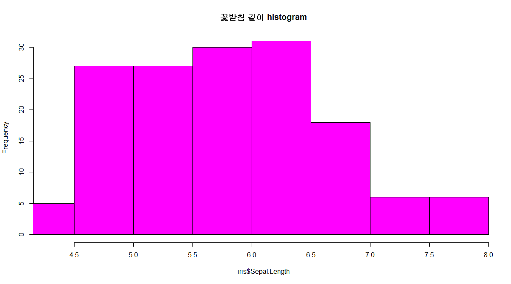


결과 2 : 빈도 수로 히스토그램 그리기

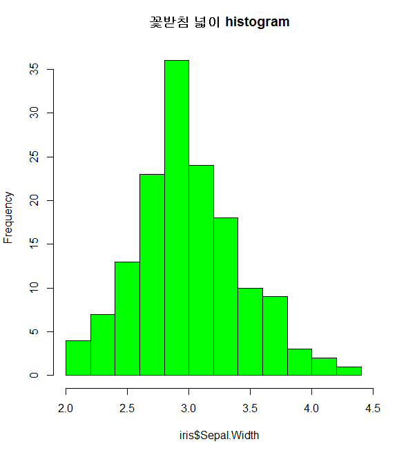


결과 3 : 확률 밀도로 히스토그램 그리기

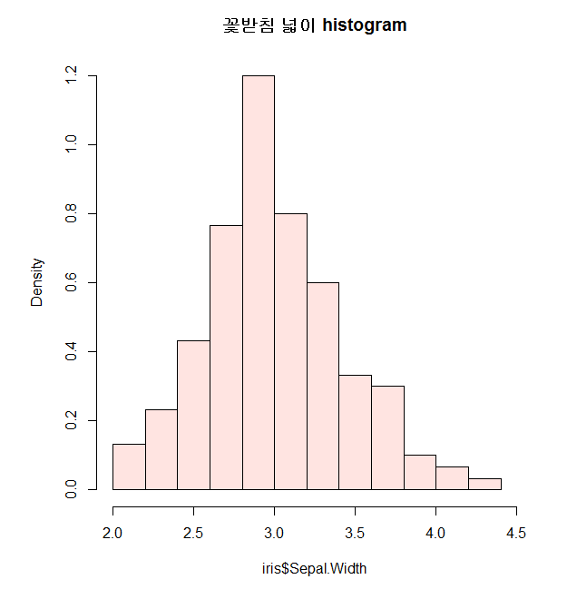


결과 4 : 분포 곡선 그리기

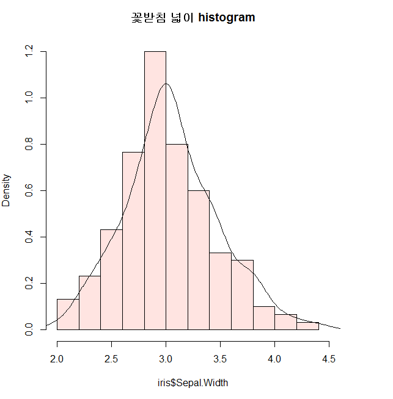


결과 5 : 정규분포 곡선 그리기

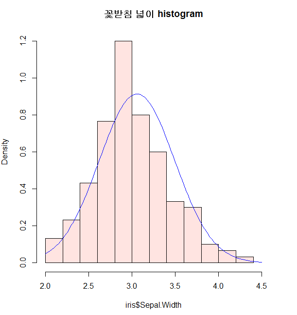


## 실습 6 :  책 2장 연습문제 28p - plot함수


type 인수 : 

p : 점( points )

l : 선 (lines )

b : 점과 선 ( both points and lines)

c : b옵션에서 점이 빠진 모습 

o : 겹친 점과 선 ( overplotted)

h : 수직선 (high denstiy)

s : 수평선 우선의 계단 모양(stpes)

S : 수직선 우선의 계단 모양(stpes)

n : 출력하지 않음 (no plotting)


실습 코드 :

```R
#x 좌표를 위한 벡터
x1 <- 1:5
#y 좌표를 위한 벡터
y1 <- x1^2
#벡터 생성
z1 <- 5:1

#행렬 생성
(mat1 <- cbind(x1,y1,z1))

#그래픽 윈도우의 화면 분할 ( 2행 3열 )
op <- par(no.readonly = T)
par(mfrow=c(2,3))

#일변량 그래프 
plot(y1, main= "using index")
#이변량 그래프 
plot(x=x1, y=y1, main= "x^2")
#이변량 그래프 (행렬)
plot(mat1, main="using matrix")
plot(x1,y1, type="l", main="line")
plot(x1,y1, type="h", main="high density")
plot(x1,y1, type="n", main="no plotting")
#그래픽 윈도우의 화면 병합 (1행 1열)
par(op)
# 6개의 그림 영역 설정을 해제하기 위해 마지막에 par 함수로 설정하는 작업을 해준다.

```


결과 : 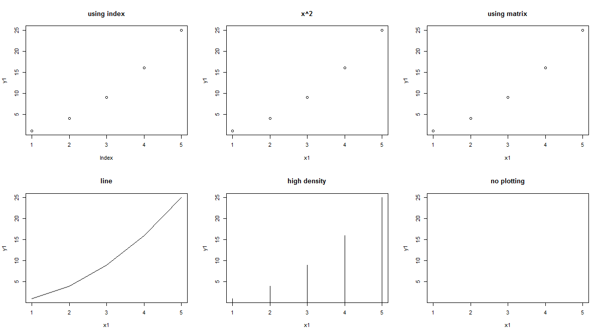


## 실습 6-2 : ※ 화면분할


mfrow(1,2)


mfrow(2,3)

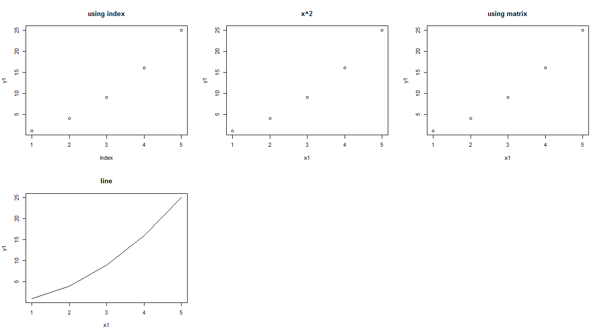


mfrow는 그래프를 한번에 몇개 보여줄지를 설정하는 명령어다.


mfrow뿐만 아니라 par 도 같이 쓰는데

````
#그래픽 윈도우의 화면 분할 ( 2행 3열 )
op <- par(no.readonly = T) # 1
par(mfrow=c(2,3))

par(op) # 2

#6개의 그림 영역 설정을 해제하기 위해 마지막에 par 함수로 설정하는 작업을 해준다.
````

#1 과 #2 와 같이 시작과 끝에서 함수로 설정을 해주어야 한다.


## 실습 7 :  책 2장 연습문제 30p - points()함수

포인트의 라벨들을 전부 출력하고 옆에 텍스트 같이 넣어주는 예제


코드 : 

```R
x <- rep(1:5, rep(5,5))
y <- rep(5:1, 5)

pchs <- c("&","z","Z","1","가")
plot(1:5, type = "n", xlim = c(0,7.5), ylim = c(0.5,5.5), main = "points by 'pch'")
points(x,y,pch=1:25,cex=1.5)
text(x - 0.4, y, labels = as.character(1:25), cex=1.2)
points(rep(6,5), 5:1, pch = 65:69, cex=1.2)
text(rep(6,5) - 0.4, y, labels = as.character(65:69), cex=1.2)
points(rep(7,5), 5:1, pch = pchs, cex=1.5)
text(rep(7,5) - 0.4, y, labels = paste("'", pchs, "'", sep = ""), cex=1.2)

```


실행 결과

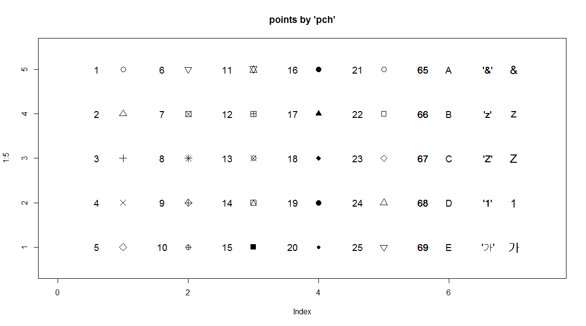


## 실습 8 :  책 2장 연습문제 32p - abline()함수

시간 부족해서 못하면 내일 할듯


코드 :

```
cars[1:4,]
z <- lm(dist ~ speed, data = cars)
is(z)

z$coef

plot(cars,main = "abline")
```


