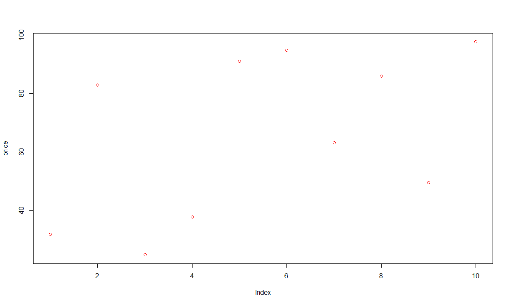
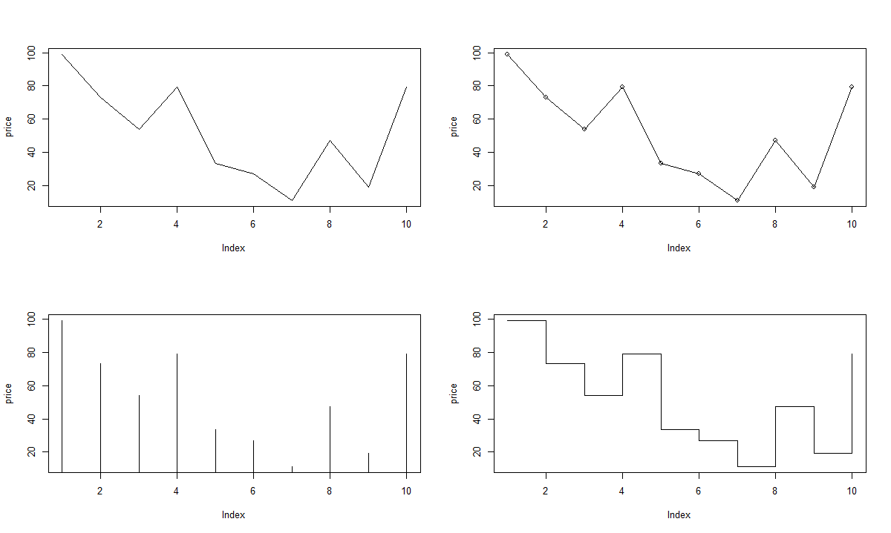
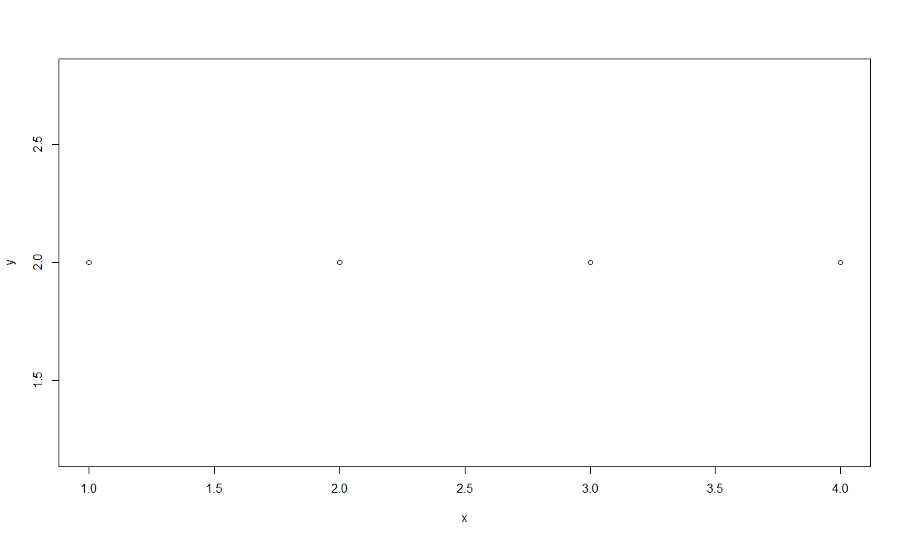
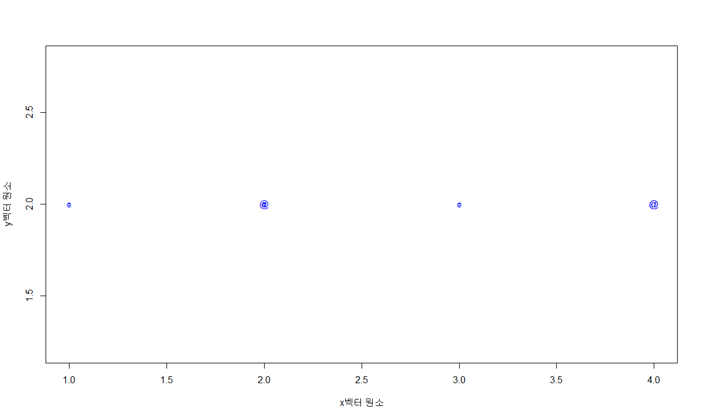

# R 4일차


## 과제 : 

```R
##############################################
게임 매상 감소 원인 분석
##############################################
 
 
# CSV 파일을 읽어들이기
dau <- read.csv("./data/dau.csv", header = T, stringsAsFactors = F)
head(dau)
dpu <- read.csv("./data/dpu.csv", header = T, stringsAsFactors = F)
head(dpu)
install <- read.csv("./data/install.csv", header = T, stringsAsFactors= F)
head(install)


# DAU 데이터에 Install 데이터를 결합시키기 (merge함수)
# 기준변수 ("user_id", "app_name")

# 1차결합된 데이터에 DPU 데이터를 결합시키기 (merge함수)
# 기준변수 (("log_date", "app_name", "user_id") 

# 비과금 유저의 과금액에 0을 넣기 ( data[row,col]<-0)
#데이터객체[is.na(데이터객체$컬럼명)] <- 0

# 월 항목 추가   (data.frame객체$새컬럼변수 <- 추가될 데이터, mutate, cbind 등 이용)

# 추가된 월 항목으로 그룹핑후 과금액 집계 (ddply, aggregate, dplyr::group_by등 이용)

# 신규 유저인지 기존 유저인지 구분하는 항목의 새 컬럼변수 추가

# 그래프로 데이터 시각화 
```


내 코드 :

```R
# CSV 파일을 읽어들이기
  dau <- read.csv("./datas/dau.csv", header = T, stringsAsFactors = F)
  head(dau)
  
  dpu <- read.csv("./datas/dpu.csv", header = T, stringsAsFactors = F)
  head(dpu)
  
  install <- read.csv("./datas/install.csv", header = T, stringsAsFactors= F)
  head(install)
  
  # DAU 데이터에 Install 데이터를 결합시키기 (merge함수)
  merge1 <- merge(dau,dpu)
  head(merge1)
  # 1차결합된 데이터에 DPU 데이터를 결합시키기 (merge함수)
  game <- merge(merge1,install)
  head(game)
  # 비과금 유저의 과금액에 0을 넣기 ( data[row,col]<-0)
  game[is.na(game)]<-0
  
  game
  
  
  
  
  # 월 항목 추가   (data.frame객체$새컬럼변수 <- 추가될 데이터, mutate, cbind 등 이용)
  

  
  game_date <- game[(format(game$log_date, "%Y-%m") == "2013-06")]

  game_6 <- subset(game, as.Date(log_date) >= as.Date("2013-06-01") & as.Date(log_date) < as.Date("2013-07-01"))
  game_7 <- subset(game, as.Date(log_date) >= as.Date("2013-07-01") & as.Date(log_date) < as.Date("2013-08-01"))
  
  game_data
  
  
  game_67 <-  game  %>% mutate(month=ifelse(as.Date(log_date) >= as.Date("2013-06-01") & as.Date(log_date) < as.Date("2013-07-01") , "06", "07" ) ) 
  print( game_67 )
  
  #이게 진짜 
  game_679 <-  game  %>% mutate(month=ifelse(as.Date(log_date) >= as.Date("2013-06-01") & as.Date(log_date) < as.Date("2013-07-01") , "06", 
                ifelse(as.Date(log_date) >= as.Date("2013-07-01") & as.Date(log_date) < as.Date("2013-08-01") , "07" ,"NULL")))  
                
  print( game_679 )
  
  
  
  # 추가된 월 항목으로 그룹핑후 과금액 집계 (ddply, aggregate, dplyr::group_by등 이용)
  
  
  game_pay_total <- game_679 %>% group_by(month) %>% summarise(total_payment=sum(payment))
  
  game_pay_total
  
  # 신규 유저인지 기존 유저인지 구분하는 항목의 새 컬럼변수 추가
  
  game_new_olg <-  game  %>% mutate(new=ifelse(as.Date(log_date) == as.Date(install_date ) , "new" ,"original"))  
  
  print( game_new )
  
  game_new <- game_new_olg %>% filter(new == "new")
  print(game_new)
  
  game_new_olg_pay <- select(game_new_olg, new, payment)
  
 
  
  # 그래프로 데이터 시각화 
  
  game_pay_total
  
  game_new_olg_pay
```


답 코드 

```R

##############################################
게임 매상 감소 원인 분석
##############################################
 
 
# CSV 파일을 읽어들이기
dau <- read.csv("./data/dau.csv", header = T, stringsAsFactors = F)
head(dau)
dpu <- read.csv("./data/dpu.csv", header = T, stringsAsFactors = F)
head(dpu)
install <- read.csv("./data/install.csv", header = T, stringsAsFactors= F)
head(install)


# DAU 데이터에 Install 데이터를 결합시키기 (merge함수)
# 기준변수 ("user_id", "app_name")
dau.install <- merge(dau, install, by = c("user_id", "app_name"))
head(dau.install)

# 1차결합된 데이터에 DPU 데이터를 결합시키기 (merge함수)
# 기준변수 (("log_date", "app_name", "user_id") 
dau.install.payment <- merge(dau.install, dpu, 
                       by = c("log_date","app_name", "user_id"), 
                       all.x = T)
head(dau.install.payment, 20)
head(na.omit(dau.install.payment))

# 비과금 유저의 과금액에 0을 넣기 ( data[row,col]<-0)
#데이터객체[is.na(데이터객체$컬럼명)] <- 0
dau.install.payment$payment[is.na(dau.install.payment$payment)] <- 0
head(dau.install.payment, 20)

# 월 항목 추가   (data.frame객체$새컬럼변수 <- 추가될 데이터, mutate, cbind 등 이용)
dau.install.payment$log_month <-substr(dau.install.payment$log_date, 1, 7)
dau.install.payment$install_month <- substr(dau.install.payment$install_date, 1, 7)
head(dau.install.payment, 20)


# 추가된 월 항목으로 그룹핑후 과금액 집계 (ddply, aggregate, dplyr::group_by등 이용)
mau.payment <- ddply(dau.install.payment,
                     .(log_month, user_id, install_month), # 그룹화
                     summarize, # 집계 명령
                     payment = sum(payment) # payment 합계
                     )

head(mau.payment, 10)


# 신규 유저인지 기존 유저인지 구분하는 항목의 새 컬럼변수 추가
mau.payment$user.type <-  ifelse(mau.payment$install_month == mau.payment$log_month, "new", "old")


# 그래프로 데이터 시각화 
library("ggplot2")

ggplot(mau.payment.summary, aes(x = log_month, 
                             y = total.payment,
                             fill = user.type)) + 
       geom_bar(stat="identity") 
```


## 실습 1 : 산점도

- 산점도(scatter plot) : 두 개 이상의 변수들 사이의 분포를 점으로 표시한 차트, 두 변수의 관계를 시각적으로 분석할 때 유용


기본 

```R
price <- runif(10, min=1, max=100)
print(price)
plot(price, col="red")
```


결과 : 




선 덧그리기


```R
par(new=T) #차트 추가
line_chart=1:100
#x축은 생성된 난수의 순서,  y축은 
plot(line_chart, type="l", col="red", axes=F, ann=F) #대각선 추가 
```


### plot 선 그리기


- 좌표평면상의 점 등을 선으로 연결

코드 :

```
par(mfrow=c(2, 2))
plot(price, type="l")  #실선
plot(price, type="o")  #원형과 실선
plot(price, type="h")  #직선
plot(price, type="s")  #꺽은선
```





### 중복된 데이터의 수만큼 plot점 크기 확대

기본 플롯

```
x<-c(1, 2, 3, 4, 2, 4)
y<-rep(2, 6)
table(x, y)  #빈도수
par(mfrow=c(1, 1))
plot(x, y)
```


결과 : 


빈도수에 따라 점 크기 다르게 하기

```
xy.df <- as.data.frame(table(x, y))
xy.df
plot(x, y, pch='@', col='blue', cex=0.5*xy.df$Freq, 
     xlab="x벡터 원소", ylab="y벡터 원소")
```


결과 : 




install.packages("psych")
library(psych)
data(galton)

#child컬럼, parent컬럼을 대상으로 교차테이블을 생성 결과를 데이터프레임으로 생성
galtondf <- as.data.frame(table(galton$child, galton$parent))
head(galtondf)
str(galtondf)

names(galtondf) <-c("child", "parent", "freq")
head(galtondf)
parent <- as.numeric(galtondf$parent)
child <- as.numeric(galtondf$child)

plot(parent, child, pch=21, col="blue", bg="green", 
     cex=0.2*galtondf$freq, xlab="parent", ylab="child")