# R ggplot


### ggplot 패키지를 이용한 시각화

```
#ggplot2문법은 레이어(layer) 구조로 되어 있다.

# 1단계 : 배경 설정(축) 
# ggplot(data, aes(x, y, ..)) : 사용할 데이터 지정
# 데이터는 data.frame 타입으로 변환 후 입력

# 2단계 : 그래프 추가(점, 막대, 선)
geom_boxplot, geom_histogram, geom_col, geom_bar,  geom_line, geom_point

# 3단계 : 설정 추가(축 범위, 색, 표식)
xlim(), ylim(), labs(), theme()....
```


## 실습 : 배경, 산점도, 빨강산점도, 꺾은선, 겹쳐그리기

```
installed.packages("ggplot2")
library(ggplot2)
str(airquality)

# 1. x축을 Day, y축을 Temp로 맵핑
ggplot(airquality, aes(x = Day, y= Temp))

# 2. x축을 Day, y축을 Temp로 맵핑한 후 산점도 그리기
ggplot(airquality, aes(x = Day, y= Temp)) + geom_point()

# 3. 크기를 3, 색상을 빨강으로 적용하여 산점도 그리기
ggplot(airquality, aes(x = Day, y= Temp)) + geom_point(size = 3, color = "red")

# 4. x축을 Day, y축을 Temp로 맵핑한 후 꺾은선 그래프 그리기 
ggplot(airquality, aes(x = Day, y= Temp)) + geom_line()

# 5. 그래프 겹쳐 그리기 (꺾은선, 산점도)
ggplot(airquality, aes(x = Day, y= Temp)) + geom_line() + geom_point()

```


1. 배경

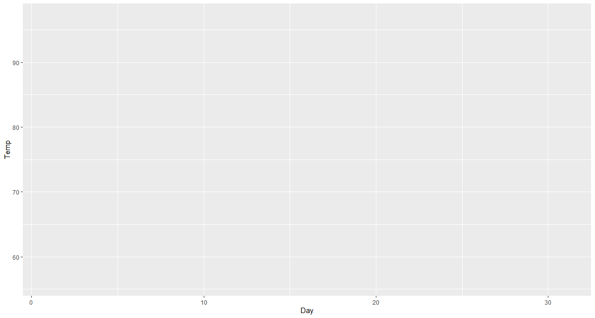


2. 산점도


3. 빨강산점도

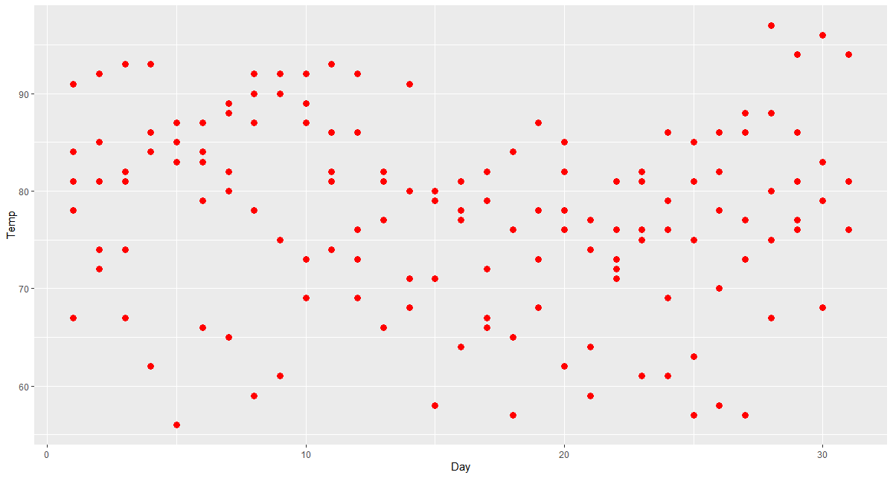


4. 꺾은선

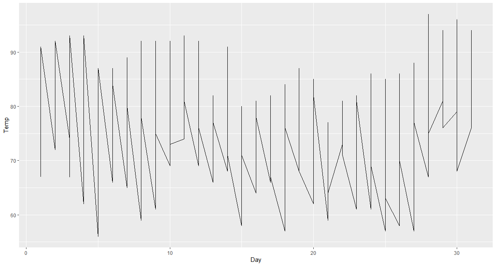


5. , 겹쳐그리기

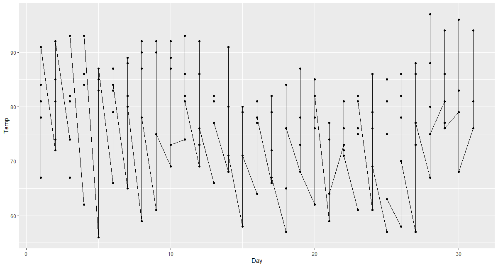


## 실습 : 막대, 원 그래프


코드 : 

```R
============== 막대 ========
#1. mtcars에서 cyl 종류별 빈도수 확인
ggplot(mtcars, aes(x=cyl)) + geom_bar(width = 0.5)

#2. 빈 범주를 제외하고 cyl 종류별 빈도수 확인
ggplot(mtcars, aes(x=factor(cyl))) + geom_bar(width = 0.5)

#3. cyl 종류별 gear 빈도 누적 막대 그래프
ggplot(mtcars, aes(x=factor(cyl))) + geom_bar(aes(fill=factor(gear)))


=============== 원 =====
#4. 선버스트 (누적막대로)
  ggplot(mtcars, aes(x=factor(cyl))) + geom_bar(aes(fill=factor(gear))) + coord_polar()

#5. 원그래프 
ggplot(mtcars, aes(x=factor(cyl))) + geom_bar(aes(fill=factor(gear))) + coord_polar(theta = "y")
```


결과 : 


1.

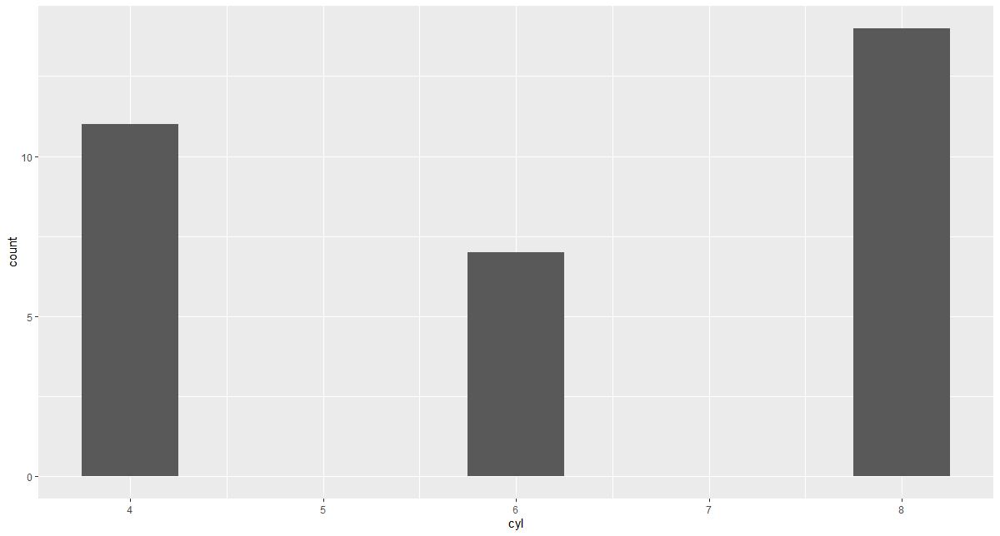


2.

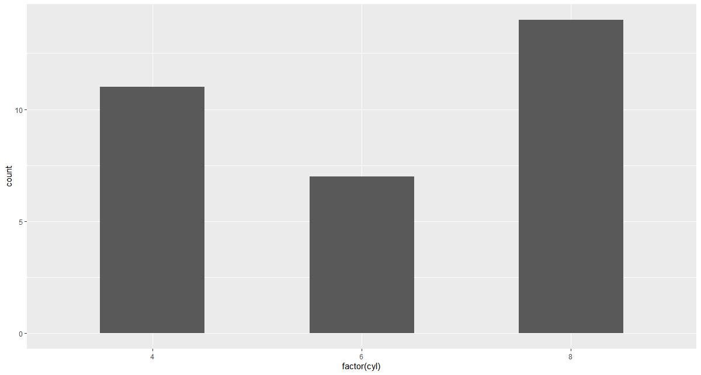


3.

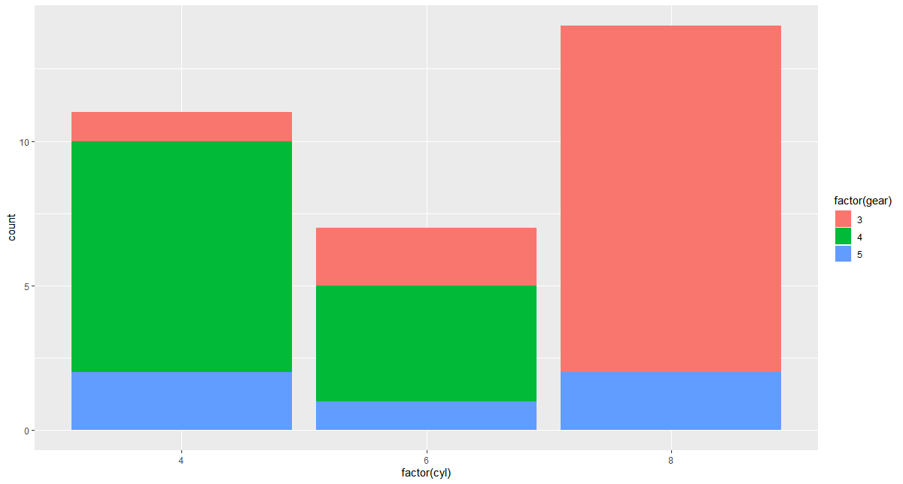


4.


5. 


## 실습 : 상자 그림 & 히스토그램 

```R
========== 상자 그림 & 히스토그램 =============

  
  # 1. airquality 에서 Day 열을 그룹 지어 날짜별 온도 상자 그림을 그림 
  ggplot(airquality, aes(x = Day, y= Temp, group = Day)) + geom_boxplot()

  # 2. airquality 에서 히스토그램
  ggplot(airquality, aes(Temp)) + geom_histogram()

  # 2-2. 히스토그램 비율조정  
  ggplot(airquality, aes(Temp)) + geom_histogram(binwidth = 1)
  
```


1.

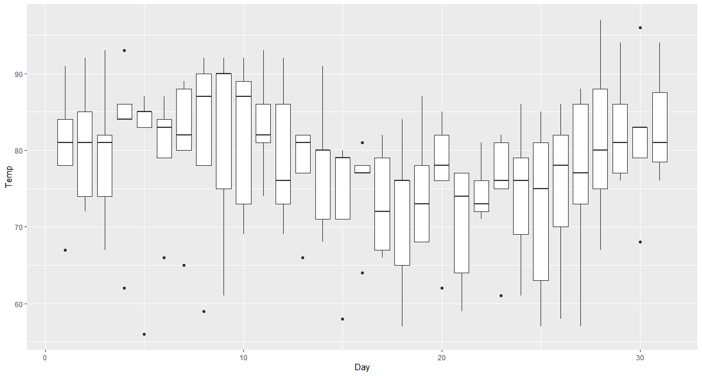


2.

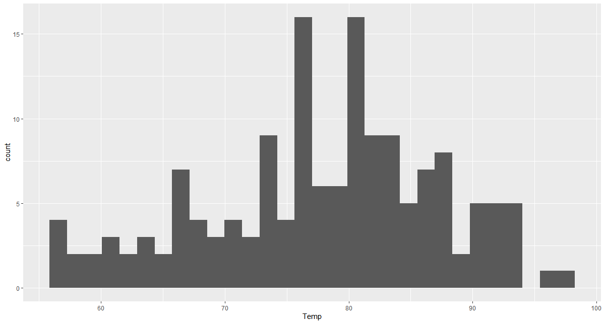


3.


## 실습 : 객체 추가 ( 선, 텍스트, 도형 )


### 객체 추가 - 선 

코드 : 

```R
 =========== 객체 추가 - 선  =========
    
    #1. 꺾은선 그래프에 사선 그리기
    
    ggplot(economics, aes(x = date, y = psavert)) + geom_line() +
    geom_abline(intercept = 12.18671, slope = -0.0005444)

    #2. 꺾은선 그래프에 평행선 그리기
     ggplot(economics, aes(x = date, y = psavert)) + geom_line() +
    geom_hline(yintercept = mean(economics$psavert))

    #3. 꺾은선 그래프에 수직선 그리기
     
     library(dplyr)
    #개인 저축률(psavert)이 최솟값일 때의 날짜(date)를 구해 x_inter 변수에 할당 
     x_inter <- filter(economics, psavert == min(economics$psavert))$date
  
     ggplot(economics, aes(x = date, y = psavert)) + geom_line() +
       geom_vline(xintercept = x_inter)
```


결과 :


1.

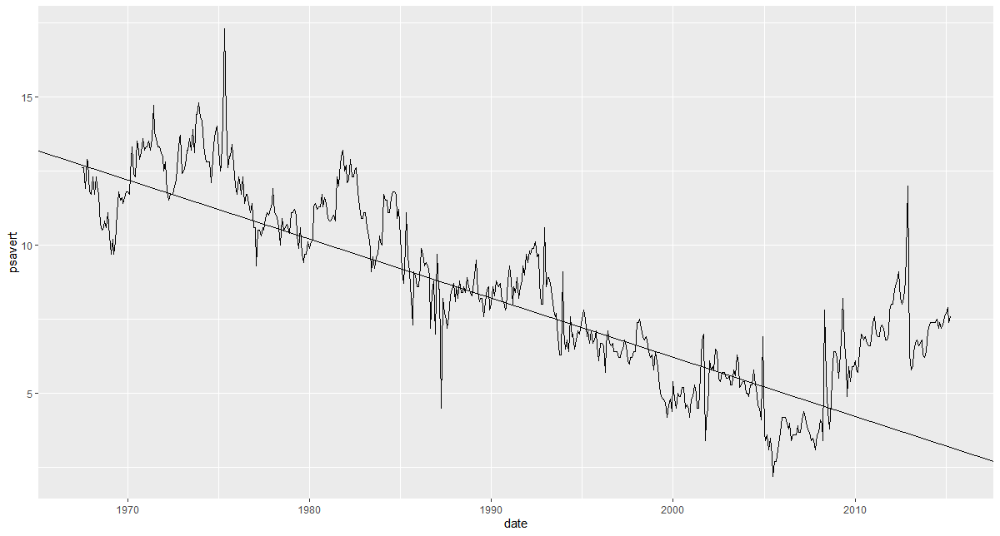


2.


3.


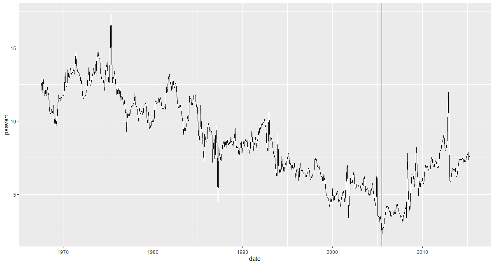


### 텍스트 입력 및 도형 그리기


코드 : 

```R
 =========== 객체 추가 - 도형, 텍스트  ========
     
    #1. 산점도를 그리고 데이터 레이블 입력하기
       
       #goem_text(aes(label = 라벨명, vjust = 세로위치, hjust = 가로위치)
       
       ggplot(airquality, aes( x = Day, y = Temp)) + 
       geom_point() +
       geom_text(aes(label = Temp, vjust = 0, hjust = 0))

     
    #2. 산점도에 사각형 그리기       
     
     # annotate("모양", xmin = x축 시작, xmax = x축 끝, ymin = y축 시작, ymax = y축 끝)

     ggplot(mtcars, aes(x = wt, y = mpg)) +
       geom_point() + 
       # x축 3~4, y축 12~21 위치에 하늘색 투명한(alpah=0.5) 사각형 그리기
       annotate("rect", xmin = 3, xmax = 4, ymin = 12, ymax=21, alpha = 0.5, fill = "skyblue")
       
     
     #3. 산점도에 사각형 및 화살표 그리기
     
     ggplot(mtcars, aes(x = wt, y = mpg)) +
       geom_point() + 
       # x축 3~4, y축 12~21 위치에 하늘색 투명한(alpah=0.5) 사각형 그리기
       annotate("rect", xmin = 3, xmax = 4, ymin = 12, ymax=21, alpha = 0.5, fill = "skyblue") +
       # x축 2.5 ~ 3.7, y축 10~17 위치에 빨간색 화살표 그리기
       annotate("segment", x=2.5, xend =3.7, y= 10, yend = 17, color = "red" , arrow= arrow()) 
     
     
     
     #4. 산점도에 사각형, 화사표, 레이블 추가하기
     
     ggplot(mtcars, aes(x = wt, y = mpg)) +
       geom_point() + 
       annotate("rect", xmin = 3, xmax = 4, ymin = 12, ymax=21, alpha = 0.5, fill = "skyblue") +
      annotate("segment", x=2.5, xend =3.7, y= 10, yend = 17, color = "red" , arrow= arrow()) +
     annotate("text", x=2.5, y= 10, label = "point") 
     
```


1.

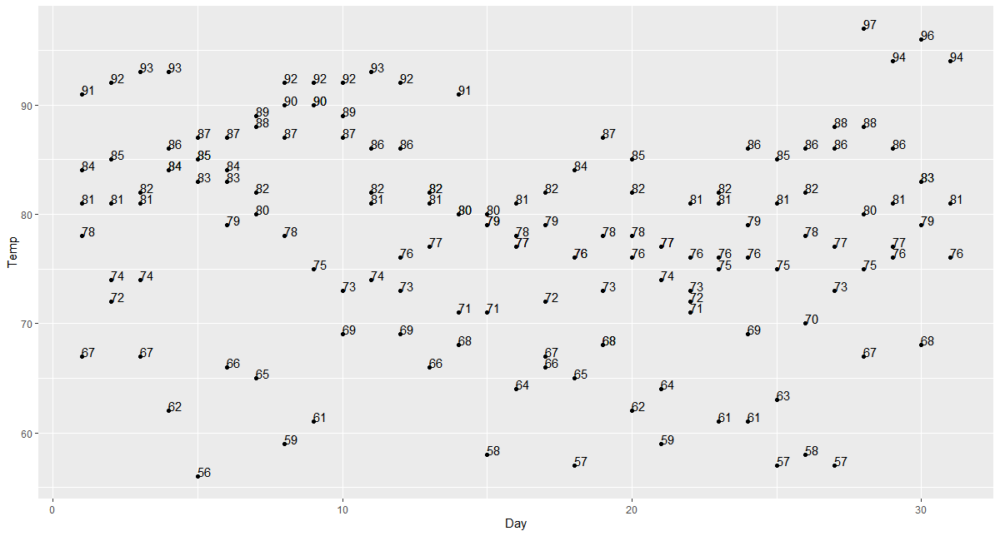


2.


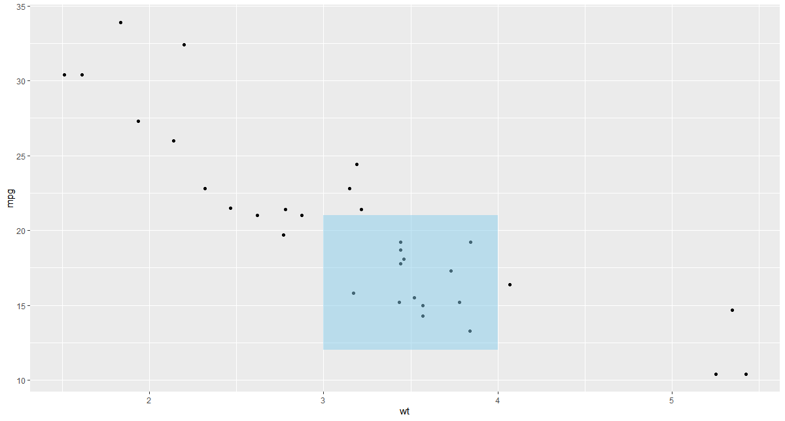


3.


4.


## 실습 : 그래프 제목 및 축 제목을 추가하고 디자인 테마 작용하기


```R
#labs(x = "x축 이름", y = "y축 이름", title = "그래프 제목")

 # 1. 막대 그래프에 제목 추가하기 
     
     ggplot(mtcars, aes( x= gear)) + geom_bar() +
       labs(x= "기어수", y= "자동차수", title = "변속기 기어별 자동차수")
     
 # 2. 테마 적용하기
     ggplot(mtcars, aes( x= gear)) + geom_bar() +
       labs(x= "기어수", y= "자동차수", title = "변속기 기어별 자동차수") + theme_dark()
     

```


#### 테마 종류 

- theme_gray() : 흰색 바탕과 흰 선

- theme_bw() : 흰 바탕과 회색 선

- theme_linedraw() : 흰 바탕과 가늘고 검은 선

- theme_light() : 밝은 회색 바탕

- theme_dark() : 어두운 바탕

- theme_minimal() : 단순한 배경

- theme_classic() : 눈금과 안내선이 없는 기본 바탕

- theme_void() : 가장 간결한 바탕

  등이 있다.


1.

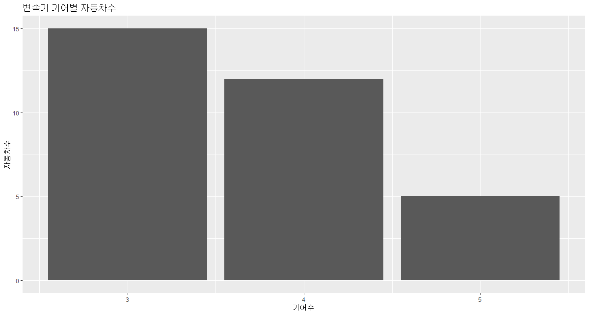


2.

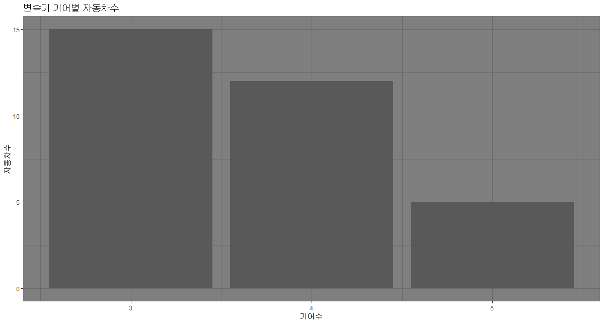

