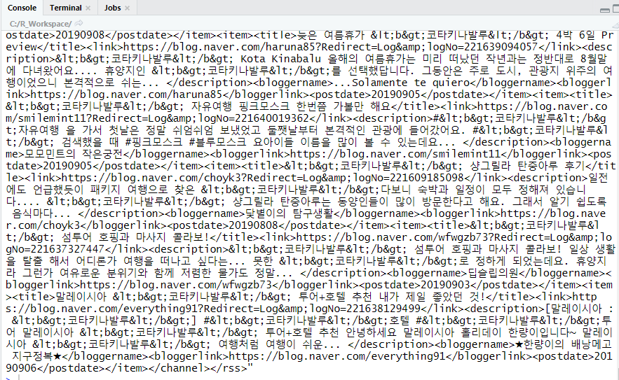
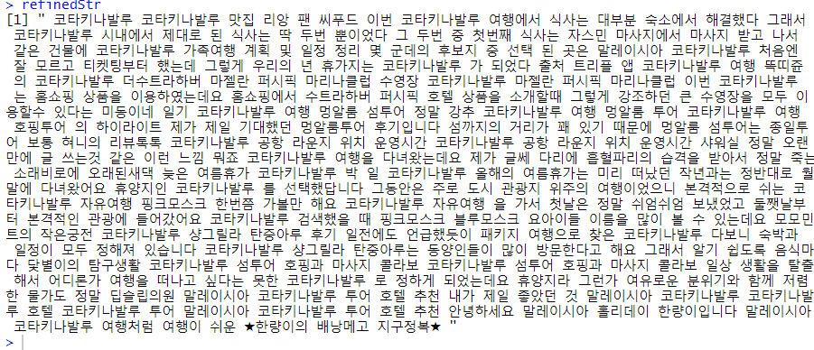

# R 네이버 검색 API 활용 + 시각화

코드 : 아이디 , 비번만 발급받아서 사용 

```R
#기본 URL
urlStr <- "https://openapi.naver.com/v1/search/blog.xml?"
#검색어 설정 및 UTF-8 URL 인코딩
searchString <- "query=코타키나발루"
#UTF-8 인코딩
searchString <- iconv(searchString, to="UTF-8")
#URL 인코딩
searchString <- URLencode(searchString)
searchString

#나머지 요청 변수 : 조회 개수 100개, 시작페이지1, 유사도순 정렬
etcString <- "&dispaly=100&start=1&sort=sim"

#URL 조합
reqUrl <- paste(urlStr, searchString, etcString, sep="")
reqUrl

#get방식으로 URL을 호출하기 위해 httr 패키지의 GET함수 활용
library(httr)
clientID <- 아이디 	#아이디나 비번은 개발자센터에서 신청해서 받으셈
clientSecret <- 비번


#인증 정보는 add_headers에 담아 함께 전송
apiResult <- GET(reqUrl, add_headers("X-Naver-Client-Id"=clientID,
                                  "X-Naver-Client-Secret"=clientSecret))

apiResult #응답 코드 status가 200이면 정상

# OpenAPI의 결과 구조 확인 (UTF-8로 인코딩된 XML 형식)
str(apiResult) #XML 응답값은 "content"에 담겨있음.

apiResult$content
str(apiResult$content)

#raw형식이므로 rawToChar()를  활용해 문자로 변환
result <- rawToChar(apiResult$content)
result

#인코딩(한글깨짐 고쳐줌)
Encoding(result) <- "UTF-8"
result # 블로그 링크, 제목, 이름, 요약정보등을 제공
```


결과 : 




## gsub


```R
#워드 클라우드에 표현할 단어를 추출하기 전에 문자열을 치환하는 gsub 함수를 활용해 불필요한 XML관련 태그(tag)와 특수문자 제거
#gsub(pattern, replacement, x, ignore.case)
#변환 전 문자열(정규표현식 가능), 변환 후 문자열, 변환할 문자열 벡터, 대소문자 무시 

gsub("ABC", "***", "ABCabcABC")  #ABC를 **로 변환
gsub("ABC", "***", "ABCabcABC", ignore.case=T)
x<-c("ABCabcABC", "abcABCabc")
gsub("ABC", "***", x) 

#gsub()는 고정된 문자열뿐 아니라 정규표현식을 통해 특정 패턴의 문자열들도 치환할 수 있습니다.
# 패턴문자  \\w 는 '_'를 포함한 문자와 숫자
# 패턴문자  \\W 는  \\w 의 반대의미 '_'와 문자와 숫자를 제외한 기호
# 패턴문자  \\d 는  숫자
# 패턴문자  \\D 는  숫자를 제외한 기호와 문자
# 패턴문자 []는 대괄호 안의 문자 중 한 개를 의미
# 패턴문자 [^]는 대괄호 안의 문자가 없는 패턴을 의미

gsub("b.n", "***", "i love banana")  
gsub("b.*n", "***", "i love banana") 
gsub("[bn]a", "***", "i love banana") 
gsub("010-[0-9]{4}-[0-9]{4}", "010-****-****", "내 폰번호는 010-1234-6789") 
gsub("010-\\d{4}-\\d{4}", "010-****-****", "내 폰번호는 010-1234-6789") 


#문자 + : one or more
#문자 ? : zero or one
#문자 * : zero or more
```


## 블로그 검색 결과에서 gsub로 치환하기

```R
refinedStr <- result
#XML 태그를 공란으로 치환
refinedStr <- gsub("<\\/?)(\\w+)*([^<>]*)>", " ", refinedStr)
#단락을 표현하는 불필요한 문자를 공란으로 치환
refinedStr <- gsub("[[:punct:]]", " ", refinedStr)
#영어 소문자를 공란으로 치환
refinedStr <- gsub("[a-z]", " ", refinedStr)
#영어 대문자를 공란으로 치환
refinedStr <- gsub("[A-Z]", " ", refinedStr)
#숫자를 공란으로 치환
refinedStr <- gsub("[0-9]", " ", refinedStr)
#여러 공란은 한 개의 공란으로 변경
refinedStr <- gsub(" +", " ", refinedStr)

refinedStr 
```


**문자 + : one or more**
**문자 ? : zero or one**
**문자 * : zero or more**


gsub 결과 : 




여기 해봐

```r
################################################################
#한글 자연어 분석 패키지 KoNLP
#extractNoun()는 입력받은 문장에서 단어를 추출해 벡터로 반환
#extractNoun( "안녕하세요 오늘은 기분 좋은 하루 입니다.")
##########################################################
library(KoNLP)
library(rJava)

nouns<- extractNoun( refinedStr )
str(nouns)
nouns[1:40]

#길이가 1인 문자를 제외
nouns <-nouns[nchar(nouns) > 1]

#제외할 특정 단어를 정의
excluNouns <- c("코타키나발루", "얼마" , "오늘", "으로", "해서", "API", "저희", "정도")
# ?? excluNouns <- c("코타키나발루", "얼마" , "오늘", "으로", "해서", "API", "저희", "정도")


nouns  <- nouns [!nouns  %in% excluNouns ]
nouns [1:40]

#빈도수 기준으로 상위 50개 단어 추출
wordT <- sort(table(nouns), decreasing=T)[1:50]
wordT

#wordcloud2 패키지 
# wordcloud2 (data, size, shape) 
# 단어와 빈도수 정보가 포함된 데이터프레임 또는 테이블, 글자 크기, 워드 클라우드의 전체 모양(circle:기본# 값, cardioid, diamond, triangle, star등)

install.packages("wordcloud2")
library(wordcloud2)
wordcloud2(wordT, size=3, shape="diamond")
```


