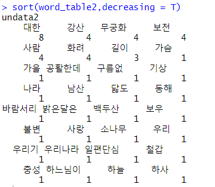
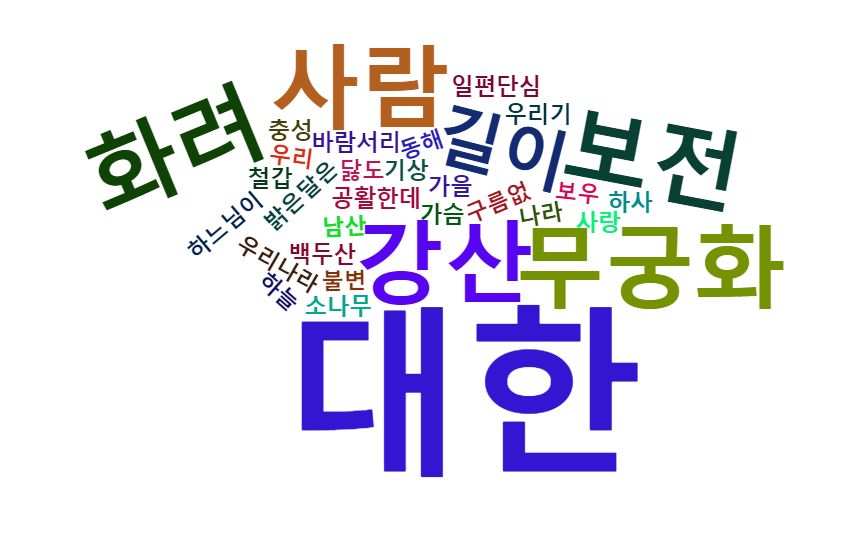
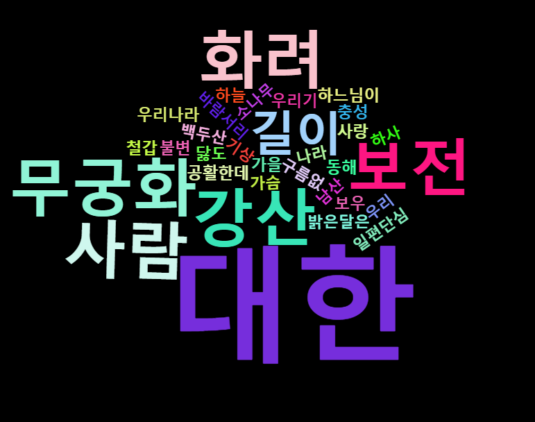
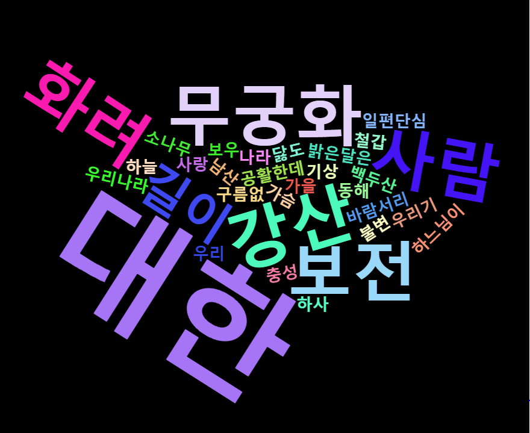
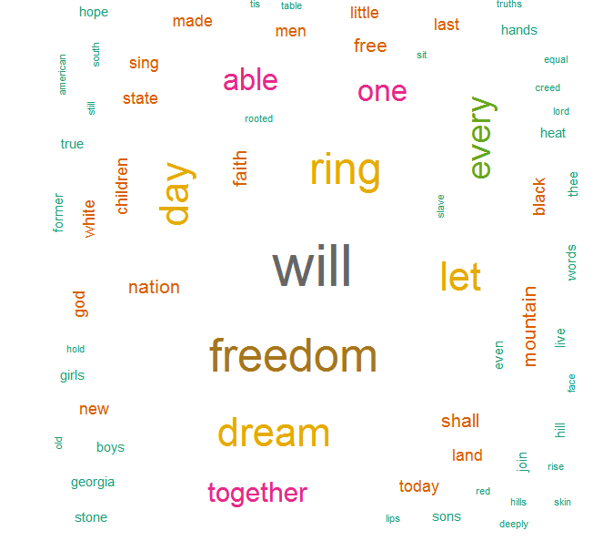

# R 시각화 2일차


## KoNLP 한글 분석 패키지 , wordcloud2 패키지

※ 오류나면 rJava룰 먼저 설치해야함.


##### 사용할 사전 설정

```R
install.packages("KoNLP")
install.packages("wordcloud2")

library(KoNLP)
useSystemDic()
useSejongDic()
useNIADic()

```


#### 애국가 단어 워드클라우드로 만들기


테이블 형태로 만들기 




코드 : 

```R
library(KoNLP)

useSejongDic()

#https://mois.go.kr/frt/sub/a06/b08/nationalIcon_3/screen.do 에서 애국가 가사파일 다운
word_data <- readLines("datas/애국가(가사).txt")
word_data

#명사만 추출하기
word_data2 <- sapply(word_data, extractNoun, USE.NAMES = F)
word_data2

add_words <- c("백두산", "남산", "철갑", "가을", "하늘", "달")

#사용자 정의 사전 추가 하기
buildDictionary(user_dic = 
                  data.frame(add_words, rep("ncn", length(add_words))),replace_usr_dic = T)

word_data3 <- sapply(word_data, extractNoun, USE.NAMES = F)
View(word_data3)
View(word_data2)     

#행렬을 벡터로 변환하기
undata <- unlist(word_data3)
undata

#사용 빈도 확인하기
word_table <- table(undata)
word_table

#필터링하기
undata2 <- Filter(function(x) {nchar(x) >= 2}, undata)
word_table2 <- table(undata2)
word_table2

#정렬
sort(word_table2,decreasing = T)

```


### 워드클라우드

문법 : wordcloud2 (데이터셋, [옵션])


기본 : 

```R
wordcloud2(word_table2)
```





배경 등 색상 변경하기 :

```R
wordcloud2(word_table2, color = "random-light", backgroundColor = "black")
```





모양 변경하기 : 

```R
#1.
wordcloud2(word_table2, fontFamily = "맑은 고딕", size = 1.2, 
           color = "random-light", backgroundColor = "black", shape = start)
#2.
wordcloud2(demoFreq, size = 1.6, color = rep_len(c("red", "blue"), nrow(demoFreq)))

#3.
wordcloud2(demoFreq, minRotation = -pi/6 , maxRotation = -pi/6 , rotateRatio = 1)

#4.? 결과 안나옴;
wordcloud2(demoFreq, figPath = "datas/user.png")
```


1.




2.


3.


## 영어 워드클라우드


코드 :  (50개 워닝 뜸...?)

```R
####################################################
영문서 형태소 분석 및  워드클라우드
####################################################
# Install
install.packages("tm")  # 텍스트 마이닝을 위한 패키지
install.packages("SnowballC") # 어간추출을 위한 패키지
#install.packages("wordcloud") # word-cloud generator 
install.packages("RColorBrewer") # color palettes
# Load
library("tm")
library("SnowballC")
#library("wordcloud")
library("RColorBrewer")

filePath <- "http://www.sthda.com/sthda/RDoc/example-files/martin-luther-king-i-have-a-dream-speech.txt"
text <- readLines(filePath)
str(text)

# VectorSource () 함수는 문자형 벡터을 만듭니다.
docs <- Corpus(VectorSource(text))
head(docs)

# 텍스트의 특수 문자 등을 대체하기 위해 tm_map () 함수를 사용하여 변환이 수행됩니다.
# “/”,“@”및“|”을 공백으로 바꿉니다.
toSpace <- content_transformer(function (x , pattern ) gsub(pattern, " ", x))
docs <- tm_map(docs, toSpace, "/")
docs <- tm_map(docs, toSpace, "@")
docs <- tm_map(docs, toSpace, "\\|")
head(docs)

# 소문자로 변환
docs <- tm_map(docs, content_transformer(tolower))
# 수치 데이터 제거
docs <- tm_map(docs, removeNumbers)
# 영어 불용어 제거
docs <- tm_map(docs, removeWords, stopwords("english"))

# 벡터 구조로 사용자가 직접 불용어  설정 , 제거
docs <- tm_map(docs, removeWords, c("blabla1", "blabla2")) 

# 문장 부호 punctuations
docs <- tm_map(docs, removePunctuation)

# 공백 제거
docs <- tm_map(docs, stripWhitespace)

# 텍스트 형태소 분석
# docs <- tm_map(docs, stemDocument)


# 문서 매트릭스는 단어의 빈도를 포함하는 테이블입니다. 
# 열 이름은 단어이고 행 이름은 문서입니다. 
# text mining 패키지에서 문서 매트릭스를 생성하는 함수 사용
dtm <- TermDocumentMatrix(docs)
m <- as.matrix(dtm)
v <- sort(rowSums(m),decreasing=TRUE)
d <- data.frame(word = names(v),freq=v)
head(d, 10)


set.seed(1234)
wordcloud(words = d$word, freq = d$freq, min.freq = 1,
          max.words=200, random.order=FALSE, rot.per=0.35, 
          colors=brewer.pal(8, "Dark2"))
```





