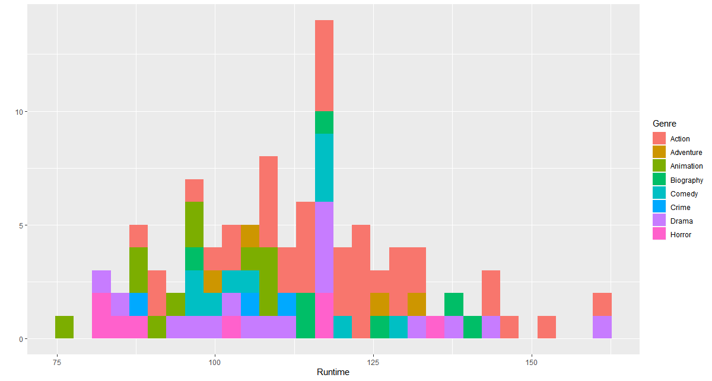
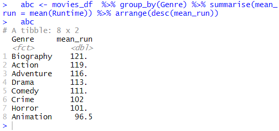
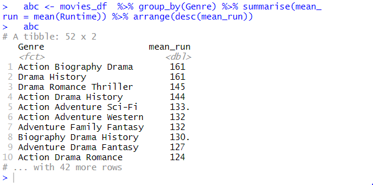
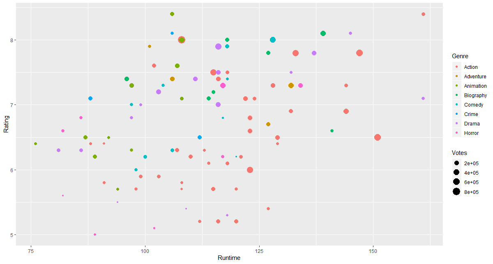

# R 크롤링

Ctrl + Shift + i 눌러서 개발자도구로 해당 코드의 CSS 를 읽어와야함.

```R
#########################################################################################
 read_html() : url에서 html 파일을 읽어오고 저장한다.
 html_table() :  테이블추출
 html_node()는 매칭되는 한 요소만 반환하고, 
 html_nodes()는 모든 요소를 반환한다.
 id를 찾을 경우에는 html_node()를 사용하면 되고, tag, class로 같은 요소를 모두 추출하고자 할 경우에는 html_nodes()를 사용하면 된다
 #html_names()는 attribute의 이름을 가져온다.    
 ex) 
#html_chidren() 해당 요소의 하위 요소를 읽어온다.
#html_tag() tag이름 추출한다.
#html_attrs() attribute을 추출한다.
#########################################################################################

install.packages('rvest')
 
library(rvest)

#스크래핑할 웹 사이트 URL을 변수에 저장
url <- 'http://www.imdb.com/search/title?count=100&release_date=2016,2016&title_type=feature'

#웹 사이트로부터  HTML code 읽기
webpage <- read_html(url)   
webpage

# 스크래핑할 데이터 - rank, title, description, runtime, genre, rating, metascore, votes, gross_earning_in_Mil, director, actor

#랭킹이 포함된 CSS selector를 찾아서 R 코드로 가져오기
rank_data_html <- html_nodes(webpage,'.text-primary')

#랭킹 데이터를 텍스트로 가져오기
rank_data <- html_text(rank_data_html)
head(rank_data)

#랭킹 데이터를 수치형 데이터로 변환
rank_data<-as.numeric(rank_data) 
head(rank_data)
#str(rank_data)
#length(rank_data)


#제목 영역의  CSS selector 스크래핑
title_data_html <- html_nodes(webpage,'.lister-item-header a')

#제목 데이터 텍스트로 가져오기
title_data <- html_text(title_data_html)
head(title_data)


#description 영역의 CSS selectors 스크래핑
description_data_html <- html_nodes(webpage,'.ratings-bar+ .text-muted')

#description 데이터 텍스트로 가져오기
description_data <- html_text(description_data_html)
head(description_data)

#'\n' 제거 데이터 처리
description_data<-gsub("\n","",description_data)
head(description_data)

#영화 상영시간 CSS selectors 스크래핑
runtime_data_html <- html_nodes(webpage,'.text-muted .runtime')

#영화 상영시간 데이터 텍스트로 가져오기
runtime_data <- html_text(runtime_data_html)
head(runtime_data)

#mins(분) 문자열 제거 후 수치형 데이터로 변환 데이터 처리
runtime_data<-gsub(" min","",runtime_data)
runtime_data<-as.numeric(runtime_data)
head(runtime_data)


 
#영화장르 영역 CSS selectors 스크래핑
genre_data_html <- html_nodes(webpage,'.genre')

#영화장르 데이터 텍스트로 가져오기
genre_data <- html_text(genre_data_html)
head(genre_data)

# \n 제거 데이터 처리
genre_data<-gsub("\n","",genre_data)
head(genre_data)

#1개이상의 공백을 제거하는 데이터 처리
genre_data<-gsub(" ","",genre_data)
head(genre_data)


#영화장르 영역 CSS selectors 스크래핑
genre_data_html <- html_nodes(webpage,'.genre')

#영화장르 데이터 텍스트로 가져오기
genre_data <- html_text(genre_data_html)
head(genre_data)

# \n 제거 데이터 처리
genre_data<-gsub("\n","",genre_data)
head(genre_data)

#1개이상의 공백을 제거하는 데이터 처리
genre_data<-gsub(" ","",genre_data)
head(genre_data)

#장르는 첫번째 장르문자열만 남기고 모두 제거
genre_data<-gsub(",.*","",genre_data)
head(genre_data)

#문자열 데이터를 범주형 데이터로 변환 처리
genre_data<-as.factor(genre_data)
head(genre_data) 

#IMDB rating 영역의 CSS selectors를 이용한 스크래핑
rating_data_html <- html_nodes(webpage,'.ratings-imdb-rating strong')

#IMDB rating 데이터 text로 가져오기
rating_data <- html_text(rating_data_html)
head(rating_data) 

##IMDB rating 데이터를 numerical으로 변환 데이터 처리
rating_data<-as.numeric(rating_data)
head(rating_data)

#votes 영역의 CSS selectors를 이용한 스크래핑
votes_data_html <- html_nodes(webpage,
                     '.sort-num_votes-visible span:nth-child(2)')

#votes 데이터 text로 가져오기
votes_data <- html_text(votes_data_html)
head(votes_data)

#콤마(,) 제거 데이터 처리
votes_data<-gsub(",","",votes_data)

#votes 데이터를 numerical으로 변환 데이터 처리
votes_data<-as.numeric(votes_data) 
head(votes_data)

#감독 영역의 CSS selectors를 이용한 스크래핑
directors_data_html <- html_nodes(webpage,
                                '.text-muted+ p a:nth-child(1)')

#감독 데이터 text로 가져오기
directors_data <- html_text(directors_data_html)
head(directors_data)

#감독 데이터 문자열을  범주형 데이터로 변환 처리
directors_data<-as.factor(directors_data)
directors_data
 
# 배우 영역의 CSS selectors를 이용한 스크래핑
actors_data_html <- html_nodes(webpage,
                '.lister-item-content .ghost+ a')

# 배우 데이터 text로 가져오기
actors_data <- html_text(actors_data_html)
head(actors_data)

#배우 데이터 문자열을  범주형 데이터로 변환 처리
actors_data<-as.factor(actors_data)
actors_data 


# metascore 영역의 CSS selectors를 이용한 스크래핑
metascore_data_html <- html_nodes(webpage,'.metascore')

# metascore 데이터 text로 가져오기
metascore_data <- html_text(metascore_data_html)
head(metascore_data)
 

#1개 이상의 공백 제거
metascore_data<-gsub(" ","",metascore_data)
length(metascore_data)
metascore_data

#metascore 누락된 데이터  NA처리하기  - 29,58, 73, 96
for (i in c(29,58, 73, 96)){
a<-metascore_data[1:(i-1)]    #리스트로 확인
b<-metascore_data[i:length(metascore_data)]
metascore_data<-append(a,list("NA"))
metascore_data<-append(metascore_data,b)
}
metascore_data

# metascore  데이터를 numerical으로 변환 데이터 처리
metascore_data<-as.numeric(metascore_data)

# metascore  데이터 개수 확인
length(metascore_data) 


#metascore 요약 통계 확인
summary(metascore_data)


gross revenue(총수익)  영역의 CSS selectors를 이용한 스크래핑
gross_data_html <- html_nodes(webpage,'.ghost~ .text-muted+ span')

#gross revenue(총수익) 데이터 text로 가져오기
gross_data <- html_text(gross_data_html)
head(gross_data)
 
# '$' 와 'M' 기호 제거 데이터 처리
gross_data<-gsub("M","",gross_data)
gross_data<-substring(gross_data,2,6)

#gross revenue(총수익) 데이터 개수 확인
length(gross_data)

# 누락된 데이터  NA로 채우기 - 29,45,57,62,73,93,98
for (i in c(29,45,57,62,73,93,98)){
a<-gross_data[1:(i-1)]
b<-gross_data[i:length(gross_data)]
gross_data<-append(a,list("NA"))
gross_data<-append(gross_data,b)
}

# gross revenue(총수익) 데이터를 numerical으로 변환 데이터 처리
gross_data<-as.numeric(gross_data)

#gross revenue(총수익) 데이터 개수 확인
length(gross_data)

#gross revenue(총수익) 요약 통계 확인 
summary(gross_data)


#data.frame으로 변환
movies_df<-data.frame(Rank = rank_data, Title = title_data,
Description = description_data, Runtime = runtime_data,
Genre = genre_data, Rating = rating_data,
Metascore = metascore_data, Votes = votes_data,   
Director = directors_data, Actor = actors_data)

#변환된 data.frame 구조 확인
str(movies_df)
 

library('ggplot2')
#x축 상영시간, y축 장르별 필름 수 
qplot(data = movies_df,Runtime,fill = Genre,bins = 30)
# 결과 1

# 평균 상영시간이 가장 긴 필름의 장르는?

  library(dplyr)

  abc <- movies_df  %>% group_by(Genre) %>% summarise(mean_run = mean(Runtime)) %>% arrange(desc(mean_run))
  
  abc

#결과 2, Biography

#결과 3, 장르 1개가 아니라 다 묶어서, 


# 평균이 아니라 전체 영화 중 가장 긴 필름의 장르는 ? 
액션

#결과 4 참고

#상영시간이 130-160 분인 장르중 votes가 가장 높은 것은?

액션

#역시 결과 4 참고

```


결과 1 :




결과 2 : 




결과 3 :  장르 3개 다 합친거





결과 4 : 





```R
#장르 다 살리기


#장르는 첫번째 장르문자열만 남기고 모두 제거
genre_data<-gsub(",.*","",genre_data)
head(genre_data)


#### 장르 모두다 살리려면
# genre_data<-gsub(",","",genre_data)
# head(genre_data)    
# genre_data<-gsub("  ","",genre_data)
# head(genre_data)
#### but 데이터 다루기가 힘들어진다.


걍복붙
#description 영역의 CSS selectors 스크래핑
     genre_data_html <- html_nodes(webpage,'.genre')
     genre_data_html
     
     #description 데이터 텍스트로 가져오기
     genre_data <- html_text(genre_data_html)
     head(genre_data)

     genre_data<-gsub("\n","",genre_data)
     head(genre_data)     
     
     
     
     genre_data<-gsub(",","",genre_data)
     head(genre_data)
     
     genre_data<-gsub("  ","",genre_data)
     head(genre_data)
     

     
     genre_data <- as.factor(genre_data)
```


많이 쓰는 거 

nth-child(1)

자식 중에 1번째


```
actors_data_html <- html_nodes(webpage,
                '.lister-item-content .ghost+ a')
```


ghost+ 

ghost 옆에 있는 a


결측 데이터 NA 처리하는 방법 

```R
meta_data<- append(meta_data, NA, after=28)
  meta_data<- append(meta_data, NA, after=57)
  meta_data<- append(meta_data, NA, after=72)
  meta_data<- append(meta_data, NA, after=95)
  
  meta_data <- meta_data[-30](잘못 넣었을 때 지우기)
```


gsup으로 첫번째 글자 못 바꿀 때 쓰는 방법

```
gross_data<-substring(gross_data,2,6)
```

