# R 8일차


```R
getwd()
data <- read.csv("./data/descriptive.csv", header=TRUE)
head(data)
str(data)     #8개변수(컬럼), 300개의 관측치
#resident(거주지역)
#gender(성별 - 명목(1,2))
#level(학력수준-서열1,2,3)
#cost(생활비-비율)
#type(학교유형-명목 1, 2)
#survey(만족도 -등간척도 5점)
#pass(합격여부- 명목 1, 2)

dim(data)
length(data) #변수 개수 (컬럼개수)
length(data$survey)   #관측치 개수 (행개수)

fivenum(data)
summary(data)  #컬럼단위로 최소값, 최대값, 평균, 1,3 분위수, 결측치, 중앙값(중위수) 등 제공


#명목척도의 기술 통계량 - 결측치 제거 -> 빈도수 - >비율 ->백분률 
length(data$gender)  #관측치 확인
summary(data$gender)  #명목척도는 최소값, 최대값, 평균등 의미없음

table(data$gender) #각 성별의 빈도수

data <- subset(data, data$gender==1 | data$gender=2)
x <- table(data$gender)  #빈도수에 따른 분할표
barplot(x)  #범주별 데이터 시각화 -> 막대 차트

y <- prop.table(x) #비율 계산
round(y*100, 2)    #백분률로 변환


```


```R
#########서열 척도 기술 통계량
data <- read.csv("./data/descriptive.csv", header=TRUE)
summary(data$level)  #명목척도는 최소값, 최대값, 평균등 의미없음
table(data$level)  #고졸(1), 대졸(2), 대학원(3)  의 빈도수에 따른 분할표

x1<- table(data$level) 
barplot(x1)

y1 <- prop.table(x1) #비율 계산
round(y1*100, 2)    #백분률로 변환


#########등간 척도 기술 통계량
survey <- data$survey
survey
summary(survey) #등간척도에서 평균 통계량은 어느 정도 의미가 있다고 볼 수 있습니다.

x2 <- table(survey)   #빈도수는 의미 있음
hist(survey)   #등간척도 시각화(히스토그램)
pie(x2)  #빈도수를 이용한 시각화 - 파이 차트


#########비율 척도 기술 통계량
length(data$cost)
summary(data$cost)   #요약 통계 - 의미 있음

plot(data$cost)   # 이상치 발견
data <- subset(data, data$cost >=2 & data$cost <= 10)
x3<-data$cost
mean(x3)
median(x3)  #평균이 극단치에 영향을 받는 경우 중위수로 대체하는 것이 더 효과적입니다.

A반 성적 = 75,80,80,80,85    평균=80 중위수=80
B반 성적 = 75,75,75,75,100   평균=80 중위수=75

quantile(x3, 1/4)  # 1사분위수
quantile(x3, 2/4)  #중앙값과 동일
quantile(x3, 3/4)   #
quantile(x3, 4/4)

#최빈수 - 빈도수가 가장 많은 변량  
x3.t <- table(x3)   #빈도수
max(table(x3) )

x3.m <- rbind(x3.t)
x3.m

class(x3.m)
str(x3.m)
x3.df <- as.data.frame(x3.m)
which(x3.df[1,]==18)
x3.df[1, 19]
names(x3.df[19])


#########산포도는 분산과 표준편차를 통계량으로 사용


##########비율척도의 빈도 분석 : 비율척도를 범주화 (리코딩)
table(data$cost)
hist(data$cost)
plot(data$cost)


#연속형 변수 범주화
data$cost2[data$cost >=1 & data$cost<=3] <- 1
data$cost2[data$cost >=4 & data$cost<=6] <- 2
data$cost2[data$cost >=7 ] <- 3

table(data$cost2)
barplot(table(data$cost2))
pie(table(data$cost2))


##########정규 분포를 갖는지 확인 - 왜도, 첨도 
install.packages("moments" )   #moments 패키지
library(moments)
cost <- data$cost
result <- cost[!is.na(cost)]
result
skewness(result)  #왜도 반환  0보다 크면  , 0보다 작으면 ....
kurtosis(result)   #첨도 반환 (정규분포의 첨도는 3)
hist(result)
hist(result, freq=F) #히스토그램의 계급을 확률 밀도로 표현
lines(density(result), col='blue')  #cost의 밀도 분포 곡선
x<-seq(0, 8, 0.1)   #0~8범위의 0.1씩 증가하는 데이터 벡터 생성
curve(dnorm(x, mean(result), sd(result)), col='red', add=T)  #정규분포 확률 밀도


#######attach()/detach() 함수 
리스트객체$key, dataframe객체$컬럼변수
attach()함수는 dataframe객체$컬럼변수로부터  dataframe객체 데이터셋 이름을 생략하고 컬럼변수만으로 관측치에 사용가능
detach()함수는  dataframe객체$컬럼변수로 관측치에 접근

data <- read.csv("./data/descriptive.csv", header=TRUE)
data$survey
data$cost
attach(data)   # '데이터셋$' 생략할 수 있도록 설정
length(cost)   # na.rm옵션
summary(cost)
mean(cost, na.rm=T) 
min(cost, na.rm=T)
range(cost, na.rm=T)
sort(cost, decreasing=T)
detach(data)    # '데이터셋$' 생략할 수 없도록 설정, attach() 해제
length(pass)   #오류?
length(data$pass)


#########Hmisc 패키지
install.packages("Hmisc")
library(Hmisc)
describe(data)


############prettyR 패키지
install.packages("prettyR")
library(prettyR)
freq(data)

```


### Hmisc 패키지 이용 기술 통계량 구하기

- 전체 데이터 셋에 포함된 모든 변수를  대상으로 기술 통계량 제공하며, 빈도와 비율 데이터를 일괄적으로 제공해준다.

- describe() : 변수의 척도에 따라서 서로 다르게 통계량을 제공한다 명목, 서열, 등간척도는 빈도수, 비율 등을 제공하며, 비율척도는 mean, lowest, hightest등의 통계량을 제공해준다.


### prettyR 패키지 이용 기술 통계량 구하기

- freq() :  Hmisc 패키지의 describe() 와 유사한 기능을 제공

- 변수별 빈도수, 결측치, 비율을 제공하며, 비율은 소주점까지 제공하며, freq() 함수는 각 명목척도의 변수를 대상으로 NA 비율까지 제공한다.


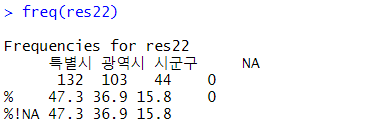


특별시	132	47.3%

광역시	103	36.9%

시군구	44	15.8%


남	 173	58.2%

여	124	41.8%


장년층  200	66.7%

노년층 	78	26%

중년층	22	7.3%


고졸	117 40.8%

대졸	100	34.8%

대학원졸	70	24.4%


성공	159	56.8%

실패 	121	43.2%


퀴즈 코드 

```R
data$res2[data$resident ==1] <- "특별시"
data$res2[data$resident >=2 & data$resident<=4] <- "광역시"
data$res2[data$resident ==5 ] <- "시군구"


Quiz> 성별 변수 리코딩 후 비율 계산
범주화 : 1은 남자  , 2은 여자
빈도수, 비율, 백분율


data$gen2[data$gender ==1] <- "남자"
data$gen2[data$gender ==2] <- "여자"

freq(data$gen2)

Quiz> 나이변수 리코딩 후 비율 계산
범주화 : <=45 중년층,  46~59는 장년층, >=60 노년층
빈도수, 비율, 백분율


data$age2[data$age <= 45] <- "중년층"
data$age2[data$age >= 46 & data$age <=59 ] <- "장년층"
data$age2[data$age >= 60] <- "노년층"

freq(data$age2)

str(data)

describe(data)
freq(data)


data$lev2[data$level ==1] <- "고졸"
data$lev2[data$level ==2] <- "대졸"
data$lev2[data$level ==3] <- "대학원졸"

freq(data$lev2)


data$pass2[data$pass ==1] <- "합격"
data$pass2[data$pass ==2] <- "실패"

freq(data$pass2)
pie(table(data$pass2),table(data$lev2))
```


# 표본 추출


### 복원추출


```R
sample(1:10, 5, replace = TRUE)
#지워진 거 다시 추가한 뒤 추출

sample(1:10, 5, replace = FALSE)
sample(1:10, 5)
#지워진거 제외하고 추출, 디폴트가 replace = FALSE라서 아예 뺴도 됨.
```


### 층화 임의 추출


1. 데이터가 중첩없이 분할될 수 있는 경우 (ex 남 , 여) 더 정확한 분석 결과를 얻을 수 있다.


```R
###########################샘플 추출###########################
# 벡터 데이터 1~10 로부터 5개 샘플 추출 복원 추출
sample(1:10, 5, replace=TRUE)

# 벡터 데이터 1~10 로부터 5개 샘플 추출 비복원 추출
sample(1:10, 5)

install.packages("sampling")
library(sampling)
head(iris)
result <- strata(c("Species"), size=c(3,3,3) , method="srswor", data=iris))
# srswor : 비복원 단순 임의 추출
# srswr : 복원 단순 임의 추출
# poisson : 포아송 추출
# systematic : 계통 추출

result
getdata(iris, result)
```


### 계통추출

- ##### 계통 추출은 모집단의 임의 위치에서 시작해 매 k번째 항목을 표본으로 추출하는 방법이다

- 단순 임의 추출 방법과 동일한 효과를 보이고, 데이터가 순서대로 나열된 순서 모집단Ordered Population(예를 들면, 1, 2, 3, …, 10과 같이 순서대로 나열된 모집단)의 경우 단순 임의 추출보다 좋은 표본을 추출한다

- doBy 패키지의 sampleBy(formula, frac=0.1, replace=FALSE, data=parent.frame( ), systematic=FALSE) 함수를 사용하여 수행

- sampleBy( )의 첫 번째 인자는 ‘~ 1’이다. 그 이유는 첫 번째 인자가 표본을 추출할 그룹을 지정하는 포뮬러기 때문

- 표본으로부터 평균을 계산하여 모집단의 평균을 추정할 때 표본 평균의 기댓값이 모집단의 평균과 다르다면 편향되었다고 말한다.


코드 : 

```R
#계통추출 
install.packages("doBy")
library(doBy)
x <- data.frame(x=1:10)
sampleBy(~1, frac=.3, data=x, systematic=TRUE)
```


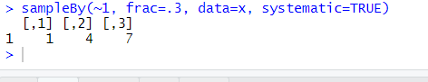


#### 분할표 - Contingency Table

- 명목형Categorical 또는 순서형Ordinal 데이터의 도수frequency를 표 형태로 기록한 것이다

- 기계 학습으로 데이터의 양성Positive, 음성Negative을 예측하는 경우 사용

- 이메일 텍스트를 보고 해당 이메일이 스팸인지 아닌지를 예측하는 경우 사용

- 분할표를 작성하는 함수 -  table( ), xtabs( )

- xtabs( )는 포뮬러를 사용해 데이터를 지정할 수 있다


코드

```R
d <- data.frame(x=c("1", "2", "2", "1"),  y=c("A", "B", "A", "B"),   num=c(3, 5, 8, 7))
xtabs(num ~ x + y, data=d)

d2 <- data.frame(x=c("A", "A", "A", "B", "B"))
xtabs(~ x, d2)
```


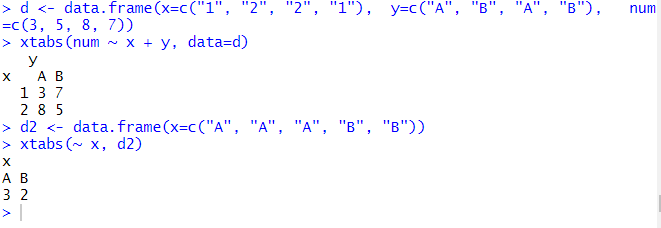


#### 테이블 연산 - 덧셈 margin.table

위의 분할표에서 연산하는 방법.

```R
d <- data.frame(x=c("1", "2", "2", "1"),  y=c("A", "B", "A", "B"),   num=c(3, 5, 8, 7))
xt <- xtabs(num ~ x + y, data=d)   #분할표 생성
xt

margin.table(xt, 1)  # 3 + 7 = 10, 8 + 5 = 13
margin.table(xt, 2)  # 3 + 8 = 11, 7 + 5 = 12
margin.table(xt)     # 3 + 7 + 8 + 5 = 23
```


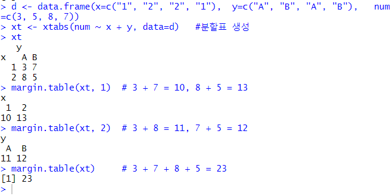


#### 테이블 연산 - 비율 prop.table

위의 분할표에서 연산하는 방법.


```R
prop.table(xt,1) # 3/10, 7/10
								 # 8/13, 5/13

prop.table(xt,2) # 3/11, 7/12
								 # 8/11, 5/12

prop.table(xt) # 3/23, 7/23
							 # 8/23, 5/23
```


# 교차분석 

- 범주형 자료(명목척도 또는 서열척도)를 대상으로 두개 이상의 변수들에 대한 **관련성을 알아보기 위해서** 결합분포를 나타내는 교차 분할표를 작성하고 이를 통해서 변수 상호 간의 관련성 여부를 분석하는 방법

- 빈도분석의 특성별 차이를 분석하기 위해 수행하는 분석방법으로 빈도분석결과에 대한 보충자료를 제시하는데 효과적
- 교차분석은 빈도분석과 함께 고급통계 분석의 기초 정보를 제공한다.


#### 교차분석 고려사항

- 교차분석에 사용되는 변수는 값이 10 미만인 범주형 변수(명목 척도, 서열 척도)이어야 한다.

- 비율척도인 경우는 코딩변경(리코딩)을 통해서 범주형 자료로 변화해야 한다.

  예) 연령대 10~19세는 1, 20~29세는 2, 30~39세는 3등으로 범주화하여 변경한다.


- 교차 분할표를 작성하기 위해서는 연구 환경에서 해당 변수를 화긴(독립 변수와 종속변수)하여 모델링한 후 범주형 데이터로 변환하는 리코딩 과정을 거친 후에 대상 변수를 데이터 프레임으로 생성한다.


#### 변수 모델

특정 객체를 대상으로 분석할 속성(변수)을 선택하여 속성 간의 관계를 설정하는 일련의 과정 


### 교차 분석

##### gmodels 패키지 

- CrossTable() : 교차 분할표 생성,  ‘chisq=TRUE’ 속성을 적용하면 카이제곱검정 결과를 볼수 있다.
   교차분할표의 첫번째 줄은 관측치, 두번째 줄은 카이제곱의 결과(기대치 비율), 세번째 줄은 현재 행의 비율, 네번째는 현재 열의 비율, 마지막 줄은 전체 비율에서 현재 셀의 값이 차지하는 비율

- 교차 분할표에서 기대비율은 카이 제곱에 의해서 구해진 결과이다.


- 카이제곱식에서 기대값은 (현재 셀의 행 합 X 현재 셀의 열 합) / 전체합


코드 : 

```R
install.packages("gmodels")
library(gmodels)
library(ggplot2)
CrossTable(x=result$Level, y=result$Pass)
```


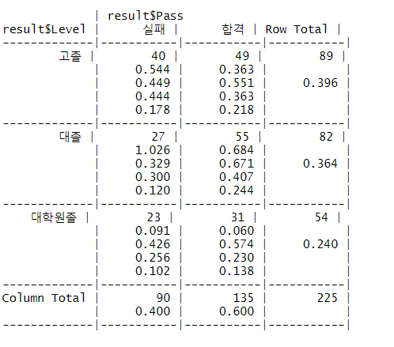


고졸의 실패 40 밑에 있는 확률은

카이제곱	0.544

행 비율	0.449 (가로)

열 비율	0.444 (세로)

전체 비율	0.178

순이다.


# 카이제곱 검정(chi-square test)

- 범주별로 관측빈도와 기대빈도의 차이를 통해서 확률 모형이 데이터를 얼마나 잘 설명하는지를 검정하는 통계방법

- 교차분석으로 얻어진 분할표를 대상으로 유의확률을 적용하여 변수 간의 독립성(관련성) 여부를 검정하는 분석 방법으로 사용한다

- 교차분석은 카이제곱검정 통계량을 사용하기 때문에 교차분석을 카이제곱검정이라고 한다.


#### 카이제곱 검정(chi-square test) 유형

- 적합도 검정

- 독립성 검정

- 동질성 검정


#### 카이제곱 검정(chi-square test) 중요사항

- 카이제곱검정을 위해서는 교차분석과 동일하게 범주형 변수를 대상으로 한다

- 집단별로 비율이 같은지를 검정(비율에 대한 검정)하여 독립성 여부를 검정한다

- 유의확률에 의해서 집단 간의 ‘차이가 있는가?’ 또는 ‘차이가 없는가?’로 가설을 검정한다.


#### 카이제곱 검정(chi-square test) 해석

- 귀무가설 : 두 변인은 서로 독립적이다.

- 대립가설 : 두 변인은 서로 독립적이지 않다. 

(여기서 두 변인은 테이블에 입력한 변수 , ex 부모의 학력과 자식의 합격여부의 연관성)


두 변인이 영향을 준다 -> 대립가설

두 변인은 영향을 주지 않는다. (관계 X) -> 귀무가설


### 카이제곱 검정(chi-square test) 절차와 기본가정


단계1 ] 가설을 설정한다.
           귀무가설 H0  : ~ 같다, ~ 다르지 않다, ~ 차이가 없다, ~ 효과가 없다.
           대립가설 H1 :  ~같지 않다, ~다르다 , ~ 차이가 있다, ~ 효과가 있다


단계2 ] 유의수준(α)을 결정한다

#####               일반 사회과학 분야 : α=0.05,  의.생명과학 분야 : α =0.01


단계3 ] 자유도(df)와 유의수준(α)에 따른  X2 분포표에 의한 기각값 결정한다.


단계4 ] 관찰도수에 대한 기대도수를 구한다.


단계5 ] 검정 통계량 X2 값을 구한다 (X2   = Σ(관측값 – 기대값) 2 / 기댓값)


단계6 ] X2 검정 통계량 과 기각값을 비교하여 귀무가설 채택 여부를 판정한다


단계7 ] 카이제곱검정 결과를 진술한다.


- [관찰빈도-기대빈도] 값이 작을수록 카이 제곱 값도 작아져서 귀무가설이 채택될 가능성이 크다


## 카이제곱분표

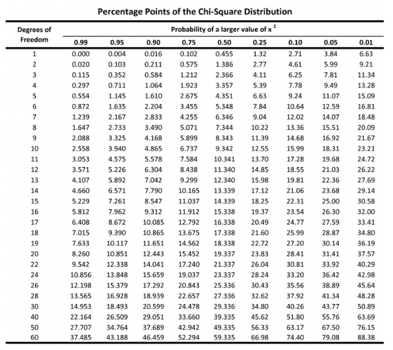


실습 : 

```
##############################################################
부모의 학력수준과 자녀의 진학여부와 관련성이 있는지 독립성 검정
##############################################################
연구가설(H1) :  부모의 학력수준과 자녀의 진학여부와 관련성 있다
귀무가설(H0) : 부모의 학력수준과 자녀의 진학여부와 관련성이 없다

str(data)

#부모의 학력수준이 자녀의 대학진학 여부와 관련이 있는지를 분석하기 위해
학력수준 변수는 독립변수
대학진학 여부 변수는 종속변수
x<- data$level2  
y<- data$pass2

result <- data.frame(Level=x, Pass=y)
CrossTable(x=result$Level, y=result$Pass)

chisq.test(x=result$Level, y=result$Pass)

해석 : 
유의확률(p-value) 0.2507 이 유의수준(α= 0.05) 보다 크므로 귀무가설 채택
부모의 학력수준과 자녀의 진학여부와 관련성이 없다

카이제곱 검정통계량 : 2.767, 자유도 : 2
```


해석 (카이제곱 검정 통계량) 참고 : 

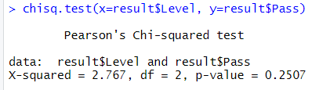


```
카이제곱 검정통계량 : 2.767, 자유도 : 2
임계값 : 5.99, 기각값(X^2 >= 5.99) 이면 귀무가설을 기각할 수 있다 .

but X^2 = 2.767 < 5.99 이므로 귀무가설을 기각할 수 없다. (관련성이 없음)
```


#### 일원 카이제곱 검정  

- 교차 분할표를 이용하지 않는 카이제곱검정으로 한 개의 변인(집단 또는 범주)를 대상으로 검정을 수행한다.- 

- 관찰도수가 기대도수와 일치하는지를 검정하는 적합도 검정(test for goodness of fit)과 선호도 분석에서 주로 이용된다.


#### 적합도 검정(test for goodness of fit)   

- chisq.test()

- 관찰빈도와 기대빈도 일치 여부를 검정한다


- 유의확률로 해석하는 방법 

- 검정 통계량으로 해석하는 방법 
   

#### 자유도(df : degree of freedom)  

- 검정을 위해서 n개의 표본(관측치)을 선정한 경우 n번째 표본은 나머지 표본이 정해지면 자동으로 결정되는 변인의 수를 의미하기 때문에 자유도 N-1로 표현한다

- 교차 분할표에서 자유도(df) = (행수 -1) X (열수 -1)로 구해진다.

- 카이제곱 검정 통계량의 자유도가 클수록 정규분포에 가까워진다.


## 선호도 검정

- 관찰빈도와 기대빈도의 차이를 통해서 확률 모형이 주어진 자료를 얼마나 잘 설명하는지를 검정하는 통계 방법

```
########### 선호도 검정 : 일원 카이제곱 검정, 한 개의 변인(집단 또는 범주)를 대상으로 검정을 수행, 관찰도수가 기대도수와 일치하는지를 검정###################

귀무가설 : 기대치와 관찰치는 차이가 없다   예) 스포츠음료에 대한 선호도에 차이가 없다
대립가설 : 기대치와 관찰치는 차이가 있다.  예) 스포츠음료에 대한 선호도에 차이가 있다

data <- textConnection("스포츠음료종류   관측도수
                     1  41
                     2  30
                     3  51
                     4  71
                     5  61")
x <- read.table(data, header=T)
x
str(x)
chisq.test(x$관측도수)


해석 : 
유의확률(p-value)  0.0003999 이 유의수준(α= 0.05) 보다 작으므로 귀무가설을 기각할 수 있다
연구가설 채택 됨 (스포츠음료에 대한 선호도에 차이가 있다)

카이제곱검정통계량 20.88 > 9.49 귀무가설을 기각할 수 있다
```


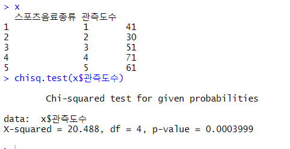


표는 위에 사진 참고 , 유의수준은 0.05로 ?


## 동질성 검정

```R
#동질성 검정 : 이원 카이제곱검정 방법, 두 집단의 분포가 동일한지 여부 검정
data <- read.csv("./homogenity.csv", header=TRUE)
head(data)
str(data)
#method 교육방법 1, 2, 3
#survey 만족도  1:매우만족 ~ 5:매우 불만족

대립가설 : 교육방법에 따라 만족도가 차이가 있다.
귀무가설 : 교육방법에 따라 만족도가 차이가 없다.


data <- subset(data, !is.na(survey), c(method, survey))

data$method2[data$method==1] <- "방법1"
data$method2[data$method==2] <- "방법2"
data$method2[data$method==3] <- "방법3"

data$survey2[data$survey==1] <- "매우만족"
data$survey2[data$survey==2] <- "만족"
data$survey2[data$survey==3] <- "보통"
data$survey2[data$survey==4] <- "불만족"
data$survey2[data$survey==5] <- "매우불만족"


table(data$method2, data$survey2)  #table(행, 열)
# 방법1, 방법2, 방법3의 관측치의 개수는 50으로 동일 => 반드시 각 집단의 길이가 동일해야 합니다.

#동질성 검정
chisq.test(data$method2, data$survey2)
```


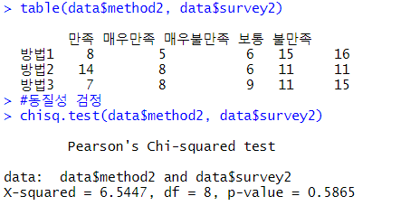


#### 유의수준은 일반주제 0.05 의료주제 0.01 

```
해석 : 
유의확률(p-value)   0.5865 이 유의수준(α= 0.05) 보다 크므로 귀무가설을 기각할 수 없다
귀무가설 채택 됨 (교육방법에 따라 만족도가 차이가 없다.)

카이제곱검정통계량 6.545 < 15.51 귀무가설을 기각할 수 없다
```


## 연습문제 : 

```
실습 연습문제#############################################
Quiz01>
 교육수준(education)과 흡연율(smoking) 간의 관련성을 분석하기 위한 연구가설을 수
립하고, 각 단계별로 가설을 검정하시오. [독립성 검정]
귀무가설(H0) :  교육수준에 따라 흡연율의 차이가 없다.
연구가설(H1) :  교육수준에 따라 흡연율의 차이가 있다. 
 
smoke <- read.csv("./data/smoke.csv", header=TRUE)
head(smoke)

education : 1:대졸, 2:고졸, 3:중졸
smoke : 1:과다흡연, 2:보통흡연, 3:비흡연
 
 
smoke$education2[smoke$education==1] <- "대졸"
smoke$education2[smoke$education==2] <- "고졸"
smoke$education2[smoke$education==3] <- "중졸"


smoke$smoking2[smoke$smoking==1] <- "과다흡연"
smoke$smoking2[smoke$smoking==2] <- "보통흡연"
smoke$smoking2[smoke$smoking==3] <- "비흡연"

```

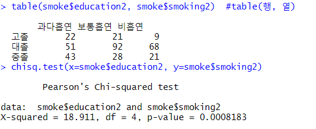


```
해석 : 
유의확률(p-value)   0.0008 이 유의수준(α= 0.05) 보다 작으므로 귀무가설을 기각할 수 있다
연구가설 채택 됨 (교육수준에 따라 흡연율의 차이가 있다. )

카이제곱검정통계량 18.911 > 9.49 귀무가설을 기각할 수 있다.
연구가설 채택 

결론 : 교육수준에 따라 흡연율의 차이가 있다.
```


```
Quiz02>
나이(age3)와 직위(position) 간의 관련성을 단계별로 분석하시오. [독립성 검정]

귀무가설(H0) : 나이에 따라 직위의 차이가 없다.
연구가설(H1) : 나이에 따라 직위의 차이가 있다.

 
data <- read.csv("./data/cleanData.csv", header=TRUE)
head(data)
 

```


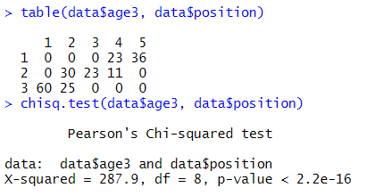


```
해석 : 
유의확률(p-value)   2.2e-16 이 유의수준(α= 0.05) 보다 작으므로 귀무가설을 기각할 수 있다
연구가설 채택 됨 (나이에 따라 직위의 차이가 있다. )

카이제곱검정통계량 287.9 > 15.51 귀무가설을 기각할 수 있다.
연구가설 채택 

결론 : 나이에 따라 직위의 차이가 있다.
```


```

Quiz03>
직업유형에 따른 응답정도에 차이가 있는가를 단계별로 검정하시오.[동질성 검정]

귀무가설(H0) : 직업 유형에 따라 응답정도에 차이가 없다.
연구가설(H1) : 직업 유형에 따라 응답정도에 차이가 있다.
 
response <- read.csv("/data/response.csv", header=TRUE)
head(response) 

job : 1:학생, 2:직장인, 3:주부
response : 1:무응답, 2:낮음, 3:높음

response$job2[response$job==1] <- "학생"
response$job2[response$job==2] <- "직장인"
response$job2[response$job==3] <- "주부"


response$response2[response$response==1] <- "무응답"
response$response2[response$response==2] <- "낮음"
response$response2[response$response==3] <- "높음"
```


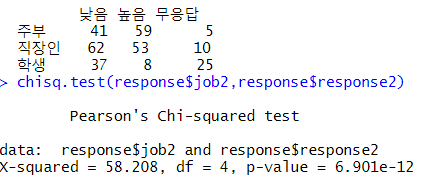


```
해석 : 
유의확률(p-value)   6.901e-12 이 유의수준(α= 0.05) 보다 작으므로 귀무가설을 기각할 수 있다
연구가설 채택 됨 (직업 유형에 따라 응답정도에 차이가 있다. )

카이제곱검정통계량 58.208 > 9.49 귀무가설을 기각할 수 있다.
연구가설 채택 

결론 :직업 유형에 따라 응답정도에 차이가 있다.
```


### 피셔의 정확 검정

-  표본 수가 적거나 표본이 분할표의 셀에 매우 치우치게 분포되어 있다면 카이 제곱 검정의 결과가 부정확할 수 있다. 

```R
fisher.test(
  x,      # 행렬 형태의 이차원 분할표 또는 팩터
  y=NULL, # 팩터. x가 행렬이면 무시된다.
  alternative="two.sided" # 대립가설로 two.sided는 양측 검정, less는 작다, greater는 크다를 의미
)
#연구가설(H1) : 글씨를 쓰는 손이 박수 칠때 위로 가는지 관련이 있다. (독립이 아니다)
#귀무가설(H0) : 글씨를 쓰는 손이 박수 칠때 위로 가는지 관련이 없다. (독립이다)
#MASS::survey 데이터에서 손 글씨를 어느 손으로 쓰는지와 박수를 칠 때 어느 손이 위로 가는지 사이의 경우#에 대해 피셔의 정확 검정을 수행
 xtabs(~ W.Hnd + Clap, data=survey)
 chisq.test(xtabs(~ W.Hnd + Clap, data=survey))
 fisher.test(xtabs(~ W.Hnd + Clap, data=survey))
```


# 맥니마 검정 
- #### 사건 전후에 어떻게 달라지는지를 알아보는 경우

예) 벌금을 부과하기 시작한 후 안전벨트 착용자의 수의 변화율 있는지?
   선거 유세를 하고 난 뒤 지지율의 변화

```R

##투표권이 있는 나이의 미국인 1,600명에 대해 대통령 지지율을 조사
1차 조사1st Survey와 2차 조사2nd Survey는 한 달 간격으로 수행
## Agresti (1990), p. 350.
## Presidential Approval Ratings.
## Approval of the President's performance in office in two
## surveys, one month apart, for a random sample of 1600
## voting-age Americans.
  Performance <-
    matrix(c(794, 86, 150, 570),
           nrow = 2,
           dimnames = list(
           "1st Survey" = c("Approve", "Disapprove"),
           "2nd Survey" = c("Approve", "Disapprove")))

 Performance
 mcnemar.test(Performance)
 
귀무가설 : 유세 전후의 지지율에 변화가 없다.
대립가설 : 유세 전후의 지지율에 변화가 있다.
```


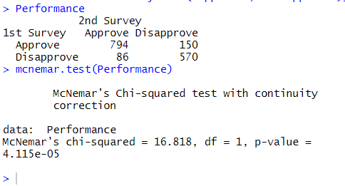