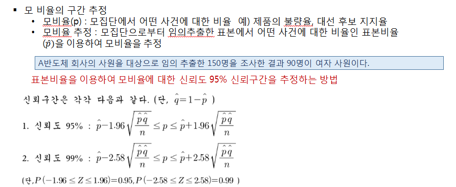
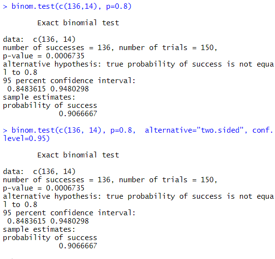
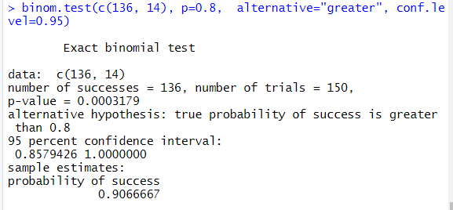
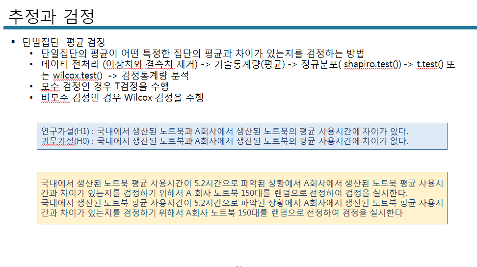
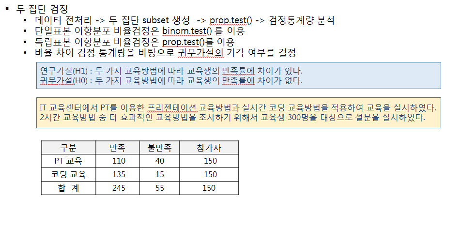
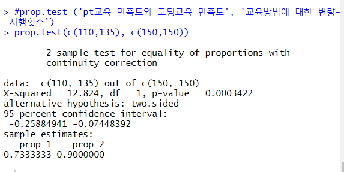
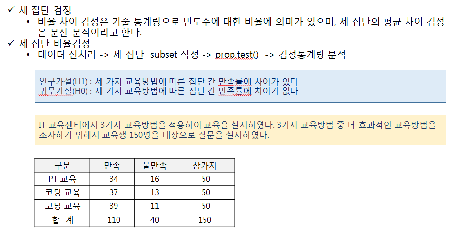

# R 9일차

v3 ppt


## 모 평균의 구간 측정


N는 전체 표본 크기

σ는 표준 편차(=S?)

X는 표본 평균


즉 위의 예제에서는 

165.1 - 1.96 * 2/100 가 신뢰구간의 하한값

165.1 + 1.96 * 2/100 가 신뢰구간의 상한값

각각 

[1] 165.0608
[1] 165.1392 

의 값을 갖는다.


하한값-평균신장 , 상한값-평균신장 값을 백분율로 적용

(low-X)  * 100

(165.0608 - 165.1) * 100 = -3.92

(165.1392 -165.1) * 100 = +3.92

신뢰구간의 표본 오차는 ±3.92


```
##########표본의 통계량으로 모집단의  평균 구간 추정  ###################
#전체 표본 크기(N) : 10,000명
#표본평균 (????) : 165.1cm
#표본 표준편차(S) : 2cm

N <- 10000
X <- 165.1
S <- 2
low <- X-1.96 * S/sqrt(N)   #신뢰구간의 하한값
high <- X+1.96 * S/sqrt(N)   #신뢰구간의 상한값

low;high

# 신뢰구간 165.0608< μ(165.1) < 165.1392 에 평균 이 포함

# 신뢰구간으로 표본 오차
# 하한값-평균신장 , 상한값-평균신장 값을 백분율로 적용
(low-X)  * 100
(high-X) * 100
# 신뢰구간의 표본 오차는 ±3.92

해석 : 우리나라  중학교 2학년 남학생의 평균 신장이 95%신뢰수준에서 표본 오차는 ±3.92 범위에서 
평균 165.1cm로 조사되었다면 실제 평균키는 165.0608 ~165.1392 사이에 나나탈 수 있다
```


우리나라 전체 중학교 2학년 여학생 평균 키가 148.5cm로 알려져 있는 상태에서 A중
학교 2학년 전체 500명을 대상으로 10%인 50명을 표본으로 선정하여 표본평균신장을
계산하고 모집단의 평균과 차이가 있는지를 각 단계별로 분석을 수행하여 검정하시오.

N <- 500

X <- 148.5

S <- 

## 모 비율의 구간 측정




```
##########표본의 비율로부터 모집단의 비율 구간 추정  ###################
#A반도체 회사의 사원을 대상으로 임의 추출한 150명을 조사한 결과 90명이 여자 사원이다
#표본 크기(n) : 150 
n <- 150
# 표본비율(????)  : 90/150 = 0.6
p <- 90/150

# 전체 여자 사원 비율 (모비율) 
p-1.96 * sqrt(p*(1-p)/n)
p+1.96 * sqrt(p*(1-p)/n)

#모집단의 비율 구간은 다음과 같습니다.  
0.596864 ≤ 모비율(P) ≤ 0.603136

```


## 단일 집단 비율 검정


```
##################단일 집단 비율 검정 실습###################
data <- read.csv("./data/one_sample.csv", header=TRUE)
head(data)
str(data)   
#변수 : 번호, 성별, 만족도(명목척도), 시간
x<-data$survey
summary(x) 
length(x)   #결측치 확인
table(x)   #0:불만족, 1:만족
library(prettyR)
freq(x)   #결측치 확인

#만족도(명목척도)의 비율을 바탕으로 binom.test() 이항분포 양측검정 수행 -> 검정 통계량 -> 가설 검정
binom.test(c(136, 14), p=0.8)
binom.test(c(136, 14), p=0.8,  alternative="two.sided", conf.level=0.95)

해석 : p-value 유의확률 0.0006735로 유의수준 0.05보다 작기 때문에 기존 만족률(80%)과 차이가 있다
       기존 만족률(80%)보다 크다 혹은 작다의 방향성을 제시하지 않음

#방향성을 갖는 단측 검정 수행 (더 큰 비율인가? 검정)
binom.test(c(136, 14), p=0.8,  alternative="greater", conf.level=0.95)
해석 : p-value 유의확률 0.0003179로 유의수준 0.05보다 작기 때문에 기존 만족률 80%  이상의 효과를 얻을 수 있다 
 CS 교육후에 고객의 불만율은 낮아졌다고 할 수 있습니다.
 귀무가설은 기각이고 연구가설이 채택되므로 CS교육에 효과가 있다.
```


결과1 : 




결과 2: 




+@

```
#불만율 기준 비율 검정
binom.test(c(14, 136), p=0.2)
binom.test(c(14, 136), p=0.2,  alternative="two.sided", conf.level=0.95)
해석 : p-value 유의확률 0.0006735로 유의수준 0.05보다 작기 때문에 기존 불만족률(20%)과 차이가 있다

binom.test(c(14, 136), p=0.2,  alternative="less", conf.level=0.95)
해석 : p-value 유의확률 0.0003179로 유의수준 0.05보다 작기 때문에 기존 불만족률 20% 보다 낮다  


```


## 단일집단의 평균 검정





```

###########단일집단의 평균 검정 (단일표본 T검정) ##############
data <- read.csv("./data/one_sample.csv", header=TRUE)
head(data)
str(data) 
x<-data$time
summary(x)  #결측치 확인
length(x)   
mean(x, na.rm=T)  #NA 제외 평균  

x1 <- na.omit(x)  #NA 제외 평균 
mean(x1) 

#정규분포 검정
shapiro.test(x1)  

해석 : 검정 통계량 p-value 값은 0.7242 로 유의수준 0.05보다 크기 때문에
x1 객체의 데이터 분포는 정규분포를 따른다고 할 수 있다

hist(x1)  
#stats패키지에서 정규성 검정 - qqnorm(), qqline()는 정규분포 시각화
install.packages("stats")
library(stats)
qqnorm(x1)
qqline(x1, lty=1, col='blue')

# 모수 검정 :T-검정 
t.test(x1, mu=5.2)  #x1객체와 기존 모집단의 평균 5.2시간 비교
t.test(x1, mu=5.2, alter="two.side", conf.level=0.95)

해석 : 검정 통계량 p-value 값은 0.0001417 로 유의수준 0.05보다 작기 때문에
귀무가설 : 차이가 없다  0.05보다 크면 채택, 0.05보다 작으면 기각
연구가설 : 차이가 있다 
국내에서 생산된 노트북 평균 사용시간과  A회사에서 생산된 노트북의 평균 사용시간의 차이가 있다
x1의 평균은 5.55688(점추정)는 신뢰구간에 포함되고
A회사에서 생산된 노트북의 평균 사용시간 5.2는 신뢰구간을 벗어나므로 귀무가설이 기각된다
(신뢰구간은 귀무가설의 채택역의 의미가 있으므로)
```


```
#방향성을 갖는 단측 검정
t.test(x1, mu=5.2, alter="greater", conf.level=0.95)
연구가설 : '국내에서 생산된 노트북 평균 사용시간이  A회사에서 생산된 노트북의 평균 사용시간보다 더 길다'
해석 : 검정 통계량 p-value 값은 7.083e-6로 유의수준 0.05보다 매우 작기 때문에 
귀무가설 :'A회사에서 생산된 노트북의 평균 사용시간이 국내에서 생산된 노트북 평균 사용시간보다 더 길다'고 할 수 있다.

#귀무가설 임계값 계산 qt(p-value, df)
귀무가설을 기각할 수 있는 임계값  qt(7.083e-6, 108) 계산 결과는 -3.946073 (임계값은 절대값)
임계값 3.946073 이상이면 귀무가설을 기각할 수 있다
t 검정 통계량 3.9461이므로 귀무가설을 기각할 수 있다
```


## 두 집단 평균 검정




```
##############두 집단 비율 차이 검정 실습 ######################
data <- read.csv("./data/two_sample.csv", header=TRUE)
head(data)
str(data) #method교육방법 , 관측치

x<- data$method
y<- data$survey
length(x)   # NA 없음
length(y)   # NA 없음

table(x)
table(y)

#교차 분석을 위한 분할표 생성
table(x, y, useNA="ifany")   #결측치까지 출력(useNA="ifany")

#두 집단의 만족도 차이 비율 검정
#prop.test ('pt교육 만족도와 코딩교육 만족도', '교육방법에 대한 변량-시행횟수')
prop.test(c(110, 135), c(150, 150))
prop.test(c(110, 135), c(150, 150), alter="two.sided", conf.level=0.95)

해석 : 검정 통계량 p-value 값은 0.0003422로 유의수준 0.05보다 작기 때문에 두 교육방법 간의 만족도에 차이가 있다 (연구가설 채택)
검정 통계량 X-squared로 가설 검정을 수행하면 df 1일때 기각역은 3.84이고 X-squared 12.82..가 더 크기 때문에 귀무가설을 기각할 수 있다

```





## 카이제곱분표


## 두 집단 평균 검정


```
#################두 집단 평균 검정(독립표본 T검정)#######################
data <- read.csv("./data/two_sample.csv", header=TRUE)
head(data)
str(data) #method교육방법 , score(점수)

summary(data)  #score의 NA 개수 : 73개

# 두 집단 subset 생성 
result <- subset(data, !is.na(score), c(method, score)) #조건과 select할 변수
result
length(result)

a <- subset(result, method==1)
b <- subset(result, method==2)

ascore <- a$score
bscore <- b$score

#기술통계량(평균)
length(ascore)  # 109
length(bscore)  # 118
mean(ascore)    # 5.556881
mean(bscore)    # 5.80339

#분산의 동질성 검정 
var.test(ascore, bscore)

해석 : 검정 통계량 p-value 값은 0.3002 로 유의수준 0.05보다 크기 때문에 
두 집단 간의 분포 형태가 동일하다고 볼 수 있다.

# 두 집단 평균 차이 검정
t.test(ascore, bscore)
t.test(ascore, bscore, alter="two.sided", conf.int=TRUE, conf.level=0.95)
해석 : 검정 통계량 p-value 값은 0.0411로 유의수준 0.05보다 작기 때문에
두 집단간의 평균에 차이가 있다


#단측 가설 검정 (ascore가 기준으로 비교 -> ascore보다 bscore가 더 큰지 여부)
t.test(ascore, bscore, alter="greater", conf.int=TRUE, conf.level=0.95)
해석 : 검정 통계량 p-value 값은 0.9794로 유의수준 0.05보다 크기 때문에
pt교육보다 코딩교육의 실기 점수 평균이 더 크다


t.test(ascore, bscore, alter="less", conf.int=TRUE, conf.level=0.95)
해석 : 검정 통계량 p-value 값은 0.02055로 유의수준 0.05보다 작기 때문에
pt교육이 코딩교육의 실기 점수 평균이 더 낮다


```


## 대응 두 집단 평균 검정


```
###############대응 두 집단 평균 검정(대응 표본 T검정)################
data <- read.csv("./data/paired_sample.csv", header=TRUE)
head(data)
str(data)  #before, after 컬럼, 관측치 100개

result <- subset(data, !is.na(after), c(before, after))
length(result$after)   # 결측치 4개 제외됨

x<-result$before
y<-result$after
mean(x)  #5.16875
mean(y)  #6.220833

#동질성 검정
var.test(x, y, paired=TRUE)
해석 : 검정 통계량 p-value 값은  0.7361로 유의수준 0.05보다 크기 때문에
두 집단간의 분포형태가 동일하다

#평균 차이 검정
t.test(x, y, paired=TRUE, alter="two.sided", conf.int=TRUE, conf.level=0.95)
해석 : 검정 통계량 p-value 값은  2.2e-16 로 유의수준 0.05보다 매우 작기 때문에
두 집단간의 평균에 차이가 있다 

t.test(x, y, paired=TRUE, alter="less", conf.int=TRUE, conf.level=0.95)
해석 : 검정 통계량 p-value 값은 2.2e-16 로 유의수준 0.05보다 매우 작기 때문에
x 집단 평균이 y집단의 평균보다 작다고 할 수 있다

```


## 세 집단 만족도 차이 비율 검정





```
#################세 집단  만족도  차이 비율 검정######################
data <- read.csv("./data/three_sample.csv", header=TRUE)
head(data)
str(data)  # method(교육방법 : 1, 2,3) , 관측치 150

method <- data$method
survey <- data$survey

table(method, useNA="ifany")

table(method, survey,  useNA="ifany")  #교차분할표

#prop.test((교육방법에 대한 만족 빈도수), (변량의 길이))
prop.test(c(34,37,39), c(50,50,50))
prop.test(c(34,37,39), c(50,50,50) , alter="two.sided",  conf.level=0.95))

해석 : 검정 통계량 p-value 값은  0.5232로 유의수준 0.05보다 크기 때문에 귀무가설을 기각할 수 없다.
세 교육방법 간의 만족도에 차이가 없다 (귀무가설 채택)

X-squared 검정 통계량 1.2955는 df 2의 기각값은 5.991보다 작기 때문에 귀무가설을 기각할 수 없다

만족도 비율 68%, 74%, 78% - 차이가 있다
```


## 분산 분석

```

############분산 분석 (F 검정) : 세 집단의 평균 차이 분석 #############
data <- read.csv("./data/three_sample.csv", header=TRUE)
head(data)
str(data)   #method, score

data <- subset(data, !is.na(score), c(method, score))  #결측치 제거
head(data)

#이상치 존재 확인(데이터 분포 현황 분석)
plot(data$score)  #산점도
barplot(data$score)
mean(data$score)  # 14.45
length(data$score) # 이상치 제거 전 데이터 개수 : 91

data2 <- subset(data, score<=14)
length(data2$score)   # 이상치 제거 개수 :88

x<-data2$score
boxplot(x)

#교육방법에 따른 세 집단의 subset 생성
data2$method2[data2$method==1] <- "방법1"
data2$method2[data2$method==2] <- "방법2"
data2$method2[data2$method==3] <- "방법3"

#교육방법에 따른 빈도수 
mCnt <- table(data2$method2)
mAvg <- tapply(data2$score, data2$method2, mean)

# 데이터 프레임 생성
df <- data.frame(교육방법=mCnt, 성적=mAvg)
df

# 세 집단의 동질성 검정
#bartlett.test(종속변수 ~ 독립변수, data=데이터셋)
bartlett.test(score ~ method, data=data2)

해석 : 검정 통계량 p-value 값은 0.1905 로 유의수준 0.05보다 크기 때문에
세 집단 간의 분포 형태가 동질하다고 볼 수 있다


# 세 집단의 평균 차이 검정 : aov()
help(aov)    #aov(종속변수~독립변수, data=데이터 셋)
result <- aov(score ~method2, data=data2)
names(result)   # 검정 결과 측정 변수명 확인
summary(result)

해석 : 검정 통계량 p-value 값은 9.39e-14 로 유의수준 0.05보다 매우 작기 때문에
교육방법에 따른 세 집단 간의 실기시험 평균에 차이가 있다 (연구가설 채택)
F 검정 통계량 43.58은  -1.96 ~ +1.96 범위의 귀무가설의 채택역에 해당하지 않으므로
귀무가설을 기각할 수 있다 (귀무가설을 기각하고 연구가설 채택)

#집단간의 평균의 차에 대한 비교 => 사후 검정 수행
TukeyHSD(result)   #분산분석 결과로 사후 검정
#diff 폭(평균의 차이)의 크기 - 방법2와 방법1의 차이가 가장 큼..
#lwr, upr은 신뢰구간의 하한값과 상한값
plot(TukeyHSD(result))   

결론 :
교육방법에 따른 세 집단 간의 실기시험 평균에 차이가 있으며
세 교육방법에 따른 분석 결과 방법2와 방법1의 차이가 가장 높다

```

