# R 10일차


## 기계학습(Machine Learning)  

- 알고리즘을 통해서 기계(컴퓨터, 로봇 등)에게 학습을 시킨 후 새로운 데이터가 들어오는 경우 해당 데이터의 결과를 예측하는 학문 분야

- 인간과 로봇과의 상호작용, 포털 사이트에서 검색어 자동 완성 기능, 악성 코드 탐지, 문자인식, 기계 오작동으로 인한 사고 발생 가능성 등을 예측하는 분야에서 이용된다.

- 데이터를 통해서 반복 학습으로 만들어진 모델을 바탕으로 최적의 판단이나 예측을 가능하게 해주는 것을 목표로 한다


### 기계학습 분류

- #### 지도학습 – 사전에 입력과 출력에 대한 정보를 가지고 있는 상태에서 입력이 들어오는 경우 해당 출력이 나타나는 규칙을 발견(알고리즘 이용) 하고, 만들어진 모델(model)에 의해서 새로운 데이터를 추정 및 예측한다.

- #### 비지도학습 – 최종적인 정보가 없는 상태에서 컴퓨터 스스로 공통점과 차이점 등의 패턴을 이용해서 규칙을 생성하고, 규칙을 통해서 분석 결과를 도출하는 방식

- #### 비지도학습은 유사한 데이터를 그룹화해주는 군집화와 군집 내의 특성을 나태내는 연관분석 방법에 주로 이용된다  


### 지도학습과 비지도학습의 차이 비교

- #### 지도학습은 영향을 미치는 독립변수와 영향을 받는 종속변수의 관계(x -> y)가 형성되지만, 비지도학습은 종속변수가 존재하지 않는다  


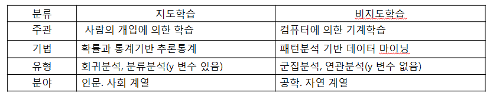


### 혼돈 매트릭스 (Confusion Matrix)

- #### 기계학습에 의해서 생성된 분류분석 모델의 성능을 지표화 할 수 있는 테이블로 모델에 의해서 예측한 값은 열(column)로 나타나고, 관측치의 값은 행(row)로 표시된다.

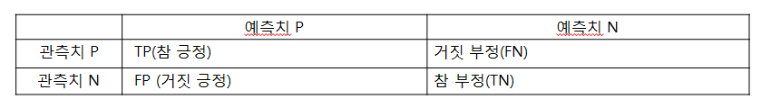


참 긍정 : 실제 값 True, 판단값 True

거짓 긍정 : 실제값 False, 판단값 True


거짓 부정 : 실제값 True , 판단값 False

참 부정 : 실제값 False, 판단값 False


- ##### 정분류율(Accuracy)  = (TP +TN) / 전체관측치(TN+FP+FN+TP)모델이 Yes로 판단한 것 중에서 실제로 Yes인 비율

  

- ##### 오분류율(Inaccuracy)  = (FN +FP) / 전체관측치(TN+FP+FN+TP) = 1- 정분류율

  

- ##### 정확율(Precision)  = TP  / (TP +FP) 

  

- ##### 재현율(Recall)  = TP  / (TP +FN) 관측치가 Yes인 것 중에서 모델이 Yes로 판단한 비율

  

- ##### F1 점수(F1 score)  =(2 * (Precision * Recall) / (Precision + Recall) 기계학습에서 Y변수가 갖는 1(Yes)과 0(No)의 비율이 불균형을 이루는 경우 모델의 평가결과로 F1 점수를 주로 이용한다.


### 지도 학습 절차  

```
- 단계 1] 학습데이터를 대상으로 알고리즘 (회귀, 분류 관련)적용

- 단계 2] 학습 후 모델 생성

- 단계 3] 검정데이터를 이용하여 생성된 모델의 정확도를 평가
```


## 회귀분석 (Regression Analysis)  

- 특정변수(독립변수)가 다른 변수(종속변수)에  어떠한 영향을 미치는가를 분석하는 방법
- 인과관계가 있는지 등을 분석하기 위한 방법
- 한 변수의 값을 가지고 다른 변수의 값을 예측해 주는 분석 방법


### 회귀분석 (Regression Analysis)  중요사항

- 가장 강력하고, 사용 범위가 넓은 분석 방법

- 돌깁변수가 종속변수에 영향을 미치는 변수를 규명하고, 이들 변수에 의해서 회귀 방정식(Y=a+βX -> Y:종속변수, a:상수, β:회귀계수, X: 독립변수)을 도출하여 회귀선을 추정한다

- 회귀계수(β)는 단위시간에 따라 변하는 양(기울기)
- 회귀선은 산점도에 위치한 각 점들의 정중앙을 통과하는 직선을 추정하는 최소제곱법을 이용
- 독립변수와 종속변수가 모두 등간척도 또는 비율척도로 구성되어 있어야 한다.


### 회귀방정식의 이해  

- 독립변수(X)와 종속변수(Y)에 대한 분포를 나타내는 산점도를 대상으로 최소자승의 원리를 적용하여 가장 적합한 선을 그릴 수 있다 (회귀선)

- 회귀선은 두 집단의 분포에서 잔차(각 값들과 편차)들의 제곱의 합을 최소화시키는(최소제곱법) 회귀방정식에 의해서 만들어진다.


## 단순 회귀분석 (Regression Analysis)  

- 독립변수와 종속변수가 각각 한 개일 경우 독립변수가 종속변수에 미치는 인과관계 등을 분석하고자 할 때 이용하는 분석 방법


### 회귀분석 (Regression Analysis)의 기본적인 가정 충족

- ##### 선형성 : 독립변수와 종속변수가 선형적이어야 한다. – 회귀선 확인

  (양의 관계든, 음의 관계든 일직선이어야함.)

  

- **잔차 정규성** : 잔차(오차)란 종속변수의 관측값과 회귀모델의 예측값 간의 차이로 잔차의 기대값은 0이며, 정규분포를 이루어야 한다 – 정규성 검정 확인

  

- **잔차 독립성** : 잔차들은 서로 독립적이어야 한다. – 더빈 왓슨 값 확인

  

- **잔차 등분산성** : 잔차들의 분산이 일정해야 한다 – 표준잔차와 표준예측치 도표

  

- **다중 공산성** : 다중 회귀분석을 수행할 경우 3개 이상의 독립변수 간의 강한 상관관계로 인한 문제가 발생하지 않아야 한다. – 분산팽창요인(VIF) 확인


### 회귀분석 (Regression Analysis)의 분석 절차


```
단계1] 회귀분석의 기본적인 가정이 충족되는지 확인한다. – 회귀분석의 기본적인 가정 충족 

단계2] 분산분석의 F 값으로 회귀모형의 유의성 여부를 판단한다

단계3] 독립변수와 종속변수 간의 상관관계와 회귀모형의 설명력을 확인한다

단계4] 검정 통계량 t값에 대한 유의확률을 통해서 가설의 채택 여부를 결정한다.

단계5] 회귀방정식을 적용하여 회귀식을 수립하고 결과를 해석한다.
```


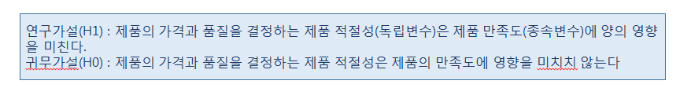


#### 회귀분석 (Regression Analysis)의 분석  

- 데이터로부터 독립변수와 종속변수 생성
- 단순 선형회귀 모델 생성 – stats 패키지의 lm()
- 모델의 적합값과 잔차 보기(계산)
- 선형회귀분석 모델 시각화  - 회귀선


### 회귀 방정식  Y=α + βX

- #### α  : 절편,  β : 회귀계수, X: 독립 변수, Y: 종속변수

- 절편(Intercept)는 x가 0일때 y값을 의미하고,
- 기울기(gradient)는 x값의 변화에 따른 y 값의 변화하는 정도를 의미
- fitted.values() – 모델의 적합값 확인
- residuals() – 모델의 잔차 확인
- 잔차와 적합값의 합으로 관측값을 계산 할 수 있다


### 회귀선(regression line)  

- 두 변수 간의 예측관계에서 한 변수에 의해서 예측되는 다른 변수의 예측치들이  그 변수의 평균치로 회귀하는 경향이 있다고 하여 갈톤(Galton)에 의해서 명명됨
- 한 변수의 증감이 다른 변수의 단위증가에 대해 어느 정도인가를 나타내는 선을 의미


#### 회귀 분석 결과는 요약 통계량을 구할 때 summary() 이용하여 확인할 수 있다  


## 회귀분석 연습 


```R
##########  회귀 분석 #######################################
product <- read.csv("./datas/product.csv", header=TRUE)
head(product)
str(product)

y<-product$제품_만족도  #종속변수
x<-product$제품_적절성  #독립변수
df <- data.frame(x, y)

# 단순 선형회귀 모델 생성 lm(y~x, data)
library(stats)
result.lm <- lm(formula=y~x, data=df)

```

### 선형회귀 모델 생성


- #### 절편(0.7789)과 기울기(0.7393)


```R

# Y=0.7789 +0.7393*X 
# X값을 구하려면 fitted.values로

# 생성된 선형회귀 모델의 적합값과 잔차 계산
names(result.lm)    #모델 관련 정보 확인
fitted.values(result.lm)[1:2]   #모델의 적합값 확인 3.735963, 2.996687
head(df, 1)   #관측값  x=4, y=3

Y=0.7789 +0.7393*4
Y     #3.7361

#오차는 관측값-적합값
3 - 3.735963     #-0.735963

residuals(result.lm)[1:2]  #-0.7359630, -0.9966869 / 잔차 확인

#관측값 = 잔차(오차)+ 적합값
-0.7359630 + 3.735963    #3


```


모델 관련 정보

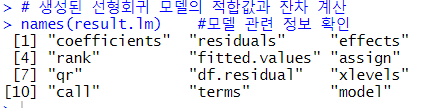


#### 적합값, 잔차(오차) 확인 


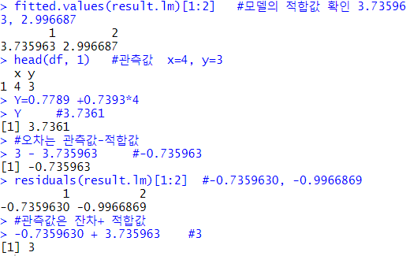


## 선형회귀 시각화


```R
#선형회귀분석 모델 시각화
plot(formula=y~x, data=result)
abline(result.lm, col="red")   #회귀선
 
```


plot + abline

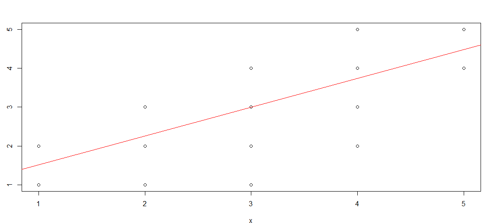


```R
#선형회귀분석 결과
summary(result.lm)
```


## 회귀분석 결과 + 해석 방법


### 결과 : 

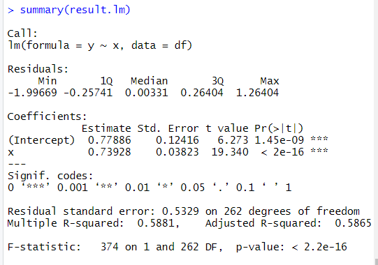


#### 결과 해석 : 


- #### Multiple R-squared:  0.5881 는 독립변수에 의해서 종속변수가 얼마만큼 설명되었는가 (회귀모델의 설명력)

  Multiple R-squared 값은 독립변수와 종속변수 간의 상관관계를 나타내는 결정계수

  설명력이 1에 가까울수록 설명변수(독립변수)가 설명을 잘한다고 판단할 수 있습니다. => 변수의 모델링이 잘 되었다는 의미


- #### Adjusted R-squared:  0.5865은 오차를 감안하여 조정된 R 값으로 (실제 분석은 이 값을 적용합니다.)


- #### F-statistic:   374는 회귀모델의 적합성을 나타내며    

  

- #### p-value: < 2.2e-16는  F-statistic와 p-value를 이용하여 회귀모델 자체를 신뢰할 수 있는지 판단

  p-value가 0.05보다 매우 작기 때문에 회귀선이 모델에 적합하다고 볼 수 있습니다.

  x            0.73928    0.03823  19.340  < 2e-16 ***

  x변수의 t=19.340 , p-value는 < 2e-16 이므로  p-value가 0.05보다 매우 작기 때문에 "제품의 가격과 품질을 결정하는 제품 적절성은 제품 만족도에 양의 영향을 미친다." 연구가설 채택


## 다중 회귀 분석


- 여러 개의 독립변수가 동시에 한 개의 종속변수에 미치는 영향을 분석할 때 이용하는 분석방법

- 다수의 독립변수가 투입되기 때문에 **한 독립변수가 다른 독립변수들에 의해서 설명되지 않은 부분을 의미**하는 **공차한계(Tolerance)**와 공차한계의 역수로 표시되는 분산팽창요인(VIF)으로 다중 공선성에 문제가 없는지를 확인해야 한다


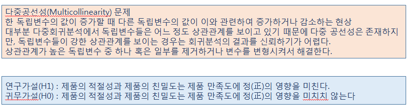


- 분산 팽창요인 값을 확인하기 위해서 관련 패키지를 설치하고 vif() 함수를 이용하여 다중 공선성 문제를 확인한다


## 회귀분석 결과 + 해석

```R

#############다중 회귀 분석###########################################
product <- read.csv("./data/product.csv", header=TRUE)
head(product)
str(product)

y<-product$제품_만족도       #종속변수
x1<-product$제품_적절성     #독립변수1
x2<-product$제품_친밀도   #독립변수2
df <- data.frame(x1, x2, y) 


#다중 회귀 분석
result.lm <- lm(formula=y~x1+x2, data=df)
result.lm    #절편(0.66731)과 기울기(x1:0.09593, x2:0.68522) 확인

#다중 공선성문제 확인
install.packages("car")
library(car)
             
vif(result.lm)     #분산팽창요인(VIF) - 결과값이 10 이상인 경우에는 다중 공선성문제를 의심해 볼수 있습니다. 


#다중 회귀 분석 결과 보기
summary(result.lm)
```


### 결과  : 

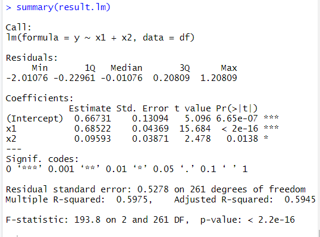


### 해석 : 


#### Multiple R-squared:  0.5975,    

#### Adjusted R-squared:  0.5945, 

#### F-statistic: 193.8 on 2 and 261 DF,  

#### p-value: < 2.2e-16

​									

|      |         |         | T-value | P-value     |
| ---- | ------- | ------- | ------- | ----------- |
| x1   | 0.68522 | 0.04369 | 15.684  | < 2e-16 *** |
| x2   | 0.09593 | 0.03871 | 2.478   | 0.0138 *    |

​          

x1는 제품의 적절성이 제품 만족도에 미치는 영향 t검정통계량 15.684, 

x2는 제품의 친밀도가 제품 만족도에 미치는 영향 t검정통계량 2.478

x1, x2의 유의 확률(p-value)은 0.05보다 작기 때문에 제품 만족도에 양의 영향을 미친다(연구 가설 채택)


상관계수(결정계수) 0.5975 다소 높은 상관관계를 나타냄, 설명력은 59.45%

회귀모델의 적합성 f검정통계량 193.8, p-value < 2.2e-16이므로 0.05 보다 매우 낮으므로 회귀모델은 적합하다고 볼 수 있습니다.


## 다중 공선성 문제 해결과 모델 평가 

- 학습데이터와 검정데이터를 7:3 비율로 샘플링
- 표본 추출
- 다중 공선성 문제 해결 – 강한 상관관계를 갖는 독립변수를 제거하여 해결
- 학습 데이터로부터 회귀모델 생성
- 검정 통계량 분석하여 가설 검정
- 검정 데이터를 이용하여 모델의 예측치 생성 – stats패키지의 predict() 
- 회귀 모델 성능을 평가 – 상관계수를 이용 , 모델의 예측치(pred)와 검정데이터의 종속변수(y)를 이용하여 상관계수(r) 를 구하여 모델의 분류정확도를 평가한다


```
#iris의 Sepal.Length(꽃받침 길이)를 종속변수로 지정하고 Sepal.Width, Petal.Length, Petal.Width을 독립변수로 ...

fit <- lm(formula= Sepal.Length ~ Sepal.Width+Petal.Length+Petal.Width, data=iris)
fit

#다중공선성 문제 확인
vif(fit)
# Petal.Length, Petal.Width 변수는 강한 상관관계로 인해서 다중 공선성 문제가 의심된다

#다중공선성 문제가 의심되는 변수의 상관계수 확인
cor(iris[, -5])


#학습데이터와 검정 데이터를 7:3으로 표본 추출
x <- sample(1:nrow(iris), 0.7*nrow(iris))  #70% 표본 추출, 행번호 추출
train <- iris[x, ] #학습데이터 
test <- iris[-x, ] #검정데이터

#Petal.Width 변수를 제거한 후 학습데이터로부터 회귀모델 생성
model <- lm(formula= Sepal.Length ~ Sepal.Width+Petal.Length, data=iris)
model
summary(model)
```

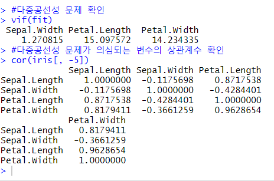


petal = 꽃잎

setal = 꽃받침


결과 : 

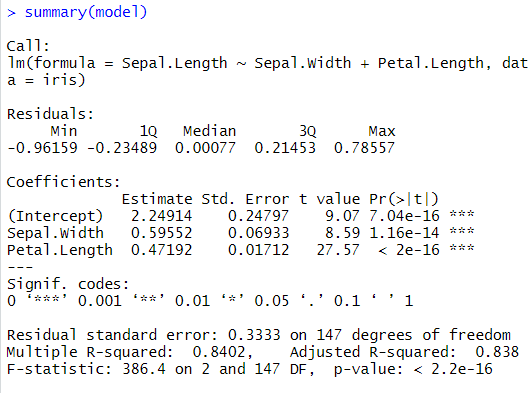


유의 변수 확률이 전부다 0.05보다 낮음.

- 꽃받침의 너비가 꽃받침의 길이에 영향을 미친다
- 꽃잎의 길이가 꽃받침의 길이에 영향을 준다


## 검정데이터에 회귀모델 적용 예측값 생성 후 모델 평가

```
model
head(train, 1) 
# 7.7         3.8          6.7         2.2  	virginica
#회귀방정식
Y = 2.2491 + 0.5955 * 3.8 + 0.4719 * 6.7
Y    #회귀모델로부터 계산된 예측값 7.67373

# 오차 = 예측값 - 관측값 
#오차 = 7.67373 - 7.7 = -0.02627

#stats::predict(model, data)
pred <- predict(model, test)
pred    #예측값 생성

#모델 평가는 상관계수를 이용하여 모델의 정확도를 평가합니다.
cor(pred, test$Sepal.Length) 
# 0.9419519
```

오차 : 7.67373 - 7.7 = -0.02627


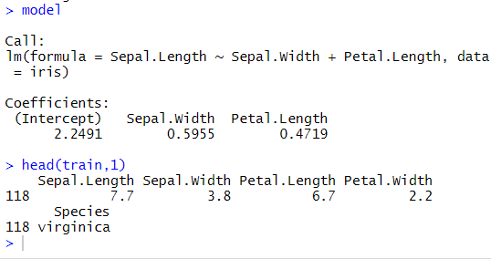


### 예측값 + 정확도

###  

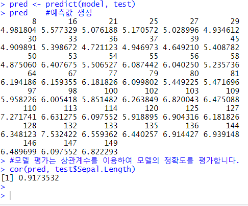


## 로지스틱 회귀분석 

```R
weather <- read.csv("./data/weather.csv", stringsAsFactors=F)
dim(weather)  # 관측치:366 ,  변수: 15
str(weather)

weather_df <- weather[, c(-1, -6, -8, -14)]

#y변수(RainTomorrow)의 로짓변환 : (0, 1)로 생성
weather_df$RainTomorrow[weather_df$RainTomorrow=='Yes']<-1
weather_df$RainTomorrow[weather_df$RainTomorrow=='No']<-0
weather_df$RainTomorrow <- as.numeric(weather_df$RainTomorrow)
head(weather_df)

#학습 데이터와 검정데이터 생성(7:3)
idx <- sample(1:nrow(weather_df), nrow(weather_df)*0.7)
train<- weather_df[idx, ]
test<- weather_df[-idx, ]

#학습 데이터로부터 로지스틱 회귀모델 생성
weather_model <- glm(formula=RainTomorrow ~., data=train, family='binomial')
weather_model

summary(weather_model)


#로지스틱 회귀모델 예측치 생성
pred <- predict(weather_model, newdata=test, type="response") #response는 예측결과를 0~1사이의 확률값으로 예측치를 반환
pred    # 예측치가 1에 가까울수록 비율 확률이 높다고 할 수 있다
#예측치를 이항형으로 변환 : 0.5이상이면 1, 0.5미만이면 0
result_pred <- ifelse(pred >=0.5, 1, 0)
result_pred

table(result_pred)   
table(result_pred, test$RainTomorrow)
#result_pred  0  1
#          0 81  15
#          1  11  3
# 분류 정확도는 (81+3) /(81+3+15+11)  :   0.7636364
```


#### 분류정확도 

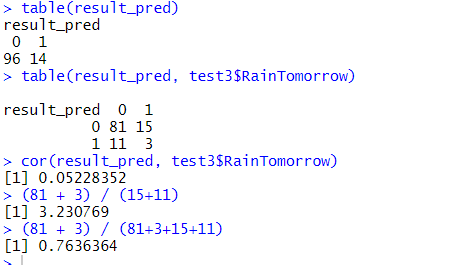


### ROC Curve 를 이용한 모델 평가

```r
install.packages("ROCR")
library(ROCR)
pr <- prediction(pred, test$RainTomorrow)
prf <- performance(pr, measure="tpr", x.measure="fpr")
plot(prf)
#왼쪽 상단의 계단모양의 빈 공백만큼이 분류 정확도에서 오분류(missing)를 나타낸다.
```


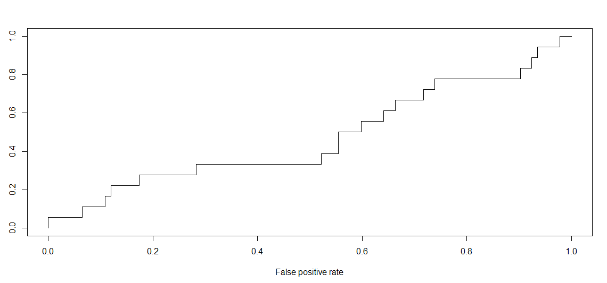


