# R 11일차


## 분류 분석(Classification Analysis)

- 다수의 변수를 갖는 데이터 셋을 대상으로 특정 변수의 값을 조건으로 지정하여 데이터를 분류하고 트리 형태의 모델을 생성하는 분석 방법

- 의사결정트리(Decision Tree)

- 랜덤 포레스트(Random Forest)

- 인공신경망(Artificial Neural Network)

- 고객을 분류하는 변수, 규칙, 특성을 찾아내고 이를 토대로 미래 잠재 고객의 행동이나 반응을 예측하거나 유도하는데 활용된다.

  

  예) 대출 은행에서 기존 고객들의 데이터를 활용하여 신용상태의 분류모델을 생성한 후 새로운 고객에 대하여 향후 신용상태를 예측하는 데 이용한다 ( 분류 모델 생성 규칙 : 기존 체납횟수, 대출금과 현재 고객의 수입 비율, 대출 사유 등)

  

  예) 과거의 환자들에 대한 종양 검사의 결과를 바탕으로 종양의 악성 또는 양성 여부를 분류하는 모델을 생성하여 새로운 환자에 대한 암을 진단하는데 이용 ( 분류 조건 : 종양의 크기, 모양, 색깔)


### 분류 분석(Classification Analysis) 특징

- Y 변수 존재 : 설명변수(x 변수)와 반응변수(y 변수)가 존재한다.
- 의사결정트리 : 분류 예측모델에 의해서 의사결정트리 형태로 데이터가 분류된다.
- 비모수 검정 : 선형성, 정규성, 등분산성 가정이 필요 없다
- 추론 기능 : 유의수준 판단 기준이 없다 (추론 기능 없음)
- 활용분야 : 이탈고객과 지속고객 분류, 신용상태의 좋고, 나쁨, 번호이동고객과 지속 고객 분류 등


### 분류 분석(Classification Analysis) 절차

- 학습 데이터 생성

- 분류 알고리즘을 통해 예측 모델 생성
- 검정 데이터를 통해 분류규칙의 모델 평가(모형 평가)
- 새로운 데이터에 적용하여 결과 예측


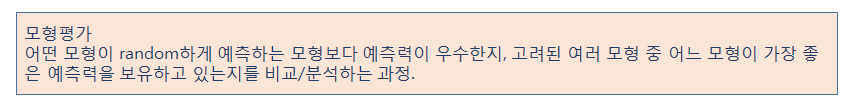


### 의사 결정 트리(Decision Tree)

- 나무(Tree) 구조 형태로 분류결과를 도출

- 입력변수 중 가장 영향력 있는 변수를 기준으로 이진분류하여 분류 결과를 나무 구조 형태로 시각화

- ##### 비교적 모델 생성이 쉽고, 단순, 명료하여 현업에서 많이 사용되는 지도학습 모델

- 의사결정규칙을 도표화 하여 분류와 예측을 수행하는 분석방법

- party 패키지 ctree()

- rpart 패키지 rpart()


### party 패키지 ctree()  분류 결과 해석


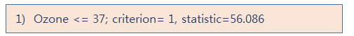


- 첫번째 번호는 반응변수(종속변수)에 대해서 설명변수(독립변수)가 영향을 미치는 중요 변수의 척도를 나타내는 수치로서 수치가 작을 수록 영향을 미치는 정도가 높고, 순서는 분기되는 순서를 의미한다.
- 두번째는 의사결정 트리의 노드명 (노드 번호 뒤에 * 기호가 오면 해당 노드가 마지막 노드를 의미)
   노드명 뒤에 해당 변수의 임계값이 조건식으로 온다
- 세번째는 노드의 분기 기준(criterion)이 되는 수치
- 네번째는 반응변수(종속변수)의 통계량(statistic)이 표시된다. 


### 특정 이름을 가진 열 제외하기

 

```r
names(weather)
weather.df <- rpart(RainTomorrow ~ ., data=weather[, c(-1, -14)], cp=0.01) 
```


## 실습 1 : 뉴욕 대기질 ctree


```R
#################의사 결정 트리(Decision Tree)##################
install.packages("party")
library(party)

library(datasets)  
#R에서 기본으로 제공해주는 데이터셋)
#뉴욕의 대기 질을 측정한 데이셋


str(airquality)     # 관측치 153개 , 변수 6개 
#Ozone, Solar.R(태양광), Wind, Temp, Month, Day
#온도에 영향을 미치는 변수를 알아보기
formula <- Temp ~ Solar.R+Wind+Ozone

#분류모델 생성
air_ctree <- ctree(formula, data=airquality)
air_ctree

plot(air_ctree)
```


결과 : 

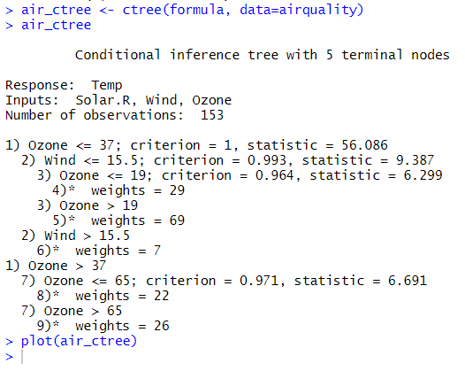


시각화 : 


- #### 온도에 가장 큰 영향을 미치는 첫번쨰 영향변수는 Ozone

- #### 두번째 영향 변수는 Wind

- #### 오존량 37이하이면서 바람의 양이 15.5이상이면 평균온도는 63정도에 해당

- #### 바람의 양이 15.5이하인 경우 평균 온도는 70이상으로 나타남

- #### 태양광은 온도에 영향을 미치지 않는 것으로 분석됨


## 실습 2 : iris 데이터로 ctree


```R
############iris 데이터 셋으로 분류 분석 수행#################
set.seed(1234)  #시드값을 적용하면 랜덤 값이 동일하게 생성
idx <- sample(1:nrow(iris), nrow(iris)*0.7)
train <- iris[idx, ]   #학습 데이터
test <- iris[-idx, ]   #검정 데이터

#종속변수는 Species, 독립변수는 ...
formula < Species ~ Sepal.Length + Sepal.Width + Petal.Length + Petal.Width

#분류모델 생성
iris_ctree <- ctree(formula, data=train)   
iris_ctree
plot(iris_ctree, type="simple") # 간단한 형태
plot(iris_ctree)	# 트리 형태

# 꽃종 분류에 가장 중요한 독립변수는 Petal.Length, Petal.Width
```


simple

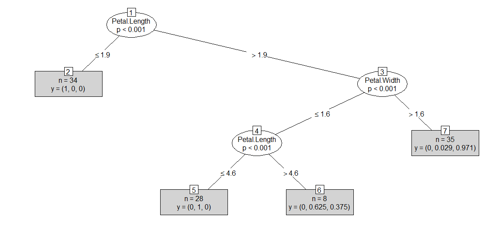


ctree	

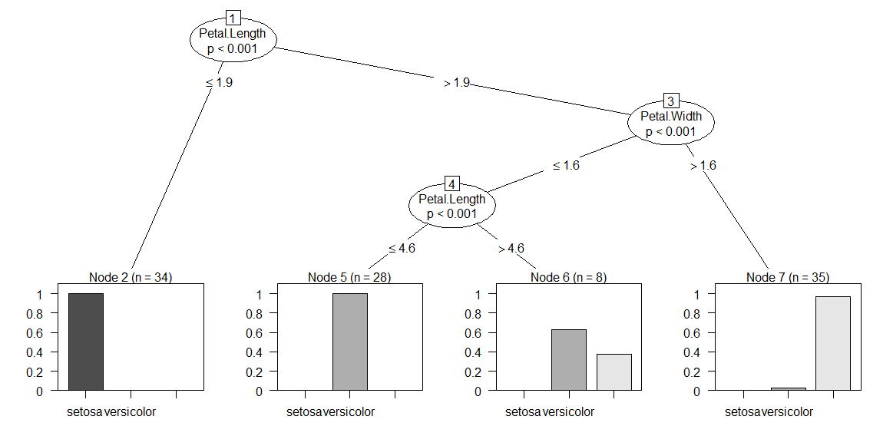


```R
# 분류모델 평가 - 예측치 생성, 혼돈 매트릭스 생성
pred <- predict(iris_ctree, test)
table(pred, test$Species)

#분류정확도 : 95.56%
(16 + 15 + 12) / nrow(test) # 0.95555556

```


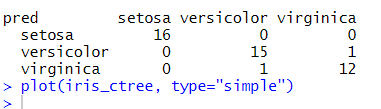


### 데이터프레임 이름 바꾸는법

```R
names(abc2)

names(abc2)[13] <- c("hours_per_week")
names(abc2)[11] <- c("capital_gain")
names(abc2)[5] <- c("education_num")
```


## rpart


### k겹 교차 검증(k-fold cross validation)

- 테스트를 더 정확하게 설정할수록 세상으로 나왔을 때 더 잘 작동한다고 할 수 있습니다. 

- 딥러닝 혹은 머신러닝 작업을 할 때 늘 어려운 문제 중 하나는 알고리즘을 충분히 테스트하였어도 데이터가 충분치 않으면 좋은 결과를 내기가 어렵습니다

- 데이터의 약 70%를 학습셋으로 써야 했으므로 테스트셋은 겨우 전체 데이터의 30%에 그쳤습니다. 이 정도 테스트만으로는 실제로 얼마나 잘 작동하는지 확신하기는 쉽지 않습니다.

- ##### k겹 교차 검증(k-fold cross validation)  - 테스트 데이터 충분하지 않을 경우  단점을 보완하고자 만든 방법이 바로 입니다. 

- k겹 교차 검증이란 데이터셋을 여러 개로 나누어 하나씩 테스트셋으로 사용하고 나머지를 모두 합해서 학습셋으로 사용하는 방법입니다. 이렇게 하면 가지고 있는 데이터의 100%를 테스트셋으로 사용할 수 있습니다. 

  

  

  

  

### rpart 패키지 rpart()를 이용한 분류 분석


- 재귀분할(recursive partitioning)

- 2수준 요인으로 분산분석을 실행한 결과를 트리 형태로 제공하여 모형을 단순화

- 전체적인 분류기준을 쉽게 분석할 수 있는 장점이 있다

    

```
############rpart 패키지 rpart()를 이용한 분류 분석############
install.packages("rpart")
library()
data(iris)

iris.df <- rpart(Sepecies ~., data=iris)
iris.df

plot(iris.df)
text(iris.df, use.n=T, cex=0.6)
post(iris.df, file="")

#줄기에 분기 조건
#끝 노드에는 반응변수의 결과값이 나타남
# 꽃 종류 변수를 분류하는 가장 중요한 변수는 Petal.Length와 Petal.Width로 나타난다.
```


```
plot(iris.df)
text(iris.df, use.n=T, cex=0.6)
```


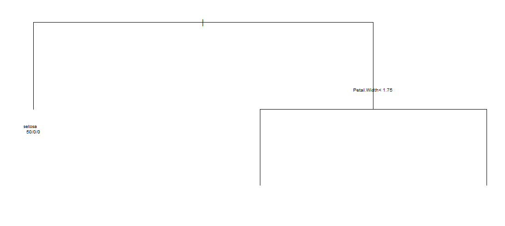


```
post(iris.df, file="")
```


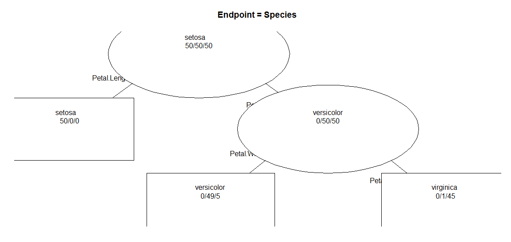


## 랜덤 포레스트(Random Forest)

- 의사결정트리에서 파생된 앙상블 학습기법을 적용한 모델

- 앙상블 학습 기법 – 새로운 데이터에 대해서 여러 개의 트리(Forest)로 학습을 수행한 후 학습 결과들을 종합해서 예측하는 모델

- 기존의 의사결정트리 방식에 비해서 많은 데이터를 이용하여 학습을 수행하기 때문에 비교적 예측력이 뛰어나고, 과적합(overfitting)문제를 해결할 수 있다

- 과적합 문제 – 작은 데이터 셋은 높은 정확도가 나타나지만 큰 데이터셋에서는 정확도가 떨어지는 현상을 의미

  

#### 랜덤 포레스트(Random Forest) 학습데이터 구성방법

- 표본에서 일부분만 복원추출 방법으로 랜덤하게 샘플링하는 방식인 부트스트랩 표본(bootstrap sample) 방식으로 학습데이터로 사용될 트리(Forest)를 생성한다.
- 입력변수 중에서 일부 변수만 적용하여 트리의 자식노드(child node)를 분류한다.


### 랜덤 포레스트(Random Forest) 형식


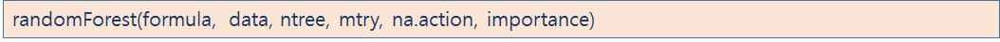


- formula : y~x 형식으로 반응변수와 설명변수 식
- data : 모델 생성에 사용될 데이터 셋
- ntree :  복원추출하여 생성할 트리 수 지정
- mtry : 자식 노드를 분류할 변수 수 지정
- na.action :  결측치를 제거할 함수 지정
- importance : 분류모델 생성과정에서 중요 변수 정보 제공 여부


실습 : 

```R

#############랜덤 포레스트 분류 분석 #########################
install.packages("randomForest")
library(randomForest)
data(iris)

model<-randomForest(Species~., data=iris)
model

#Number of trees는 학습데이터(Forest)로 복원 추출 방식으로 500개 생성했다는 의미
#No, of variables tried at each split는 두 개의 변수를 이용하여 트리의 자식노드가 분류되었다는 의미 (ntree:500, mtry:2)
#error.rate는 모델의 분류정확도 오차 비율을 의미
#Confusion matrix (혼돈 메트릭스) ..
#분류 정확도는 (setosa+versicolor+virgina)/150 : 96%


model2<-randomForest(Species~., data=iris, ntree=300, mtry=4, na.action=na.omit)
model2

#중요변수 생성으로 랜덤 포레스트 모델 생성

model3<-randomForest(Species~., data=iris, importance=T, na.action=na.omit)
model3
#중요 변수 보기 - importance속성은 분류모델 생성하는 과정에서 입력변수 중 가장 중요한 변수가 어떤 변수인가를 알려주는 역할을 한다.

importance(model3)
#MeanDecreaseAccuracy - 분류정확도를 개선하는데 기여한 변수를 수치로 제공
 
#최적의 ntree, mtry 수치값 찾아내기
ntree <- c(400, 500, 600)
mtry <-c(2:4)
param <- data.frame(n=ntree, m=mtry)
param

for(i in param$n){
  cat('ntree=', i, '\n')
  for(j in param$m) {
     cat('mtry = ', j, '\n')
     model_iris <- randomForest(Species~. , data=iris, ntree=i, mtry=j, na.action=na.omit)
     print(model_iris)
   }
}

#오차 비율을 비교하여 최적의 트리와 변수의 수를 결정합니다.
#(400, 2) (400, 3), (400, 4)
#(500, 2) (500, 3), (500, 4)
#(600, 2) (600, 3), (600, 4)
```


-> ntree가 높을수록 (500이상) 에러율이 낮다.


## 인공신경망(Artificial Neural Network)


- 인간의 두뇌 신경(뉴런)들이 상호작용하여 경험과 학습을 통해서 패턴을 발견하고,  발견된 패턴을 통해서 특정 사건을 일반화하거나 데이터를 분류하는데 이용되는 기계학습 방법

- 인간의 개입 없이 컴퓨터가 스스로 인지하고 추론, 판단하여 사물을 구분하거나 특정 상황의 미래를 예측하는데 이용될 수 있는 기계학습 방법

- 문자, 음성, 이미지 인식, 증권시장 예측, 날씨 예보 등 다양한 분야에서 활용

- 예) 구글의 알파고(딥러닝)


### 인공신경망 기계학습 역전파 알고리즘

- 인공신경망에서 기계학습은 출력값(o1)과 실제 관측치(y1)을 비교하여 오차(E)를 계산하고, 이러한 오차를 줄이기 위해서 가중치(w)와 경계값(b)를 조절한다.
- 예) 오차(E)가 0보다 큰 경우( E > 0)는  관측값에 비교하여 출력값이 작다는 의미이다 따라서 은닉층의 출력(hi)이 양수이면 가중치(wi)를 크게 하고, 은닉층의 출력(hi)이 음수이면 가중치(wi)를 더 작게 한다.
-  또한, 오차(E)가 0보다 작은 경우( E < 0)는  관측값에 비교하여 출력값이  작다는 의미이다 따라서 은닉층의 출력(hi)이 양수이면 가중치(wi)를 더 작게 하고, 은닉층의 출력(hi)이 음수이면 가중치(wi)를 더 크게 한다


- 인공신경망(퍼셉트론)은 기본적으로 단방향 망(Feed Forward Network)으로 구성된다 (입력층->은닉층->출력층)
- 단방향 전파 방식을 개선하여 (은닉층<-출력층) 역방향으로 오차(E)를 전파하여 은닉층의 가중치와 경계값을 조정하여 분류정확도를 높이는 역전파(Backpropagation) 알고리즘을 도입하고 있다.
- 역전파 알고리즘은 출력에서 생긴 오차를 신경망의 역방향(입력층)으로 전파하여 순차적으로 편미분을 수행하면서 가중치(w)와 경계값(b)등을 수정한다.
- 입력값에 최적화된 가중치와 경계값이 적용되도록 구현된 인공신경망 관련된 알고리즘을 의미한다.


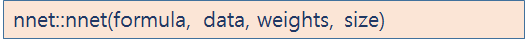


#### formula : y ~ x 형식으로 반응변수(종속변수)와 설명변수(독립변수) 식

#### data : 모델 생성에 사용될 데이터 셋

#### weights : 각 case에 적용할 가중치(기본값 : 1)

####  size : 은닉층(hidden layer)의 수 지정


## 실습 : Simple 인공신경망 모델 생성 실습


```r
###############Simple 인공신경망 모델 생성 실습##################
install.packages("nnet")
library(nnet)

#x1, x2는 입력변수, y는 출력변수로 사용할 데이터 프레임 생성
df = data.frame(x2=c(1:6), 
                x1=c(6:1), 
               y=factor(c('no', 'no','no', 'yes','yes','yes')))
str(df)

#인공신경망 모델 생성
model_net <- nnet(y~., df, size=1)
#결과는 5개의 가중치 생성 , 오차는 점차적으로 줄어드는 결과를 확인할 수 있습니다.

model_net
# 신경망(a 2-1-1)는 (경계값-입력변수-은닉층-출력변수) 형태로 5개의 가중치

summary(model_net)  #가중치 요약 정보 확인
#입력층의 경계값(b) 1개와 입력변수(i1, i2)2개가 은닉층(h1)으로 연결되는 가중치
#은닉층의 경계값(b) 1개와 은닉층의 결과값이 출력층으로 연결되는 가중치 

model_net$fitted.values  # 분류모델의 적합값 

#분류모델의 예측치 생성, 정확도 확인
#type="class"는 예측 결과를 출력변수 y의 범주('no','yes')로 분류
p <- predict(model_net, df, type="class")
table(p, df$y)

```


결과 : (summary, table만)


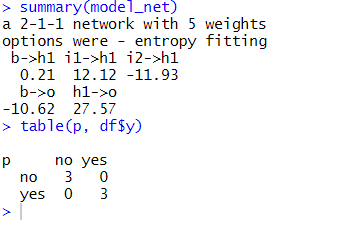


## 실습 2 : iris 데이터 셋에 인공신경망 모델 생성: nnet 패키지

```r
#####iris 데이터 셋에 인공신경망 모델 생성: nnet 패키지 ########
idx<-sample(1:nrow(iris), 0.7*nrow(iris))
training <- iris[idx, ]
testing <- iris[-idx, ]

model_net_iris <- nnet(Species ~ ., training, size=1)
#은닉층 1개, 11개의 가중치 , 출력값 3개


model_net_iris3 <- nnet(Species ~ ., training, size=3)
#은닉층 3개,  27개의 가중치, 출력값 3개

※ 입력변수의 값들이 일정하지 않으면 과적합(overfitting)을 피하기 위해서 정규화 과정을 수행해야 합니ㅏㄷ.

#가중치 확인
summary(model_net_iris) 
summary(model_net_iris3) 

#분류모델의 정확도 평가
table(predict(model_net_iris, testing, type="class"), testing$Species)
#정확률은 0.9111111

table(predict(model_net_iris3, testing, type="class"), testing$Species)
#정확률은 0.9111111(같음)

#nnet 패키지에서 제공되는 인공 신경망 모델은 1개의 은닉층으로 최적화되어 있기 때문에 
은닉층의 노두 수를 3개로 늘려서 많은 연산이 수행된 반면, 분류 정확도는 크게 차이가 없다

```


결과  :

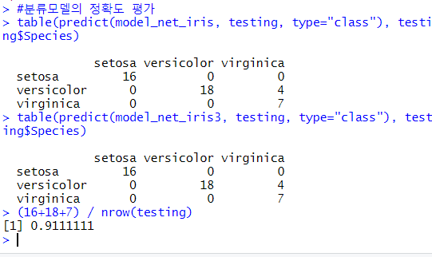


## 실습3 : iris 데이터 셋에 인공신경망 모델 생성: neuralnet 패키지


```r
install.packages("neuralnet")
library(neuralnet)
idx<-sample(1:nrow(iris), 0.7*nrow(iris))
training <- iris[idx, ]
testing <- iris[-idx, ]

※neuralnet()함수는 종속변수(출력변수y)가 수치형이어야 합니다.

training$Species2[training$Species=='setosa'] <- 1
training$Species2[training$Species=='versicolor'] <- 2
training$Species2[training$Species=='virginica'] <- 3
head(training)

testing$Species2[testing$Species=='setosa'] <- 1
testing$Species2[testing$Species=='versicolor'] <- 2
testing$Species2[testing$Species=='virginica'] <- 3
head(testing)

# 정규화 함수를 이용하여 학습데이터와 검정데이터를 정규화
# 0과 1사이의 범위로 컬럼값을 정규화 
normal <- function(x){
     return ((x-min(x))/(max(x)-min(x)))
}

training$Species <- NULL
testing$Species <-NULL

training_nor <- as.data.frame(lapply(training, normal))
summary(training_nor)

testing_nor <- as.data.frame(lapply(testing, normal))
summary(testing_nor)

#인공신경망 분류 모델 생성
model_net <- neuralnet(Species2 ~ Sepal.Length+ Sepal.Width+Petal.Length+Petal.Width, data=training_nor, hidden=1)
model_net
plot(model_net)

#분류모델 정확도(성능) 평가
model_result <- compute(model_net, testing_nor[c(1:4)])
model_result$net.result

#상관관계분석 : 상관계수로 두 변수 간의 선형관계의 강도 측정
#예측된 꼭 종류와 실제 관측치 사이의 상관관계 측정
cor(model_result$net.result, testing_nor$Species2)

#은닉층 2개
model_net2 <- neuralnet(Species2 ~ Sepal.Length+ Sepal.Width+Petal.Length+Petal.Width, 
               data=training_nor, hidden=2, algorithm="backprop", learningrate=0.01)
model_net2
plot(model_net2)


#분류모델 정확도(성능) 평가
model_result2 <- compute(model_net, testing_nor[c(1:4)])
model_result2$net.result
cor(model_result2$net.result, testing_nor$Species2)

```


모델 1 : 


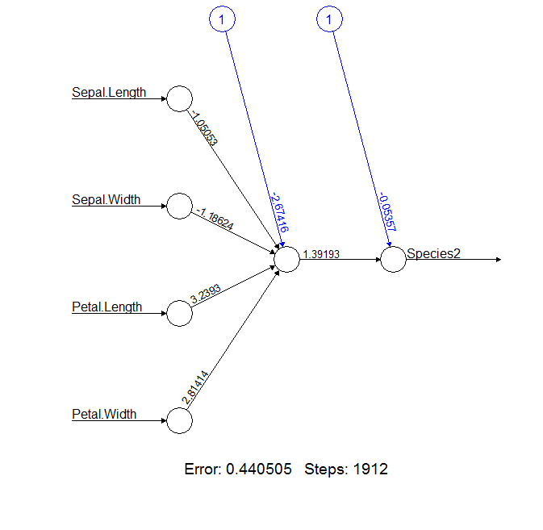


모델 2 :


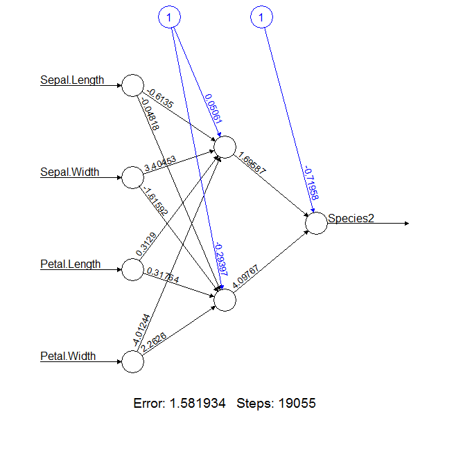


train2

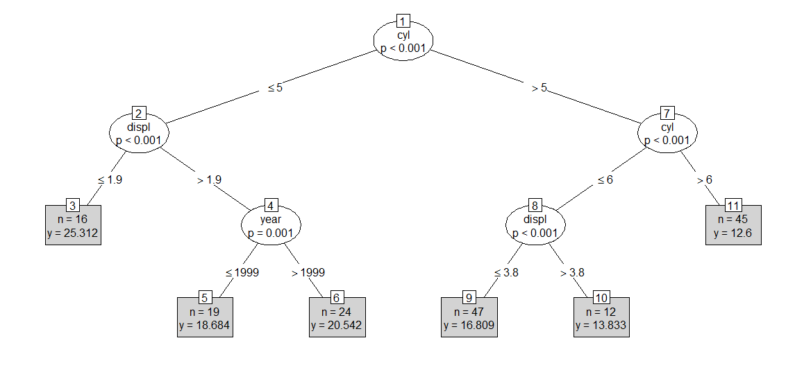

test2

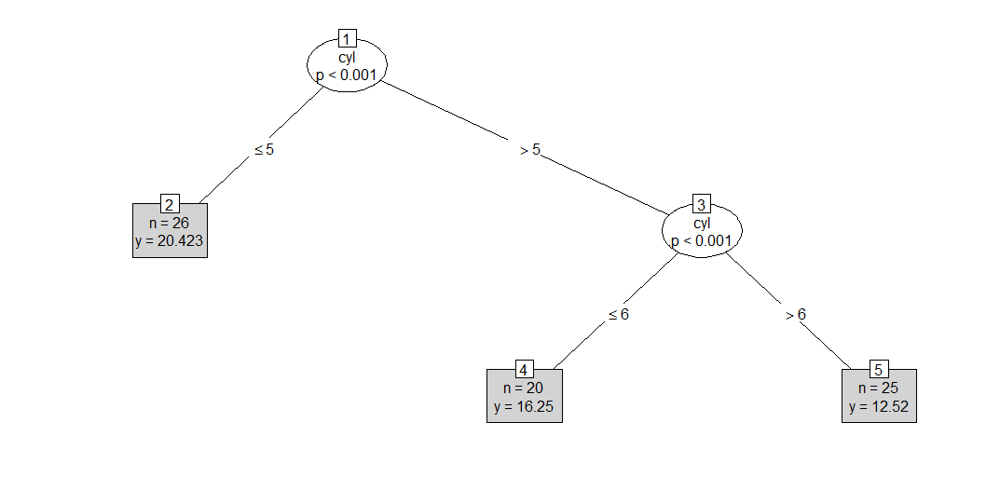


# 군집분석


## 비지도학습(unSupervised Learning)

- 데이터에 의한 학습을 통해 최적의 판단이나 예측을 가능하게 해주는 기계학습 방법의 하나로 어떤 입력에 대해서 어떤 결과가 출력되는지 사전지식이 없는 상태에서 컴퓨터 스스로 공통점과 차이점 등의 패턴을 찾아서 규칙(rule)을 생성하고, 분석 결과를 도출해내는 방식

- Y변수(정답)가 없기 때문에 검정 데이터를 이용하여 모델을 평가할 수 없다.


## 군집분석(Cluster Analysis)

- 데이터 간의 유사도를 정의하고 그 유사도에 가까운 것부터 순서대로 합쳐 가는 방법으로 그룹(군집)을 형성한 후 각 그룹의 성격을 파악하거나 그룹 간의 비교분석을 통해서 데이터 전체의 구조에 대한 이해를 돕고자 하는 탐색적 분석 방법

- 유사도 거리(distance)를 이용 – 유클리디안(Euclidean) 거리도 측정한 거리정보를 이용해서 분석 대상을 몇 개의 집단으로 분류한다. 
- 군집분석에 의해서 그룹화된 군집은 변수의 특성이 그룹 내적으로는 동일하고, 외적으로는 이질적인 특성을 갖는다.
- 용도 – 고객의 충성도에 따라서 몇 개의 그룹으로 분류하고, 그룹별로 맞춤형 마케팅 및 프로모션 전략을 수립하는데 활용된다.


### 군집분석(Cluster Analysis) 목적

- 데이터 셋 전체를 대상으로 서로 유사한 개체 들을 몇 개의 군집으로 세분화하여 대상 집단을 정확하게 이해하고, 효율적으로 활용하기 위함


### 군집분석(Cluster Analysis) 중요사항

- 군집화를 위해서 거리 측정에 사용되는 변인은 비율척도나 등간척도이어야 하며, 인구 통계적 변인, 구매패턴 변인, 생활 패턴 변인 등이 이용된다.

- 군집분석에 사용되는 입력 자료는 변수의 측정단위와 관계없이 그 차이에 따라 일정하게 거리를 측정하기 때문에 변수를 표준화하여 사용하는 것이 필요하다.

- 군집화 방법에 따라 계층적 군집분석과 비계층적 군집분석으로 분류된다. 


### 군집분석(Cluster Analysis)에 이용되는 변인

- 인구 통계적 변인 : 거주지, 성별, 나이, 교육수준, 직업, 소득수준 등

- 구매패턴 변인 : 구매상품, 1회 평균 거래액, 구매횟수, 구매주기 등
- 생활패턴 변인 : 생활습관, 가치관, 성격, 취미 등


### 군집분석(Cluster Analysis) 특징

- 전체적인 데이터 구조를 파악하는데 이용된다. 

- 관측대상 간 유사성을 기초로 비슷한 것끼리 그룹화(Clustering)한다.

- 유사성은 유클리디안 거리를 이용한다

- 분석결과에 대한 가설 검정이 없다

- 반응변수(y 변수)가 존재하지 않는 데이터마이닝 기법이다.

- 규칙(Rule)을 기반으로 계층적인 트리 구조를 생성한다.

- 활용분야는 구매패턴에 따른 고객분류, 충성도에 따른 고객분류 등

  


## 군집분석(Cluster Analysis) 절차

- 단계 1] 분석 대상의 데이터에서 군집분석에 사용할 변수 추출

- 단계 2] 계층적 군집분석을 이용한 대략적인 군집의 수 결정
- 단계 3] 계층적 군집분석에 대한 타당성 검증(ANOVA 분석)
- 단계 4] 비계층적 군집분석을 이용한 군집분류
- 단계 5] 분류된 군집의 특성 파악 및 업무 적용


### 유클리디안 거리(Euclidean distance)

- 두 점 사이의 거리를 계산하는 방법

- 관측대상 p와 q의 대응하는 변량 값의 차가 작으면, 두 관측대상은 유사하다고 정의하는 식

- 유클리디안 거리 계산식은 관측대상 p와 q의 대응하는 변량 값의 차의 제곱의 합에 제곱근을 적용한 결과이다.


- matrix 객체를 대상으로 dist() 함수를 이용하여 유클리디안 거리를 생성한다.


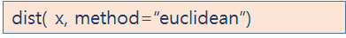


- matrix 객체의 값이 서로 가까울수록 유클리디안 거리값이 작은 값으로 나타나고, 거리가 멀수록 큰 값으로 나타난다.


## 실습 : 유클리디안 거리 계산

전체코드 :

```r
###################유클리디안 거리 계산 ########################
x <- matrix(1:9, nrow=3, by=T)
x
dist<-dist(x, method="euclidean")
dist

#1과 2, 2와 3은  유클리디안 거리 1과 3보다는 가깝고 

s<- sum((x[1,] - x[2,])^2)  #1행과 2행의 변량의 차의 제곱의 합
sqrt(s)  

s<- sum((x[1,] - x[3,])^2)  #1행과 3행의 변량의 차의 제곱의 합
sqrt(s) 
```


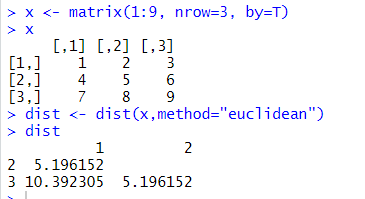


#### 유클리디안 거리 구하는 방법 참고 : 


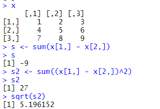


(1행의 합 - 2행의 합 )^2

한 값을 루트를 씌워준다.


### 계층적 군집분석(Hierarchical Clustering) 절차

- 개별대상 간의 거리에 의하여 가장 가까운 대상부터 결합하여 나무 모양의 계층구조를 상향식(Bottom-up)으로 만들어가면서 군집을 형성하는 방법

- 계층적 군집 분석은 군집이 형성되는 과정을 파악할 수 있다는 장점과 자료의 크기가 큰 경우 분석이 어렵다는 단점이 있다.

- 군집화된 결과를 plot() 함수를 이용하여 시각화하면 덴드로그램(Dendrogram)에 의해서 클러스터 형태로 시각화해 준다

- 덴드로그램에서 Height는 해당 군집에 대한 유클리디안 거리를 의미한다.

- 계층적 군집분석결과에서 분석자가 원하는 군집수 만큼 인위적으로 군집을 만들 수 있다 (stats::cutree(계층적 군집분석결과, k=군집수))

  

  

### 군집 대상 간의 거리를 산정하는 기준에 따라 계층적 군집 분석 분류

- 단일결합기준(최소거리 이용)

- 완전결합기준(최대거리 이용)

- 평균결합기준(평균거리 이용)

- 중심결합 기준(중심 값의 거리 이용)

- ward(유클리디안 제곱거리)  


## 실습 : 유클리디안 거리 계산 계층적 군집 분석


코드 : 

```r
install.packages("cluster")
library(cluster)

x <- matrix(1:9, nrow=3, by=T)
x
dist<-dist(x, method="euclidean")
dist

#유클리드 거리 matrix를 이용한 군집화
hc <- hclust(dist) #클러스터링 적용

plot(hc)

```


1,2의 거리는 같음, 3과1 의 거리는 다름.


## 실습 2: 유클리디안 거리 계산 계층적 군집 분석 2


```r
##########유클리디안 거리 계산 계층적 군집 분석 2 #############
interview <- read.csv("./data/interview.csv", header=TRUE)
names(interview)
head(interview)

#유클리디안 거리 계산
interview_df <- interview[c(2:7)]
idist <- dist(interview_df)
head(idist)

hc <- hclust(idist)
plot(hc, hang=-1)  #hang=-1 은 덴드로그램에서 음수값을 제거
rect.hclust(hc, k=3, border="red")
#k는 군집갯수
```


결과 : 

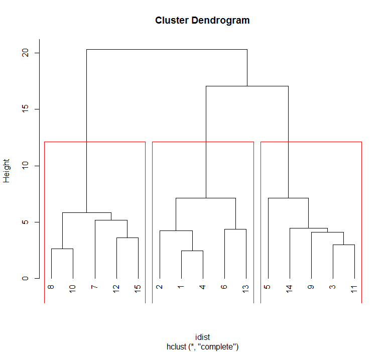


```r
#유사한 데이터끼리 그룹화한 결과, 3개 그룹 (8,10,7,12,15), (2,1,4,6,13), (3,5,9,11,14)

#군집별 특성을 보기위해서 군집별 subset 생성
g1 <- subset(interview, no==108|no==110|no==107|no==112|no==115)
g2 <- subset(interview, no==102|no==101|no==104|no==106|no==113)
g3 <- subset(interview, no==103|no==105|no==109|no==111|no==114)


summary(g1)  #종합점수 평균:71.6, 인성평균 :9.4 , 자격증 없음
summary(g2)  #종합점수 평균:75.6, 인성평균 :14.8 , 자격증 있음
summary(g3)  #종합점수 평균:62.8, 인성평균 :11 , 자격증 있음, 없음

```


결과 : 


g1 = 불합격그룹 (평균 71.6)

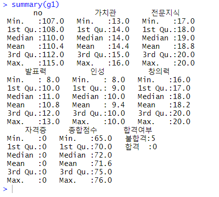


평균 점수는 높지만

인성평균이 9.4로 매우 낮음.

발표력도 10.8로 낮은 경향

자격증 0

전문지식은 높음.


g2 = 합격그룹(평균 75.6)

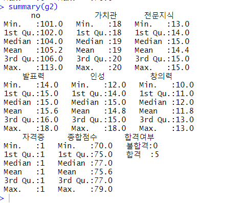


전체적으로 높음

자격증 모두 소지


g3 = 불합격그룹(평균 62.8)


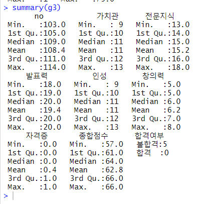


자격증 있거나 없음

창의력 매우 낮음

