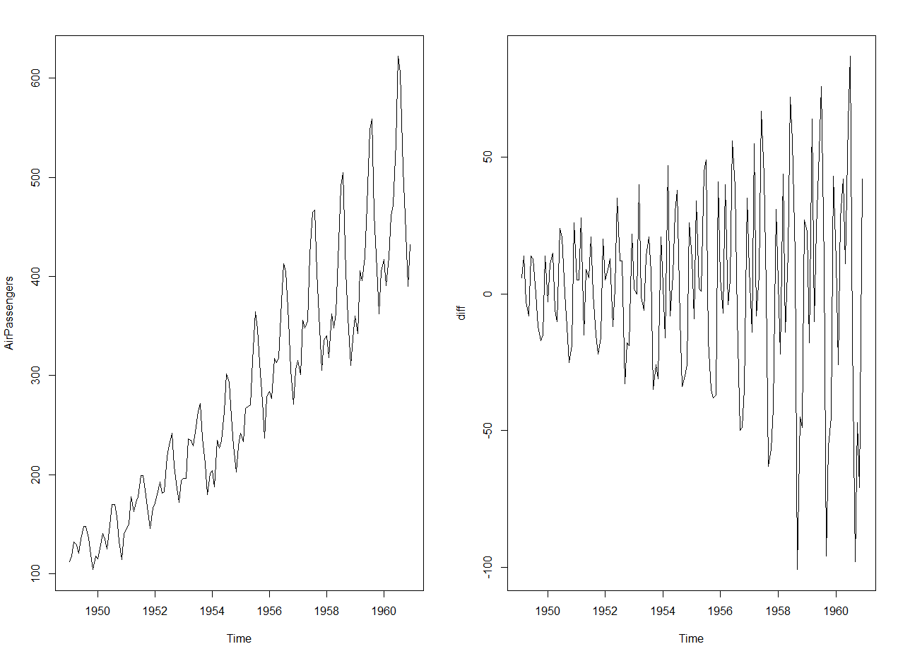
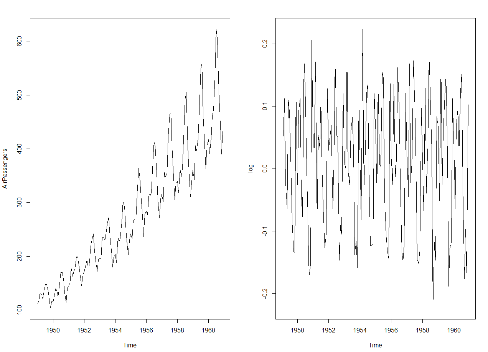
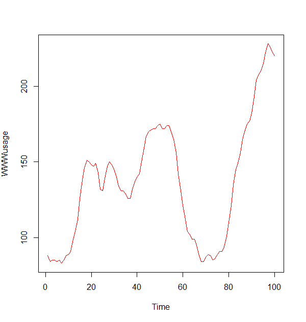
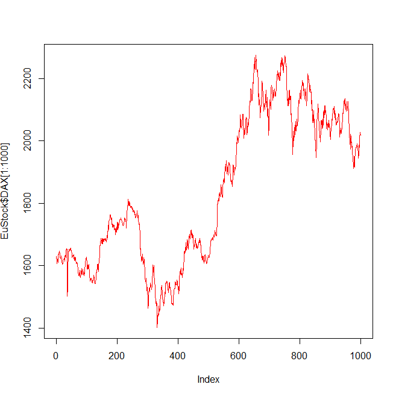
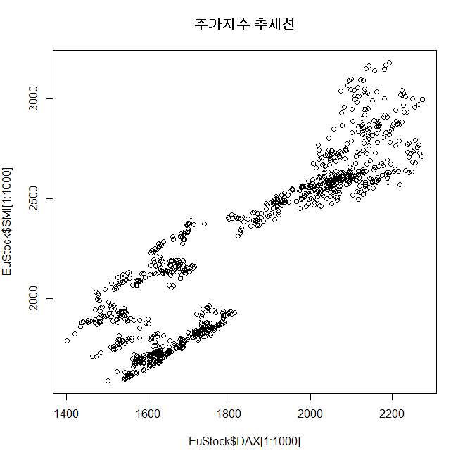

# R 12일차


```r
#############분석자가 군집수를 설정(자르기)##################
#stats::cutree(계층형 군집분석결과, k=군집수)
library(stats)
library(cluster)
idist<-dist(iris[1:4])
hc<-hclust(idist)  # 계층형 군집분석
plot(hc, hang=-1)
rect.hclust(hc, k=4,  border="red")

#군집분석 결과를 대상으로 3개의 군집수를 지정 
ghc <- cutree(hc, k=3)
ghc   #군집을 의미하는 1~3의 숫자로 출력

iris$ghc <- ghc
table(iris$ghc)   # 군집수의 빈도수

#각 군집별로 내적 특성, 다른 군집과의 차이에 해당하는 외적 특성 확인
g1<-subset(iris, ghc==1)
summary(g1[1:4])

g2<-subset(iris, ghc==2)
summary(g2[1:4])

g3<-subset(iris, ghc==3)
summary(g3[1:4])


#############군집분석 : 최단연결법(Single Linkage Method)##########
군집에 속하는 두 개체(데이터) 사이의 최단 거리를 이용
가장 유사성이 큰 개체들을 군집으로 묶어 나가는 방법
빠르고, 자료에 대한 단조변환에 대하여 Tree구조가 불변하기 때문에 
순서적 의미를 갖는 자료에 대해서 좋은 결과를 제공함
최단연결법(Single Linkage Method)은 고립된 군집을 찾는데 유용

a<-c(1, 5)
b<-c(2, 3)
c<-c(5, 7)
d<-c(3, 5)
e<-c(5, 2)
data <- data.frame(a, b, c,d, e)
data
data<-t(data)
data
m1<-hclust(dist(data)^2, method="single")
plot(m1)


#### 최장연결법(Complete Linkage Method)###
군집들의 응집성을 찾는데 유용

m2<-hclust(dist(data)^2, method="complete")
plot(m2)


######## 와드연결법(Ward's  Method)#######
새로운 군집으로 인하여 파생되는 ESS(오차 제곱의 합)의 증가량을
 두 군집 사이의 거리로 정의하여 가장 유사성이 큰 개체들을 군집으로 묶어 가는 방법

m3<-hclust(dist(data)^2, method="ward.D2")
plot(m3)

#########평균 연결법(Average Linkage Method) #########
두 군집 사이의 거리를 각 군집에 속하는 모든 개체들의 평균거리로 정의하여
가장 유사성이 큰 개체들을 군집으로 묶어 가는 방법

m4<-hclust(dist(data)^2, method="average")
plot(m4)


##############비계층적 군집 분석 #######################
library(ggplot2)
data(diamonds)
t <- sample(1:nrow(diamonds), 1000)
test <- diamonds[t, ]   #표본으로 검정 데이터 생성
names(test)

data<- test[c("price", "carat", "depth", "table")]
head(data)

#계층적 군집분석
result <- hclust(dist(data), method="ave")
result
plot(result, hang=-1)

#3개의 군집수를 적용하여 비계층적 군집분석 수행
result2 <- kmeans(data, 3)  
names(result2)
result2$cluster #각 개체가 속하는 군집수 확인

data$cluster <- result2$cluster

#price에 가장 큰 영향을 주는 변수들 확인
cor(data[, -5], method="pearson")
plot(data[, -5])  #변수간의 상관계수 보기


library(corrgram)  #상관계수를 색상으로 시각화
corrgram(data[, -5], upper.panle=panel.conf) #상관계수 수치 추가

#비계층분석 결과 price에 가장 영향을 주는 ..군집수 2의 시각화
plot(data$carat, data$price, col=data#cluster)
#중심점 추가
points(result2$centers[, c("carat", "price")], col=c(3,1,2),
        pch=8, cex=5)
 


############ iris 데이터셋 비계층적 군집 분석 ##############
data<-iris
data$Species <- NULL
head(data)
m<-kmeans(data, 3)
m

table(iris$Species, m$cluster)
plot(data[c("Sepal.Length", "Sepal.Width")], main="kmeans", col=m$cluster)


m2<-kmeans(data, 4)
m2

table(iris$Species, m2$cluster)
plot(data[c("Sepal.Length", "Sepal.Width")], main="kmeans", col=m2$cluster)


#############트랜잭션 객체를 대상으로 연관규칙 생성##############
#arules::read.transactions(), apriori()
install.packages("arules")
library(arules)
tran <- read.transactions("./data/tran.txt", format="basket",sep=",")
#거래 data는 6개
inspect(tran)   #항목(품목) 확인

rule <- apriori(tran, parameter=list(supp=0.3, conf=0.1))  #규칙 16
#맥주를 구매한 사람은 대체로 고기를 사지 않는다
#{라면, 맥주} => {우유}는 향상도가 1.2이므로 두 상품간의 상관성이 높습니다.
rule2 <- apriori(tran, parameter=list(supp=0.1, conf=0.1))  #규칙 32

stran <- read.transactions("./data/demo_single", format="single", cols=c(1,2))
inspect(stran)


stran2 <- read.transactions("./data/single_format.csv", format="single", sep=",", cols=c(1,2), rm.duplicates=T)
stran2      #트랜잭션 248, 항목은 68
summary(stran2)

#규칙 생성 (연관규칙 생성을 위한 평가척도 기본값 supp=0.1, conf=0.8)
astran2 <- apriori(stran2)   # 102 rules

#규칙 확인
inspect(astran2)

#상위 5개만 향상도 기준 내림차순 
inspect(head(sort(astran2, by="lift" ), 5))


##### 연관규칙 생성, 네트워크 형태로 시각화######
data(Adult) 
str(Adult)   #성인 대상 인구 소득에 관한 설문 조사 데이터
# AdultUCI 데이터셋을 트랜잭션 객체로 변환한 데이터셋
# transaction  48,842 , item 는 115 
# 종속변수(Class)에 의해서 연간 개입 수입이 $5만 이상인지를 예측하는 데이터 셋
  
attributes(Adult)  # transaction의 변수와 범주
names(AdultUCI) #15개의 변수(컬럼)명

adult <- as(Adult, "data.frame") 
head(adult)
str(adult)
summary(adult)

ar <- apriori(Adult, parameter=list(supp=0.1, conf=0.8))  #rules는 6,137개

ar2 <- apriori(Adult, parameter=list(supp=0.3, conf=0.95))  #rules는 124개


ar3 <- apriori(Adult, parameter=list(supp=0.35, conf=0.95))  #rules는  67

ar4 <- apriori(Adult, parameter=list(supp=0.4, conf=0.95))  #rules는  36

#상위 6개 규칙
inspect(head(ar4))

#신뢰도 기준 내림차순 정렬 상위 6개
inspect(head(sort(ar4, descreasing=T, by="confidence")))


#향상도 기준 내림차순 정렬 상위 6개
inspect(head(sort(ar4, descreasing=T, by="lift")))


install.packages("arulesViz")
library(arulesViz)

plot(ar3, method="graph", control=list(type="items"))
# 5만 달러 이상의 연봉 수령자와 관련된 연관어 :


plot(ar4, method="graph", control=list(type="items"))
# 5만 달러 이상의 연봉 수령자와 관련된 연관어 :  
주당근무시간 형태는 full-time
인종은 백인
국가는 미국
자본손실 무
직업은 자영업
나이는 중년
교육수준 ...
결혼여부 기혼

###############Groceries 데이터 셋 연관분석################
data("Groceries")
str(Groceries)
Groceries
#1개월동안 실제 로컬 식품점 매장에서 판매되는 트랜잭션 데이터
#transaction은 9835, item은 169
Groceries_df <- as(Groceries, "data.frame")

rules <- apriori(Groceries, parameter= list(supp=0.001 , conf=0.8))  # rules 410
inspect(rules)
plot(rules, method="grouped")
#빈도수가 가장 높은 상품 순서대로 2개

rules2 <- apriori(Groceries, parameter= list(supp=0.002 , conf=0.8))  # rules 11
inspect(rules2)
plot(rules2, method="grouped")

#빈도수가 가장 높은 상품

규칙이 A상품 ->B상품 형태로 표현 : 왼쪽에 있는 LHS표현, 오른쪽 RHS 표현된다

#최대 길이(LHS와 RHS길이의 합) 3 이하 규칙 생성
rules <- apriori(Groceries, parameter= list(supp=0.001 , conf=0.8 , maxlen=3))  # rules  29
inspect(rules)

rules <- sort(rules, descreasing=T, by="confidence")
inspect(rules)
plot(rules, method="graph", control=list(type="items"))


######특정 상품 서브셋 생성하여 시각화하기######
wmilk <- subset(rules, rhs %in% 'whole milk')
wmilk 
inspect(wmilk)
plot(wmilk, method="graph")
 
aveg <- subset(rules, rhs %in% 'other vegetables')
aveg
inspect(aveg)
plot(aveg, method="graph")
```


## 시계열 분석


### 시계열 분석 (Time Series Analysis)


- 시계열 자료 – 시간의 변화에 따라 관측치 또는 통계량의 변화를 기록해 놓은 자료
- 시계열 자료는 이전에 기록된 자료에 의존적이다.
- 시계열 자료를 대상으로 분석을 수행하기 위해서는 기존에 관측된 자료들을 분석하여 시계열 모형을 추정하고, 추정된 모델을 통해서 미래의 관측치 또는 통계량을 예측하게 된다.
- 시계열 분석은 어떤 현상에 대해서 시간의 변화량을 기록한 시계열 자료를 대상으로 미래의 변화에 대한 추세를 분석하는 방법
- ‘시간의 경과에 따른 관측값의 변화’를 패턴으로 인식하여 시계열 모형을 추정, 이 모형을 통해서 미래의 변화를 추정하는 분석 방법


### 시계열 분석 (Time Series Analysis) 특징


- 회귀분석과 동일하게 설명변수와 반응변수를 토대로 유의수준에 의해서 판단하는 추론통계방식
- y 변수 존재 : 시간 t를 설명변수(x)로 시계열Yt를 반응변수(y)로 사용한다.
- 미래 예측 : 시간 축을 기준으로 계절성이 있는 데이터가 기록된 시계열 자료를 데이터 셋으로 이용한다.
- 모수검정 : 선형성, 정규성, 등분산성 가정이 만족해야 한다.
- 추론 기능 : 유의수준 판단 기준이 존재하는 추론통계 방식이다
- 활용분야 : 경기계측, 판매예측, 주식시장분석, 예산 및 투자 분석 등에서 활용된다.


### 시계열 분석 (Time Series Analysis)의 적용범위


- 시계열 분석은  어떤 시간의 변화에 따라 현재 시점(t)의 자료와 이전 시점(t-1)의 자료 간의 상관성을 토대로 분석한다.
- 시간을 축으로 변화하는 통계량의 현상을 파악하여 가까운 미래를 추정하는 도구로 적합하다
- 먼 미래를 예측하는 도구로 사용될 경우 실패할 확률이 높다 – 시간의 경과에 따라 오차가 중첩되기 때문에 분산이 증가하여 예측력이 떨어진다.


### 시계열 분석 (Time Series Analysis) 적용 사례


**기존 사실에 대한 결과 규명** : 주별, 월별, 분기별, 년도별 분석을 통해서 고객의 구매패턴을 분석한다.

**시계열** **자료 특성 규명** : 시계열에 영향을 주는 일반적인 요소(추세, 계절, 순환, 불규칙)를 분해해서 분석한다(시계열 요소 분해법)

**가까운 미래에 대한 시나리오 규명** : 탄소배출 억제에 성공했을 때와 실패했을 때 지구 온난화는 얼마나 심각해질 것인가를 분석한다

**변수와 변수의 관계 규명** : 경기선행지수와 종합주가지수의 관계를 분석한다. 일반적으로 국가 경제가 좋으면 주가가 오르고, 경제가 나빠지면 주가가 내려가는 현상을 볼 수 있다.

**변수 제어 결과 규명** : 입력변수의 제어(조작)을 통해서 미래의 예측결과를 통제할 수 있다.  - 예) 상품에 대한 판매예측 시스템에서 판매 촉진에 영향을 주는 변수의 값을 조작할 경우 판매에 어떠한 영향을 미치는지를 알아볼 수 있다.


### 시계열 자료 구분


- 정상적(stationary) 시계열 – 어떤 시계열 자료의 변화 패턴이 일정한 평균값을 중심으로 일정한 변동 폭을 갖는 시계열일 때 (시간의 추이와 관계없이 평균과 분산이 일정)
   평균이 0이며 일정한 분산을 갖는 정규분포에서 추출된 임의의 값으로 불규칙성(독립적)을 갖는 데이터
   불규칙성을 갖는 패턴을 백색잡음(white noise)이라고 부른다.

  

- 비정상 시계열(non-stationary) – 시간의 추이에 따라서 점진적으로 증가하는 추세와 분산이 일정하지 않은 경우
   규칙성(비독립적)을 갖는 패턴으로 시간의 추이에 따라서 점진적으로 증가하거나 하강하는 추세(Trend)의 규칙, 일정한 주기(cycle) 단위로 동일한 규칙이 반복되는 계절성(Seasonality)의 규칙을 보인다


- 비정상 시계열(non-stationary)은 시계열 자료의 추세선, 시계열요소분해, 자기 상관함수의 시각화 등을 통해서 확인할 수 있다.
- 시계열 자료가 비정상적 시계열이면 정상적 시계열로 변화시켜야 시계열 모형을 생성할 수 있다. – 정상적 시계열로 변경하는 대표적인 방법은 차분과 로그변환 

- **차분****(Differencing)** – 현재 시점에서 이전 시점의 자료를 빼는 연산으로 평균을 정상화하는데 이용

- 차분을 수행한 결과가 대체로 일정한 값을 얻으면 선형의 추세를 갖는다는 판단을 할 수 있다
- 차분된 것을 다시 차분했을 때 일정한 값들을 보인다면 그 시계열 자료는 2차식의 추세를 갖는다고 판단한다
- **로그 변환** - log() 함수를 이용하여 분산을 정상화하는 데 이용
- 시계열 자료를 대상으로 대수를 취한 값들(log Yt)의 1차 차분이 일정한 값을 갖는 경우 분산이 정상화되었다고 할 수 있다. 
- 시계열 추세를 찾아낸 후에는 원 시계열에서 추세를 제거함으로 추세가 없는 시계열의 형태로 나타나면 정상적 시계열(Stationary Time-series)로 볼 수 있다.


### 실습 : 


```r
##########비정상 시계열 자료를 정상성 시계열 자료 변환 ##########
data(AirPassengers)  #12년간 항공기 탑승 승객 수
head(AirPassengers)
str(AirPassengers)

#차분을 이용한 평균에 대한 정상화
par(mfrow=c(1,2))
ts.plot(AirPassengers)   #시계열 시각화
diff <- diff(AirPassengers)  #차분 수행
plot(diff)   #평균 정상화

```


#### ※차분 :

 어떤 수열의 각 수에서 그 하나 앞의 수를 뺀 차를 계차라고 하고, 계차들로 이루어진 수열을 계차수열이라고 한다. 계차수열의 계차를 제2계의 계차라고 하고, 제m계의 계차까지 생각할 수 있다.


결과




```r

#로그를 이용한 분산에 대한 정상화
par(mfrow=c(1,2))
plot(AirPassengers)
log <-diff(log(AirPassengers))  #로그 + 차분 
plot(log)


```


결과 : 





비정상 시계열을 정상 시계열로 변환시키는 실습들.


## 시계열 추세선 시각화  

- 추세 – 어떤 현상이 일정한 방향으로 나아가는 경향

- 예) 주식시장분석이나 판매예측 등에서 어느 기간 동안 같은 방향으로 움직이는 경향
- 추세선 – 추세를 직선이나 곡선 형태로 차트에서 나타내는 선
- 추세선을 통해서 어느 정도 평균이나 분산을 확인 할 수 있다.
- 추세선의 시각화는 추세나 순환 등의 요인을 어느 정도 확인할 수 있기 때문에 시계열 자료의 특징을 파악하는데 도움이 된다.


## 추세선 시각화 실습 :


```r
#############시계열 자료로부터 추세선 시각화 ##################
data(WWWusage)   #인터넷 사용시간을 분 단위로 측정 
str(WWWusage)    #측정치 : 100  , 자료구조 형태: 벡터

ts.plot(WWWusage, type="l", col="red")  #가로축 :t , 세로축:시계열 데이터 값

```


결과 : 




```r

#############시계열 자료로부터 추세선 시각화 ##################
data(WWWusage)   #인터넷 사용시간을 분 단위로 측정 
str(WWWusage)    #측정치 : 100  , 자료구조 형태: 벡터

ts.plot(WWWusage, type="l", col="red")  #가로축 :t , 세로축:시계열 데이터 값

#다중 시계열 자료의 추세선 시각화
data(EuStockMarkets)  #유럽 주요 주식의 주가지수 일일 마감 가격  
str(EuStockMarkets)  #DAX:독일, SMI:스위스, CAC: 프랑스 , FISE:영국)
EuStock <- data.frame(EuStockMarkets);
X11()
plot(EuStock$DAX[1:1000], type="l", col="red")
plot(EuStock$DAX[1:1000],EuStock$SMI[1:1000], main="주가지수 추세선")

```








유럽과 스위스의 주가지수 상관관계