# R 13일차 - 시계열 분석


## 실습 : 


```r
##########시계열요소 분해 시각화 ########################
data <- c(45, 56, 45, 43, 69, 75, 58, 59, 66, 64, 62, 65, 
          55, 49, 67, 55, 71, 78, 71, 65, 69, 43, 70, 75, 
          56, 56, 65, 55, 82, 85, 75, 77, 77, 69, 79, 89)
length(data)# 36

# 시계열자료 생성 : 시계열자료 형식으로 객체 생성
tsdata <- ts(data, start=c(2016, 1), frequency=12) 
tsdata    # 2016~2018

# 추세선 확인 
par(mfrow=c(1,1))
ts.plot(tsdata)  #각 요인(추세, 순환, 계절, 불규칙)을 시각적 확인

#시계열 분해  - 시계열 변동 요인 분석-> 시계열 모델을 선정하기 위해
library(stats)
plot(stl(tsdata, "periodic"))  #주기적
#잔차는 회귀식에 의해 추정된 값과 실제 값의 차이 - 계절과 추세 적합 결과에 의해서 나타남


```


추세선 확인

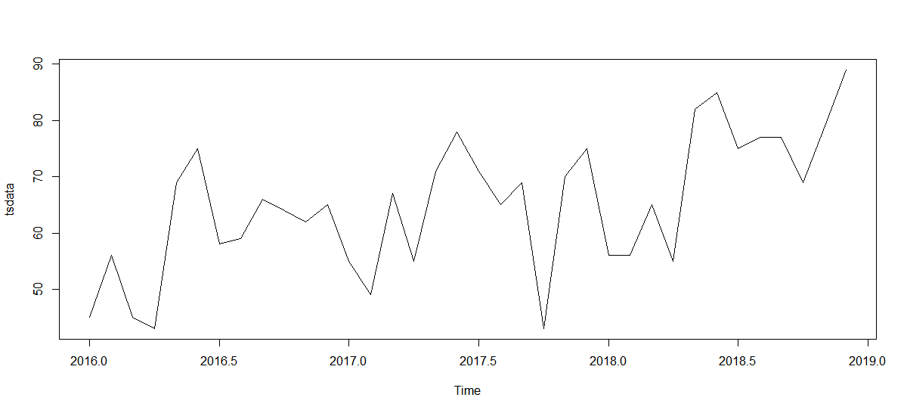


시계열 분해 

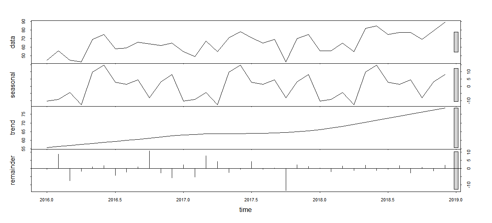


```r
#시계열 분해, 변동요인 제거
m<- decompose(tsdata)
attributes(m)

plot(m)       #추세, 계정, 불규칙 요인 포함 시각화 -1 
plot(tsdata - m$seasonal)  #계절 요인을 제거한 시각화 -2 
plot(tsdata - m$trend)    #추세 요인을 제거한 시각화 -3 
plot(tsdata - m$seasonal - m$trend)  #불규칙 요인만 시각화 -4

```


1. 추세, 계정, 불규칙 요인 포함 시각화 -1 

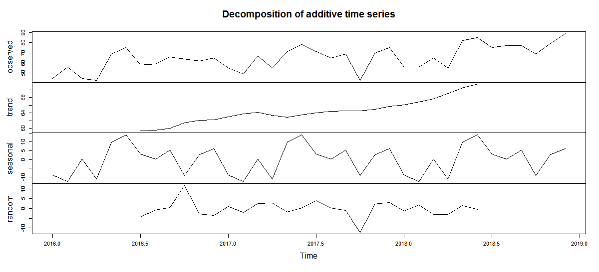


2.계절 요인을 제거한 시각화 -2 

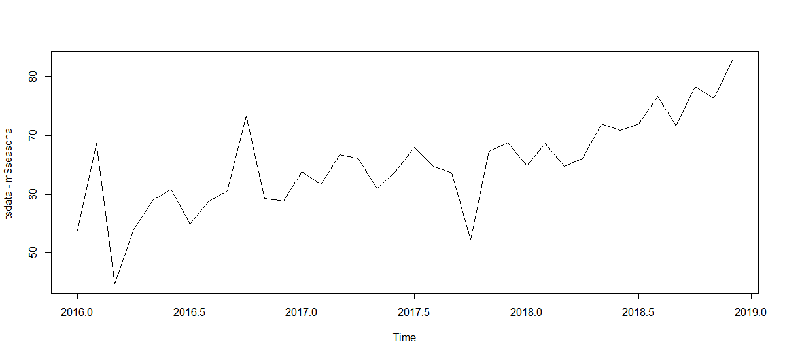


3.추세 요인을 제거한 시각화 -3 

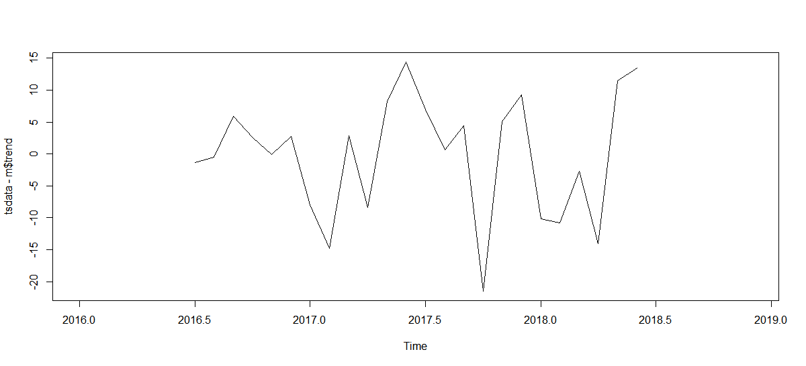


4.불규칙 요인만 시각화 -4

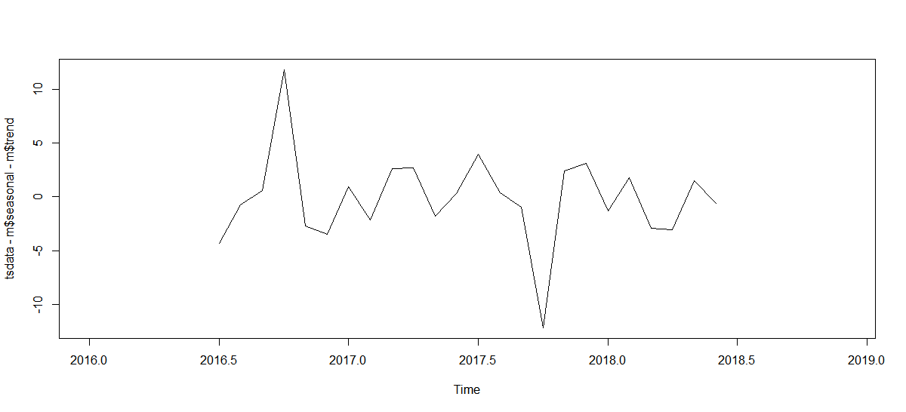


## 실습 2 : 자기 상관 함수


```r
#################자기 상관 함수 ###########################
input <- c(3180,3000,3200,3100,3300,3200,3400,3550,3200,3400,3300,3700) 

#시계열객체 생성(12개월 : 2015년 2월 ~ 2016년 1개)
tsdata <- ts(input, start=c(2015, 2), frequency=12) 
tsdata 

# 추세선 시각화 -1
plot(tsdata, type="l", col='red')

#자기 상관 함수 시각화 -2
acf(na.omit(tsdata), main="자기상관함수", col="red")

#파란점선은 유의미한 자기 상관관계에 대한 임계값을 의미
#모든 시차(Lag)가 파란 점선 안에 있기 때문에 서로 이웃한 시점 간의 
자기 상관성은 없는 것으로 해석

#부분 자기 상관 함수 시각화
pacf(na.omit(tsdata), main="부분자기상관함수", col="red") 
#주기 생성에 어떤 종류의 시간 간격이 영향을 미치는지 보여줌
#간격 0.5에서 가장 작은 값(-0.5)를 나타냄
#모든 시차가 파란 점선 안쪽에 있기 때문에 주어진 시점 간의 자기 상관성은 없는 것으로 해석
```


1-추세선 시각화 :


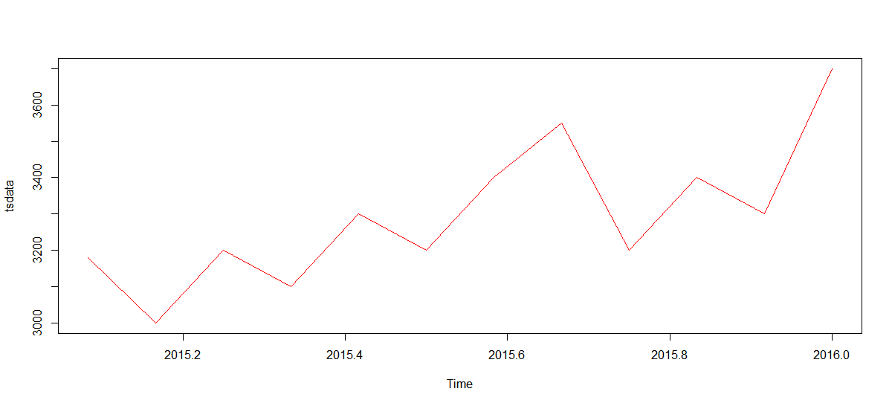


2-자기 상관 함수 시각화:

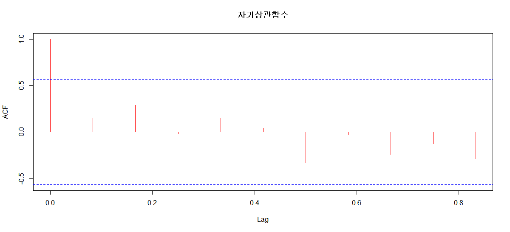


3-부분 자기 상관 함수 시각화

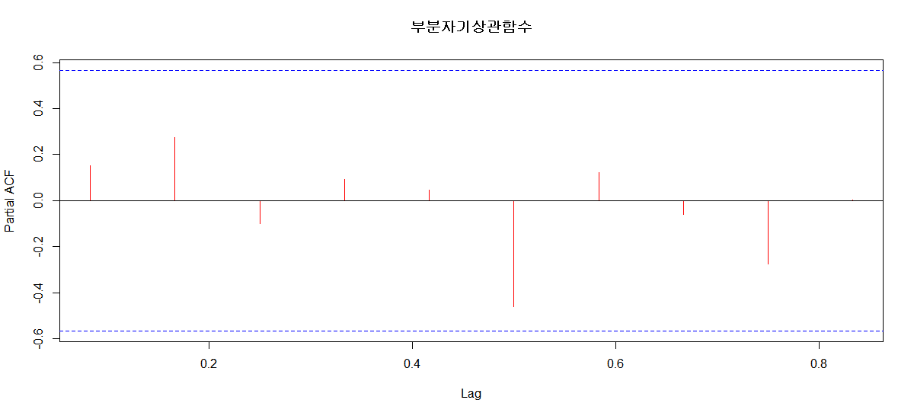


## 실습 3 :추세 패턴 찾기 시각화


```r
#############추세 패턴 찾기 시각화  ###################
input <- c(3180,3000,3200,3100,3300,3200,3400,3550,3200,3400,3300,3700) 

#시계열객체 생성(12개월 : 2015년 2월 ~ 2016년 1개)
tsdata <- ts(input, start=c(2015, 2), frequency=12) 
tsdata

# 추세선 시각화 -1
plot(tsdata, type="l", col='red')
#점진적으로 증가하는 추세의 선형 형태 확인

#자기 상관 함수 시각화 -2
acf(na.omit(tsdata), main="자기상관함수", col="red")
#자기 상관성 없음

#차분 시각화 -3
plot(diff(tsdata, differences=1))
#평균을 중심으로 일정한 폭을 나타내고 있음 

#결론 : 추세의 패턴은 선형으로 판단됨
```


1- 추세선


2- 자기 상관


3- 차분


### 평활법(Smothing Method)  

- 시계열 자료의 체계적인 자료의 흐름을 파악하기 위해서 과거 자료의 불규칙적인 변동을 제거하는 방법
- 시계열 자료의 뾰족한 작은 변동들을 제거하여 부드러운 곡서으로 시계열 자료를 조정하는 기법
- 이동평균, 지수평활법 


### 이동평균(Moving Average)  

- 시계열 자료를 대상으로 일정한 기간의 자료를 평균으로 계산하고, 이동시킨 추세를 파악하여 다음 기간의 추세를 예측하는 방법
- 시계열 자료에서 계절 변동과 불규치변동을 제거하여 추세 변동과 순환 변동만 갖는 시계열로 변환한다(시계열에서 추세와 순환예측)
- 자료의 수가 많고 비교적 안정적 패턴을 보이는 경우 효과적이다
- TTR::SMA() – 이동평균번으로 평활하는 함수
- 가장 평탄한 형태로 분포된 결과를 선정하여 추세를 예측하는데 사용된다


## 실습4 : 이동평균(Moving Average) 평활법


```r
#########이동평균(Moving Average) 평활법 ###################  
data <- c(45, 56, 45, 43, 69, 75, 58, 59, 66, 64, 62, 65, 
          55, 49, 67, 55, 71, 78, 71, 65, 69, 43, 70, 75, 
          56, 56, 65, 55, 82, 85, 75, 77, 77, 69, 79, 89)

# 시계열자료 생성 : 시계열자료 형식으로 객체 생성
tsdata <- ts(data, start=c(2016, 1), frequency=12) 
tsdata    # 2016~2018

install.packages("TTR")
library(TTR)

# 이동평균법으로 평활 및 시각화 - 결과 1~4
par(mfrow=c(2, 2))
plot(tsdata, main="원 시계열 자료") # 시계열 자료 시각화
plot(SMA(tsdata, n=1), main="1년 단위 이동평균법으로 평활")
plot(SMA(tsdata, n=2), main="2년 단위 이동평균법으로 평활")
plot(SMA(tsdata, n=3), main="3년 단위 이동평균법으로 평활")

#가장 평탄한 형태로 분포된 결과를 선정하여 추세를 예측하는데 사용
#평균으로 평활한 결과가 가장 평탄한 값으로 나타나는 값은  3년 단위 이동평균법으로 평활한 것


```


결과 : - 이동평균법으로 평활 및 시각화


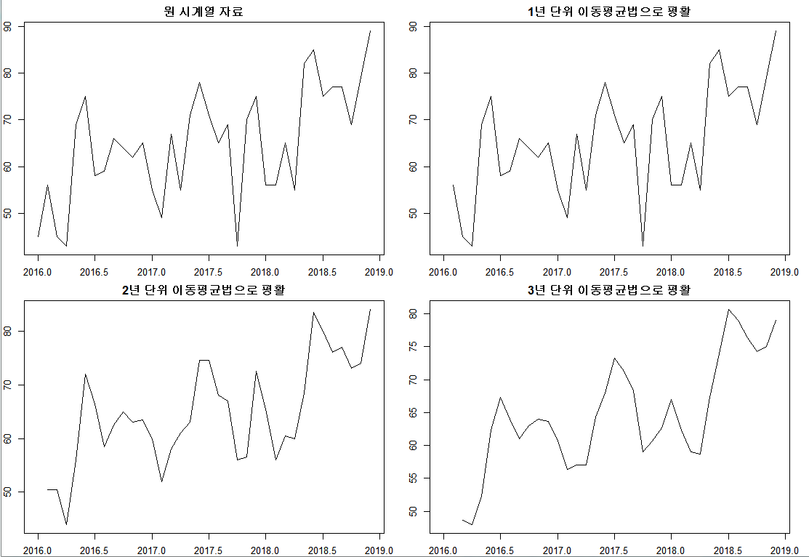


실습 5 :


```r
############정상성 시계열의 ARIMA  모델 분석 ##################

input <- c(3180,3000,3200,3100,3300,3200,3400,3550,3200,3400,3300,3700) 

#시계열객체 생성(12개월 : 2015년 2월 ~ 2016년 1개)
tsdata <- ts(input, start=c(2015, 2), frequency=12) 
tsdata

# 추세선 시각화 -1
plot(tsdata, type="l", col='red')

# 정상성시계열 변환 -2
par(mfrow=c(1,2))
ts.plot(tsdata)
diff <- diff(tsdata)
plot(diff) # 차분 : 현시점에서 이전시점의 자료를 빼는 연산

```


1- 추세선 시각화

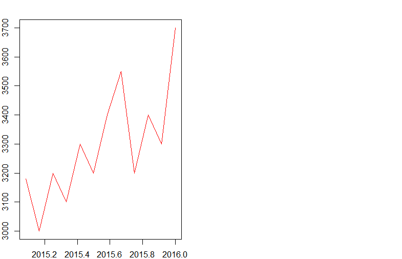


2- 정상성시계열 변환


좌 (비정상) -> 우 (정상시계열) 로 변환


```r
# auto.arima() : 시계열 모형을 식별하는 알고리즘에 의해서 최적의 모형과 파라미터를 추정하여 제공
install.packages('forecast')
library(forecast)
arima <- auto.arima(tsdata) # 시계열 데이터 이용 
arima
# ARIMA(1,1,0) - 자기 회귀 모형 차수 1, 차분 차수 1
# 1번 차분한 결과가 정상성 시계열 ARMA(1, 0) 모형으로 나타남
# AIC=148.8 는 이론적 예측력 (모형의 적합도 지수로 값이 적은 모형을 채택한다.)
# d =0 이면, ARMA(p, q) 모형이며, 정상성을 만족합니다
# p =0 이면, IMA(d, q) 모형이며, d번 차분하면 MA(q) 모형을 따른다
# q=0이면, IAR(p, d) 모형이며, d번 차분하면 AR(p) 모형을 따른다


####  모형 생성 
model <- arima(tsdata, order=c(1, 1, 0))
model 
#모형의 계수값과 표준 오차를 확인
```


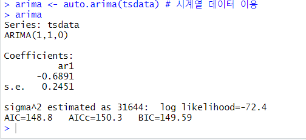


## 실습 : 모형진단


```r
####모형 진단(모형 타당성 검정)

# (1) 자기상관함수에 의한 모형 진단
tsdiag(model)
#잔차의 ACF에서 자기 상관이 발견되지 않고, p value값이 0 이상으로 분포되어 있으므로
ARIMA 모형은 매우 양호한 시계열 모형이라고 진단할 수 있다

# (2) Box-Ljung에 의한 잔차항 모형 진단
Box.test(model$residuals, lag=1, type = "Ljung")   #p-value가 0.725
#  p-value가 0.05이상이면 모형이 통계적으로 적절하다고 볼 수 있다 

# 미래 예측(업무 적용)
fore <- forecast(model) # 향후 2년 예측
fore
par(mfrow=c(1,2))
plot(fore) # 향후 24개월 예측치 시각화 
model2 <- forecast(model, h=6) # 향후 6개월 예측치 시각화 
plot(model2)
```


## 실습 : 계절성 있는 데이터의 정상성시계열의 ARIMA 모델 분석


```r


######계절성 있는 데이터의 정상성시계열의 ARIMA 모델 분석########
data <- c(45, 56, 45, 43, 69, 75, 58, 59, 66, 64, 62, 65, 
          55, 49, 67, 55, 71, 78, 71, 65, 69, 43, 70, 75, 
          56, 56, 65, 55, 82, 85, 75, 77, 77, 69, 79, 89)
length(data)# 36

# 시계열자료 생성 
tsdata <- ts(data, start=c(2016, 1), end = c(2018, 10),frequency=12)
tsdata 
head(tsdata)
tail(tsdata)


#시계열요소분해 시각화
ts_feature <- stl(tsdata, s.window="periodic")
plot(ts_feature)
#계절성이 뚜렷하게 나타남


# 단계2 : 정상성시계열 변환
par(mfrow=c(1,2))
ts.plot(tsdata)
diff <- diff(tsdata)  
plot(diff) # 차분 시각화


# 단계3 : 모형 식별과 추정
library(forecast)
ts_model2 <- auto.arima(tsdata)  
ts_model2

# ARIMA(2,1,0) - 자기 회귀 모형 차수 2, 차분 차수 1
# 1번 차분한 결과가 정상성 시계열 ARMA(2, 0) 모형으로 나타남
# ARIMA 두번째 파라미터 (1, 0, 0)는 계절성을 갖는 자기회귀(AR) 모형 차수가 1로 나타남 =>계절성을 갖는 시계열이라는 의미
# [12]는 계절의 차수가 12개월임을 의미함
# 계수(Coefficients)는 자기회귀 모형의 차수 2(ar1, ar2)와 계절성 자기회귀 차수(sar1)에 대한 계수값임을 나타냄
 

# 단계4 : 모형 생성 
model <- arima(tsdata, c(2, 1, 0), 
               seasonal = list(order = c(1, 0, 0)))
model
#모형의 계수값과 표준 오차를 확인


# 단계5 : 모형 진단(모형 타당성 검정)
# (1) 자기상관함수에 의한 모형 진단
tsdiag(model)
#잔차의 ACF에서 자기 상관이 발견되지 않고, p value값이 0 이상으로 분포되어 있으므로
ARIMA 모형은 매우 양호한 시계열 모형이라고 진단할 수 있다


# (2)Box-Ljung에 의한 잔차항 모형 진단
Box.test(model$residuals, lag=1, type = "Ljung")  #0.593
#  p-value가 0.05이상이면 모형이 통계적으로 적절하다고 볼 수 있다 


# 단계6 : 미래 예측
par(mfrow=c(1,2))
fore <- forecast(model, h=24) # 2년 예측 
plot(fore)
fore2 <- forecast(model, h=6) # 6개월 예측 
plot(fore2)

```


