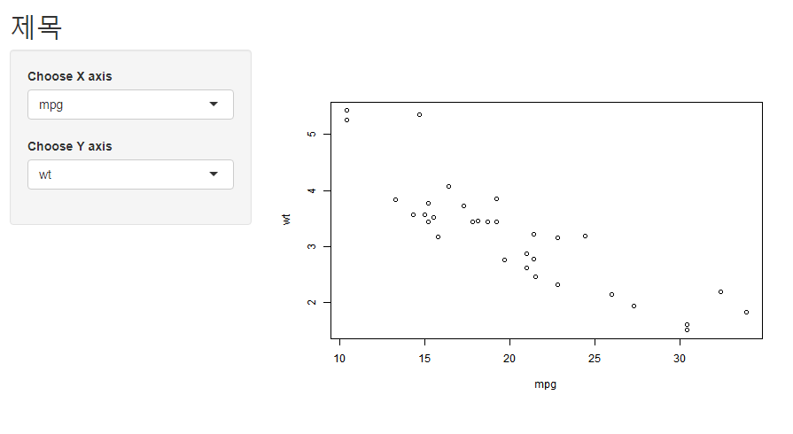
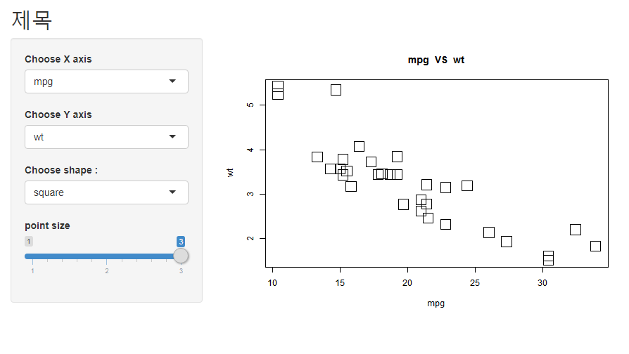
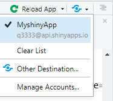

# R_Shiny


http://shiny.rstudio.com/tutorial

튜토리얼


http://shiny.rstudio.com/gallery/

갤러리에 Start simple 을 누르면 코드들이 있음.


R스튜디오에서 새 프로젝트 생성 -> Shiny 프로젝트 선택


하면 기본 앱 구성 코드가 나와있음.


mainPanel(
           plotOutput("distPlot")
        )


여기서 distplot이 아이디.


실습 :

```r
#
# This is a Shiny web application. You can run the application by clicking
# the 'Run App' button above.
#
# Find out more about building applications with Shiny here:
#
#    http://shiny.rstudio.com/
#

library(shiny)

# Define UI for application that draws a histogram
ui <- fluidPage(

    # Application title
    titlePanel("제목"),

    # Sidebar with a slider input for number of bins 
    sidebarLayout(
         sidebarPanel(
       selectInput(inputId = "xAxis", "Choose X axis", choices = c("mpg", "disp", "hp", "drat", "wt")
                   ),

       selectInput(inputId = "yAxis", "Choose Y axis", choices = c("wt", "drat", "hp", "disp", "mpg")
                   )
       ),
       
        # Show a plot of the generated distribution
        mainPanel(
           plotOutput(outputId = "mtcarsPlot")
        )
    )
)

# Define server logic required to draw a histogram
server <- function(input, output) {

    output$mtcarsPlot <- renderPlot({
        plot(mtcars[, c(input$xAxis, input$yAxis)])
    })
}

# Run the application 
shinyApp(ui = ui, server = server)

```


결과 : 




실습 2 :


```r
#
# This is a Shiny web application. You can run the application by clicking
# the 'Run App' button above.
#
# Find out more about building applications with Shiny here:
#
#    http://shiny.rstudio.com/
#

library(shiny)

# Define UI for application that draws a histogram
ui <- fluidPage(

    # Application title
    titlePanel("제목"),

    # Sidebar with a slider input for number of bins 
    sidebarLayout(
         sidebarPanel(
       selectInput(inputId = "xAxis", "Choose X axis", choices = c("mpg", "disp", "hp", "drat", "wt")
                   ),
       
          

       selectInput(inputId = "yAxis", "Choose Y axis", choices = c("wt", "drat", "hp", "disp", "mpg")
                   ),
       
       selectInput(inputId = "pch", "Choose shape :", choices = c("circle"=1, "circle2"=16, "square"= 22)
       ),
       
       
       sliderInput(inputId = "cex", "point size", min=01, max=3, value=1
       )    
       ),
       
       
        # Show a plot of the generated distribution
        mainPanel(
           plotOutput(outputId = "mtcarsPlot")
        )
    )
)

# Define server logic required to draw a histogram
server <- function(input, output) {

    output$mtcarsPlot <- renderPlot({
        title <- paste(input$xAxis, " VS " , input$yAxis)
        plot(mtcars[, c(input$xAxis, input$yAxis)],
             main=title,
             pch=as.numeric(input$pch),
             cex=input$cex)
    })
}

# Run the application 
shinyApp(ui = ui, server = server)

```


결과 : 





## shinyApp.io 와 연결


https://q3333.shinyapps.io/MyshinyApp/


Account -> 토큰으로 접속,


rsconnect 패키지 설치





여기 눈 모양 클릭 -> 퍼블리싱