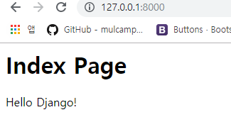
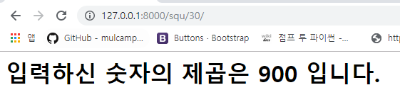
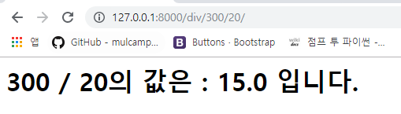
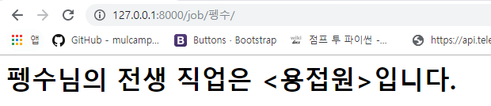
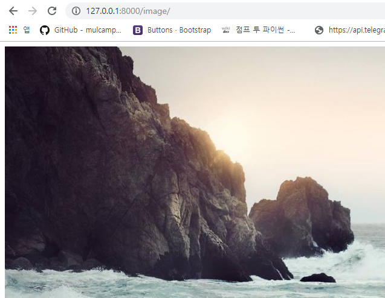
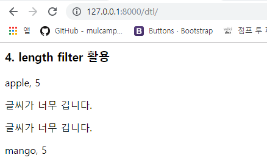

# 오늘 한거

#### @장고의 views에서 templates로 데이터를 넘길때는 context를 `딕셔너리` 로 만들어서 보내줘야한다!

## Index

## Squ

## plus~div

## Profile

## job

#### @Faker 랜덤 직업 사용

## image

#### @  Lorem Picsum  랜덤 이미지 사용

## dtl

#### @dtl 연습,  같이 있는 문서 참고

## birth

날짜계산