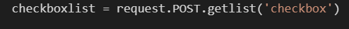
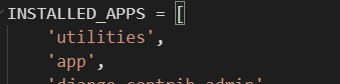
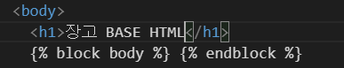
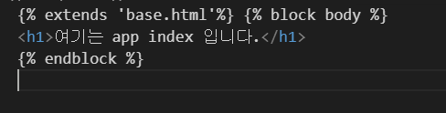
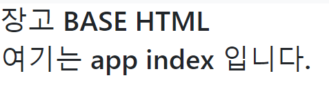
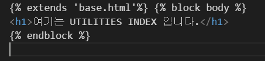
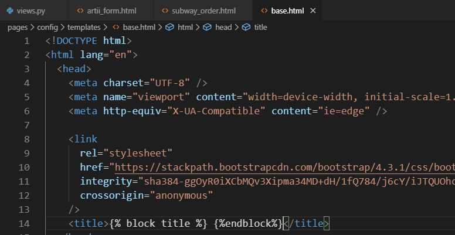
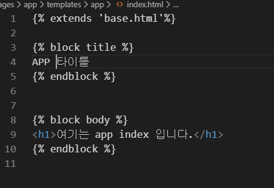
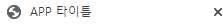

# 장고 2일차


### GET방식


form

- form : action - 데이타가 전송될 URL, method - GET/POST
- input : name: key / value: value
- label : for 옵션 input에 id값이랑 매치


GET

- data가 body 통한게 아니라 쿼리스트링
- 데이터를 조회할때


실습 : ARTII


### POST방식

####  - 디비를 생성/변경 할때 주로 사용하고 html body 정보를 담아 정송

####  - 원칙적으로 POST 요청은 html 파일로 응답하면 안됨.

##### 		- post 요청이 오면 get 요청 받는 페이지로 redirect (RESTful)

####  - Django는 post를 그냥 보내지 않는다.

#####  		- csrf_token

##### 		- Cross Site Request Forgery

##### 		- 토큰을 보내지 않으면 403 forbidden error가 뜸.


ex)

 

form html에 csrf 토큰을 넣어주어야 에러가 안뜸.


### list 깔끔하게 빼오는법





```
", ".join(리스트이름)
```


## Static File

templates와 같은 위치(앱폴더 아래)에 static 폴더를 만들고

images, stylesheets 폴더로 구분


그 뒤 사용할 html 의 맨 위에

####  을 넣고

#### link, src에  로 사용

##### 파일경로는 app폴더 아래 static 폴더로 관리가 됨

사용 예시

```html

<!DOCTYPE html>
<html lang="en">
  <head>
    <meta charset="UTF-8" />
    <meta name="viewport" content="width=device-width, initial-scale=1.0" />
    <meta http-equiv="X-UA-Compatible" content="ie=edge" />
    <title>Document</title>
    <link rel="stylesheet" href="" />
  </head>
  <body>
    <h1>Staitc 파일 실습</h1>
    
  </body>
</html>

```


## urls.py 나누기

기존 프로젝트의 urls에서 include추가 

(config, project의 내용)

```python
from django.contrib import admin
from django.urls import path, include


urlpatterns = [
    path('app/', include('app.urls')),
    path('admin/', admin.site.urls),
]
```


path('app/', include('app.urls')),에서 app대신 '/'을 넣으면 app안넣어도 실행됨.

#### include의 안은 무조건 따옴표!


(app, pages의 내용) [파일 생성해야함]

```python
from django.urls import path
from . import views

urlpatterns =[
    path('artii_form/', views.artii_form),
    path('artii_result/', views.artii_result),
    path('user_new/', views.user_new),
    path('user_create/', views.user_create),
    path('subway_order/', views.subway_order),
    path('subway_result/', views.subway_result),
    path('static_example/', views.static_example),
]
```


## Django 의 파일 관리!

but templates 폴더의 파일이름이 같으면 install 순으로 실행이 되기 때문에



ex) 이 경우에는 app의 index는 실행 안되고 util의 index만 실행이 됨.


이런 식으로 파일을 관리 해주어야 한다.


## 템플릿 상속


#### Config에 templates 폴더를 만든 뒤


#### Setting에서 dirs을 설정해준다.


#### 그 후 config의 templates에서 base.html을 만든 뒤





#### block body를 설정,


#### app의 index에 상속을 받는다.




결과 :


 


이런 식으로 다른 html에도 설정 가능하다.




## 타이틀 block





이런식으로 block title도 설정 가능,


app의 index는





이런식으로


결과는

 

이렇게 나온다.


### 템플릿 상속 정리

#### 1.Templates 설정 안에 

#### DIRS : [os.path.join(BASE_DIR, "프로젝트 셋팅즈 있는 폴더 명","templates")]


#### 2.프로젝트 셋팅즈 폴더명/templates/base.html 작성.

####  을 파일 안 원하는 곳에 둔다.


#### 3. 만들어진 base.html 을 상속하려면 

#### 상속 받고 싶은 자식 html 상단에  을 입력


#### 그 후

####   

#### 내용 입력 

#### 


#### 끝


## @@@@ 템플릿 상속 추가 팁


.assets/image-20191112173035623.png)


여기처럼 config 지워도 동작함. 이 경우는


.assets/image-20191112173057070.png)


config 속이 아니라 동일 위치로 인식한다.