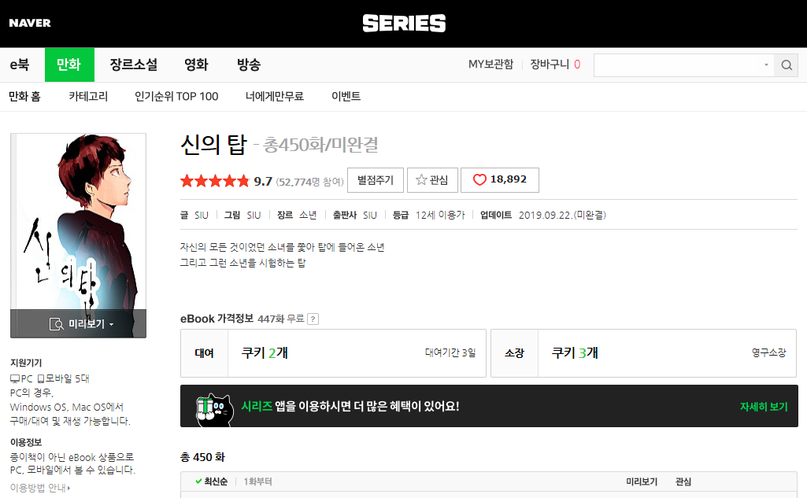
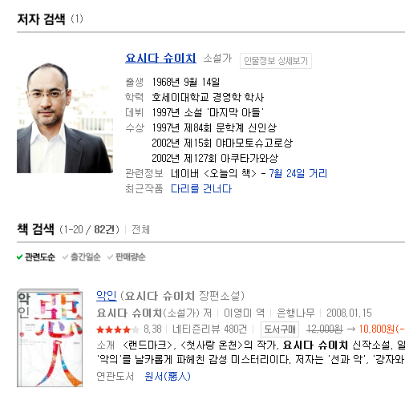
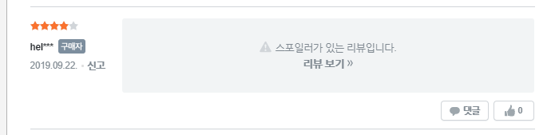
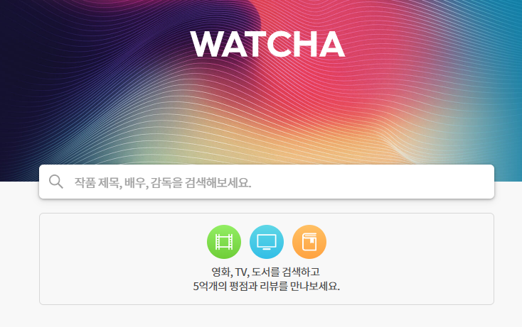
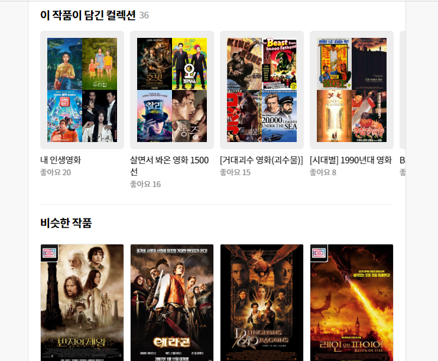

## 서비스 개요 (목적)

### 요약 :  종합 리뷰 플랫폼

### 1안 : 문화 매체 리뷰 플랫폼 

- 영화, 드라마, 소설, 만화, 웹툰 등 모든 분야의 문화 매체를 다룸.

1. 단순 평점만으로 모든 것을 알 수 있을까?

2. 영화, 소설 등 틀에 맞춘 추천등이 아니라 세분화된 지표를 바탕으로  문화 매체로서의 추천이 가능하다면?

   ex) 특정 영화를 좋아하는 사람에게 대상과 비슷한 소설, 만화, 드라마 등을 추천

3. 연재가 도중 중단되었거나 서적화가 되지 않은 이유로 리뷰를 달 수 없다면?

4. 해당 플랫폼이 저작권을 사들이지 못 했다는 이유로 리뷰를 달 수 없다면?

1,2 -> 모든 문화매체를 다루면서 맞춤형 평가 지표로 특별한 리뷰를 달 수 있는 리뷰 플랫폼을 개발. 

3,4 -> 유저가 원하는 대상의 문서를 직접 만들어서 리뷰를 달 수 있는 위키형 리뷰 플랫폼

 

### 2안(확장시) : 리뷰가 가능한 대상에 모든 리뷰를 달 수 있는 플랫폼

##### 유저가 직접 문서를 만드는 위키형 플랫폼이라는 장점을 활용한 광범위한 리뷰 플랫폼 구축 가능

-  (운영진은 카테고리 틀을 제공 및 문서 관리를 함)

1. 여행지 리뷰를 블로그나 카페의 주관적이고 긴 글이 아니라 간단한 지표로 나타낼 수 있다면? 

   -  비용, 편안함(휴양지), 편리함, 새로움, 치안, 음식, 분위기있는

   ex) 물가가 싸면서 치안이 좋은 여행지

   ex2 ) 물가는 비싸지만 분위기가 매우 좋은 여행지

   ex3 )  사람들이 잘 안가는 새로운 여행지는?

2. 식당을 단순히 별점으로만 평가할 수 있을까? 
   - 가격, 접근성(위치 + 기다리는 시간), 맛, 서비스(친절), 청결 등으로 평가 가능하면서 워드클라우드로 가게만의 특징을 파악
   - 카페나 술집 등 비슷한 분야는 지표를 조금 바꿔서 리뷰 형식 제공
   - 추후 독서실, 영화관 등 다른 기능적 건물에 대한 리뷰로 추가 확장 가능 

3. 단순히 게임 태그만으로 분류해서 추천하는 형식이 아니라 특정 평가 지표에 맞는 게임 추천

   ex) 자유도, 그래픽, 조작감(컨트롤), 전략성, 몰입감(스토리 or 집중도), 과금성 등등

   

   

 

## 서비스 이용 대상자

**자신의 경험을 공유하고 싶은 모든 사람**

참고 기사 : **정보시대를 넘어 경험시대로-경험을 공유하라 – 이모션**

https://www.emotion.co.kr/blog-preset-5-2/

SNS로 끊임없이 관련 정보를 찾고 경험을 공유하고 싶어하고, 또 공유 받고 싶어하는 현대 사람들에게 적합한 리뷰 플랫폼.

특히나 문화매체는 해당 매체를 경험하고 느낀 감정들을 공유하여 다른 사람들과의 동질감을 느낄 수 있고, 그로인한 취향 추천이 가능하므로 추가적인 문화 생활으로 유도할 수 있다. 

 

## 유사 프로그램(어플리케이션)과의 차별성 (수익과 연결될 확장성)

## 1. 네이버 시리즈 플랫폼

1-1 기본정보

네이버 시리즈는 기본적으로 '리뷰'를 위한 플랫폼이 아닌 '컨텐츠 제공' 을 위한 플랫폼이라 대여를 하기 전에 간략한 정보를 보여주는 느낌이 강하다.

1-2 리뷰

다른 사이트 중에 가장 불편한 리뷰 형식

리뷰가 매우 많은 수가 있어도 어떤 내용들을 담고 있는지 요약을 해주지도 않고 , 

그나마 네이버 웹툰의 댓글 형식은 공감순이라는 간단한 정렬이 추가 되어 있지만 이 마저도 초반에 인기 덧글이 형성되면 나머지 덧글의 영향 없이 베스트 덧글이 유지되는 형식이다.

1-3 데이터 분석, 추천알고리즘

데이터분석은 독자의 성향을 파악할 수 있게 해주는 통계가 전부,

추천 알고리즘은 만화에 한정되어 있으며 어떤 걸 기준으로 추천 되어있는지 잘 나타나지 않는다.

  

## 2. 리디북스

1. 디자인은 깔끔하지만 기본적으로 전자책 서점 형식이기 때문에 리뷰를 할 수 있는 도서가 적다.

   

네이버에서의 해당 작가 서적은 82건이지만 아직 E북 출시가 안 된 책들이 많기 때문에 리디북스는 2권이 전부이다.

2. 리뷰 정보

.

별점을 입력하는 형식이 반응형 + 별점 시각화라서 흥미롭지만 어떤 부분이 좋았는지에 대한 상세 평점이 아니라 결국 리뷰 내용에 포함되는 식으로 리뷰가 된다.

추가적으로 스포일러 방지 댓글 기능이 있다. 

## 3. 왓챠

1. 기본 정보

   

 

영화, TV, 도서 등 모든 문화 매체를 다룬다는 점에서 방향이 가장 비슷함

but 주 목적은 컨텐츠 제공이기 때문에 리뷰보다는 기본 정보, 구매로의 연결 등에 집중되어 있다.

2. 리뷰 정보

디자인은 새롭지만 코멘트들의 좋아요 순, 평점 높은 순 등의 정렬도 없고 해당 코멘트들을 요약해주는 데이터 분석도 없다.

3. 추천 알고리즘

   

    

추천알고리즘은

1. 유저들이 만든 목록을 이용한 추천 

2. 장르를 이용한 추천

2는 많은 컨텐츠 제공 플랫폼에서 활용하고 있고, 1은 독창성이 있는 추천 시스템이지만 유저의 주관성이 깊게 관여된다는 단점이 있다.

## 000(서비스 이름 미정)의 차별점

- 오직 해당 매체에 대한 경험을 나누기 위한 리뷰 전문 플랫폼 

  

- 리뷰를 하고 싶은 대상이 없을 경우 유저가 직접 문서를 만들어서 리뷰를 달 수 있다.

- 유저들의 코멘트를 한 번에 볼 수 있는 워드클라우드를 제공해서 해당 매체에 대한 전체적인 느낌을 보여줄 수 있다.

- 별점 뿐만이 아니라 6가지 항목의 세분화된 지표를 도형으로 보여주어서 매체를 고르는데 도움을 줄 수 있으며 유저들의 지표 평가를 이용하여  시각화 된 데이터를 제공해줄 수 있다. 

  

- 데이터 분석으로  어떤 사람들에게 많이 선택 받았는지 제공이 가능하다.

- 기존 장르 추천 알고리즘에 지표 평가 수치를 합친 합리적인 방법으로 매체 추천 가능

- 영화나 드라마, 소설 등 만화, 웹툰 등에서의 다양한 분야에서의 추천이 가능하다.
  - ex) 스토리가 좋고 몰입성이 있는 영화의 경우 같은 장르면서 (판타지면 판타지를 추천?) 몰입감이 높은 드라마, 소설 , 웹툰등 을 추천.

## 수익성과 확장성, 그리고 독창성

#### 수익성 

1차원적 수익 : 웹 광고 수익

2차원적 수익 : 대량의 리뷰 데이터를 이용하여 컨텐츠 제공 플랫폼과의 협업 or 기술 지원 or 플랫폼 매각 가능

참고 기사 : **리뷰 플랫폼, 소비자·기업 ‘윈윈’ 마케팅 수단으로 인기**

http://www.newstap.co.kr/news/articleView.html?idxno=60090

#### 확장성 

유저 참여형 이기 때문에 카테고리만 따로 설정을 해주는 것으로 광범위하게 확장이 가능하다. 

ex) 문화매체 뿐만이 아니라 건물, 식당, 여행지 등등

자세한 사항은 서비스 개요 (목적)의 2안 참고,

#### 독창성 :

항상 컨텐츠 제공 사이트에 참고용으로 껴 있던 '리뷰' 라는 항목을 경험을 공유하는 중요한 수단으로 인식, 전문적으로 리뷰만을 다루는 플랫폼

기존의 한 분야에만 집중하는 리뷰 플랫폼과 달리 넓은 분야를 다루기 때문에 모인 리뷰 데이터들을 연결 지어 새로운 인사이트를 제공하거나  더 많은 유저들을 유입 시킬 기반이 됨.

## 기능 정의(구체적)

사이트의 구성은 크게 3가지

1. 기본정보
2. 데이터 분석
3. 리뷰정보 

이다.

### 1.기본정보

기본 정보는 주제 별로 형식만 제공하여 유저들에게 입력을 받게 구성할 예정이다.

이로 인해 새로 인기가 없거나 저작권 문제로 다루지 못 했던 매체에 대한 리뷰가 가능하고

확장 시 사람들이 모르는 식당이나 새로운 식당 등의 구석 구석까지 리뷰를 할 수 있게 된다.

### 2.데이터 분석

데이터 분석의 주 요소는

- 리뷰 코멘트의 워드 클라우드 ( 이 매체는 이런 느낌이에요 같은 기능  )

ex) 소메트렌드 감성분석

- 6~8각형의 도형 평가 데이터 제공 

  ex) 

예시는 2개의 도형이 겹쳐있지만 하나의 도형만으로 표현할 예정

- 유저 데이터 통계
  - 일반적인 나이대, 직업, 성별 등등을 보여줌.

## 데이터 수집 방법 

유저가 댓글을 달면 리뷰 데이터가 DB에 저장 ->  DB속 리뷰 데이터들을 이용해서 분석

유저의 정보는 가입시 간단하게 수집.

## 시각화 표현 요소

데이터 분석요소와 통계 내용을 보여줌.

평가 시에 많은 입력 창에 흥미를 잃지 않게 시각화로 움직이는 도형 식으로 평가가 가능하게 만듬.

 

